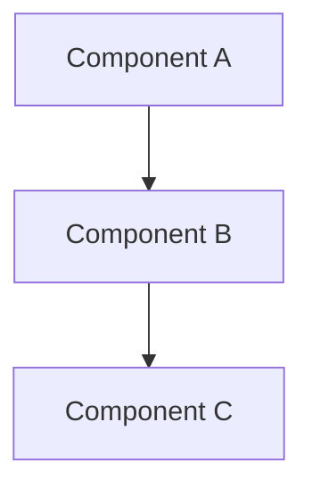
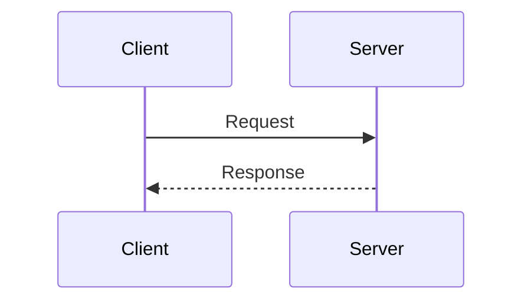
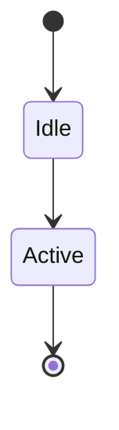

# Technical Documentation Writer Agent - Setup Summary

## Overview

A comprehensive technical documentation writer skill and documentation framework has been created for the Telemetry 2.0 embedded systems project. This agent specializes in creating and maintaining high-quality technical documentation following best practices for embedded C/C++ projects.

## What Was Created

### 1. Technical Writer Skill

**Location**: `.github/skills/technical-documentation-writer/SKILL.md`

A comprehensive skill definition that provides:
- Documentation structure guidelines
- Process for creating different types of documentation
- Mermaid diagram templates and examples
- Code example best practices
- API documentation standards
- Threading and memory management documentation patterns
- Quality checklist
- Maintenance guidelines

**How to Use**: When creating or updating documentation, invoke the skill by mentioning it in your request or by reading the SKILL.md file for guidance.

### 2. Documentation Structure

The following directory structure has been established:

```
telemetry/
├── README.md                    # ✨ NEW: Project overview and quick start
├── docs/                        # ✨ NEW: General documentation
│   ├── README.md               # Documentation index and navigation
│   ├── architecture/
│   │   └── overview.md        # System architecture with diagrams
│   └── api/
│       └── public-api.md      # Complete public API reference
└── source/
    └── docs/                   # Component-specific documentation
        ├── bulkdata/
        │   └── README.md      # Bulk data component docs
        └── scheduler/
            └── README.md      # Scheduler component docs
```

### 3. Root README.md

**Location**: `README.md`

A comprehensive project README featuring:
- Project overview with architecture diagram
- Quick start guide with code examples
- Build instructions and Docker setup
- Configuration examples
- Documentation links
- Performance metrics
- Troubleshooting section
- Contributing guidelines

**Purpose**: Primary entry point for developers, platform vendors, and contributors.

### 4. Documentation Hub

**Location**: `docs/README.md`

Central navigation hub that provides:
- Overview of Telemetry 2.0
- Documentation structure guide
- Quick links to all documentation
- Getting started paths for different user types
- Documentation conventions and style guide

### 5. Architecture Documentation

**Location**: `docs/architecture/overview.md`

Comprehensive architecture documentation including:
- High-level system architecture with Mermaid diagrams
- Component descriptions and responsibilities
- Data flow diagrams with sequence flows
- Threading model with synchronization details
- Memory architecture and budgets
- Platform integration details
- Security model
- Performance characteristics
- Error handling philosophy

### 6. API Reference

**Location**: `docs/api/public-api.md`

Complete public API documentation featuring:
- All public functions with signatures
- Parameter descriptions and constraints
- Return value documentation
- Thread safety information
- Working code examples
- Usage patterns and best practices
- Error codes reference
- Performance considerations

### 7. Component Documentation Examples

#### Scheduler Component
**Location**: `source/docs/scheduler/README.md`

Example of component-level documentation with:
- Component overview and architecture
- Threading model and synchronization
- API reference for internal functions
- Memory management details
- Usage examples
- Troubleshooting guide

#### Bulk Data Component
**Location**: `source/docs/bulkdata/README.md`

Another component example demonstrating:
- Complex data structures
- Event processing flows
- Profile configuration examples
- Performance metrics
- Testing procedures

## Documentation Features

### Mermaid Diagrams

All documentation uses Mermaid for diagrams, including:

**Architecture Diagrams:**


**Sequence Diagrams:**


**State Diagrams:**


### Code Examples

All code examples are:
- Fully compilable
- Include error handling
- Show proper resource cleanup
- Follow project coding standards
- Include comments explaining key concepts

### Cross-References

All documents include:
- Cross-references to related documentation
- File links with line numbers where appropriate
- Breadcrumb navigation
- "See Also" sections

## How to Use the Documentation System

### For Creating New Documentation

1. **Read the Skill**: Review `.github/skills/technical-documentation-writer/SKILL.md`

2. **Choose the Right Location**:
   - General/architecture docs → `docs/`
   - Component-specific docs → `source/docs/{component}/`
   - API docs → `docs/api/`

3. **Follow the Template**: Use existing docs as templates

4. **Include Required Elements**:
   - Overview section
   - Mermaid diagrams for complex concepts
   - Code examples
   - Cross-references
   - See Also section

5. **Update Navigation**: Add links in relevant README.md files

### For Requesting Documentation

When asking the AI agent to create documentation:

```
Create documentation for the XConf client component following the 
technical-documentation-writer skill guidelines.
```

Or more specifically:

```
Document the profile_create() API function including:
- Full signature
- Parameter details
- Return values
- Thread safety
- Memory ownership
- Working example
```

### For Maintaining Documentation

1. **Keep in Sync**: Update docs when code changes
2. **Validate Examples**: Ensure code examples still compile
3. **Check Links**: Verify cross-references work
4. **Review Diagrams**: Update diagrams for architecture changes

## Documentation Standards

### Naming Conventions

- **Files**: lowercase with hyphens (e.g., `threading-model.md`)
- **Directories**: lowercase, no spaces
- **Headings**: Title Case for major sections
- **Code symbols**: Use backticks (e.g., `function_name()`)

### File Organization

```
component-name/
├── README.md              # Component overview (start here)
├── api-reference.md       # Detailed API docs (optional)
├── implementation.md      # Implementation details (optional)
└── examples.md           # Extended examples (optional)
```

### Required Sections

Every component README.md should have:
1. Overview (2-3 sentences)
2. Architecture (with diagram)
3. Key Components
4. Threading Model
5. Memory Management
6. API Reference
7. Usage Examples
8. See Also

## Quality Checklist

Before considering documentation complete:

- [ ] All public APIs documented
- [ ] At least one working example per major function
- [ ] Thread safety explicitly stated
- [ ] Memory ownership documented
- [ ] Mermaid diagrams for complex flows
- [ ] Cross-references to related docs
- [ ] Code examples compile
- [ ] Spell-checked
- [ ] Reviewed by component author

## Agent Usage Examples

### Example 1: Create Component Documentation

**Prompt:**
```
Create comprehensive documentation for the Report Generator component in 
source/docs/reportgen/. Follow the technical-documentation-writer skill 
and use the scheduler component docs as a reference.
```

### Example 2: Update API Documentation

**Prompt:**
```
Update the public API documentation to add the new t2_event_batch() 
function. Include signature, parameters, thread safety, examples, and 
best practices.
```

### Example 3: Create Architecture Diagram

**Prompt:**
```
Create a Mermaid sequence diagram showing the complete flow from an 
application sending an event through to HTTP transmission. Include all 
intermediate components.
```

### Example 4: Write Integration Guide

**Prompt:**
```
Create a developer integration guide in docs/integration/developer-guide.md 
that walks through integrating Telemetry 2.0 into a new RDK component. 
Include build setup, basic usage, and common pitfalls.
```


---

**Created**: March 2026  
**Maintained By**: Telemetry Team  
**Status**: Active

## Invoking the Agent

To use the technical documentation writer agent in your development workflow, simply mention documentation needs in your requests:

```
Please document the new profile_validate() function following our 
documentation standards.
```

Or invoke the skill explicitly:

```
Using the technical-documentation-writer skill, create architecture 
documentation for the privacy control subsystem.
```

The agent will automatically follow the guidelines and produce documentation matching the established patterns and quality standards.
