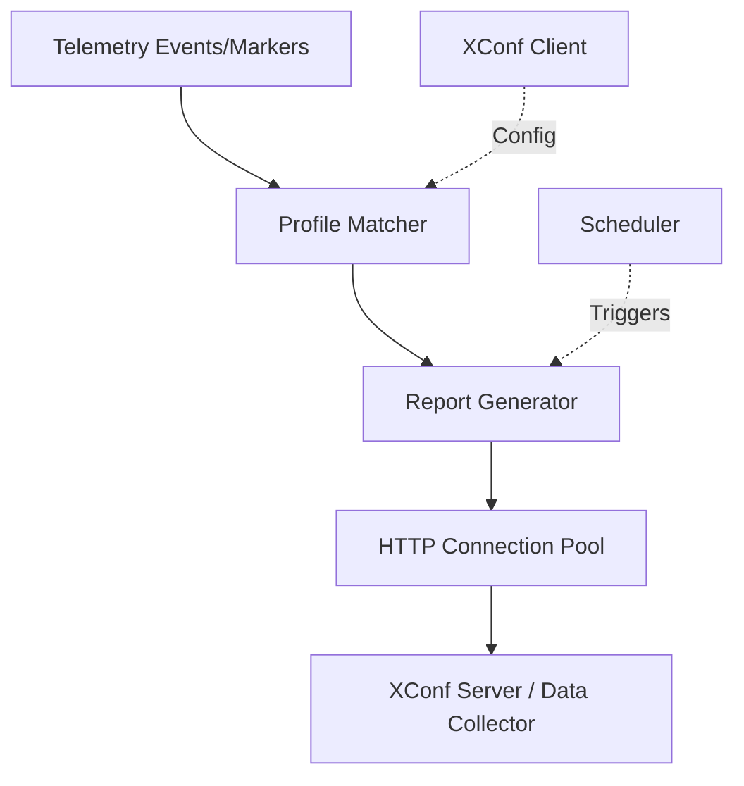

# Telemetry 2.0

[](LICENSE)
[](https://en.wikipedia.org/wiki/C_(programming_language))
[](https://www.yoctoproject.org/)

A lightweight, efficient telemetry framework for RDK (Reference Design Kit) embedded devices.

## Overview

Telemetry 2.0 provides real-time monitoring, event collection, and reporting capabilities optimized for resource-constrained embedded devices such as set-top boxes, gateways, and IoT devices.

### Key Features

- ⚡ **Efficient**: Connection pooling and batch reporting
- 🔒 **Secure**: mTLS support for encrypted communication
- 📊 **Flexible**: Profile-based configuration (JSON/XConf)
- 🔧 **Platform-Independent**: Multiple architecture support

### Architecture Highlights



## Quick Start

### Prerequisites

- GCC 4.8+ or Clang 3.5+
- pthread library
- libcurl 7.65.0+
- cJSON library
- OpenSSL 1.1.1+ (for mTLS)

### Build

```bash
# Clone repository
git clone https://github.com/rdkcentral/telemetry.git
cd telemetry

# Configure
autoreconf -i
./configure 

# Build
make

# Install
sudo make install
```

### Docker Development

Refer to the provided Docker container for a consistent development environment:

https://github.com/rdkcentral/docker-device-mgt-service-test


See [Build Setup Guide](docs/integration/build-setup.md) for detailed build options.

### Basic Usage

```c
#include "telemetry2_0.h"

int main(void) {
    // Initialize telemetry
    if (t2_init() != 0) {
        fprintf(stderr, "Failed to initialize telemetry\n");
        return -1;
    }
    
    // Send a marker event
    t2_event_s("SYS_INFO_DeviceBootup", "Device started successfully");
    
    // Cleanup
    t2_uninit();
    return 0;
}
```

Compile: `gcc -o myapp myapp.c -ltelemetry`

## Documentation

📚 **[Complete Documentation](docs/README.md)**

### Key Documents

- **[Architecture Overview](docs/architecture/overview.md)** - System design and components
- **[API Reference](docs/api/public-api.md)** - Public API documentation
- **[Developer Guide](docs/integration/developer-guide.md)** - Getting started
- **[Build Setup](docs/integration/build-setup.md)** - Build configuration
- **[Testing Guide](docs/integration/testing.md)** - Test procedures

### Component Documentation

Individual component documentation is in [`source/docs/`](source/docs/):

- [Bulk Data System](source/docs/bulkdata/README.md) - Profile and marker management
- [HTTP Protocol](source/docs/protocol/README.md) - Communication layer
- [Scheduler](source/docs/scheduler/README.md) - Report scheduling
- [XConf Client](source/docs/xconf-client/README.md) - Configuration retrieval

## Project Structure

```
telemetry/
├── source/              # Source code
│   ├── bulkdata/       # Profile and marker management
│   ├── protocol/       # HTTP/RBUS communication
│   ├── scheduler/      # Report scheduling
│   ├── xconf-client/   # Configuration retrieval
│   ├── dcautil/        # Log marker utilities
│   └── test/           # Unit tests (gtest/gmock)
├── include/            # Public headers
├── config/             # Configuration files
├── docs/               # Documentation
├── containers/         # Docker development environment
└── test/               # Functional tests
```

## Configuration

### Profile Configuration

Telemetry uses JSON profiles to define what data to collect:

```json
{
  "Profile": "RDKB_BasicProfile",
  "Version": "1.0.0",
  "Protocol": "HTTP",
  "EncodingType": "JSON",
  "ReportingInterval": 300,
  "Parameters": [
    {
      "type": "dataModel",
      "name": "Device.DeviceInfo.Manufacturer"
    },
    {
      "type": "event",
      "eventName": "bootup_complete"
    }
  ]
}
```

See [Profile Configuration Guide](docs/integration/profile-configuration.md) for details.

### Environment Variables

| Variable | Description | Default |
|----------|-------------|---------|
| `T2_ENABLE_DEBUG` | Enable debug logging | `0` |
| `T2_PROFILE_PATH` | Default profile directory | `/etc/DefaultT2Profile.json` |
| `T2_XCONF_URL` | XConf server URL | - |
| `T2_REPORT_URL` | Report upload URL | - |

## Runtime Operations

### Signal Handling

The Telemetry 2.0 daemon responds to the following signals for runtime control:

| Signal | Value | Purpose |
|--------|-------|---------|
| **SIGTERM** | 15 | Gracefully terminate the daemon, cleanup resources and exit |
| **SIGINT** | 2 | Interrupt signal - uninitialize services, cleanup and exit |
| **SIGUSR1** | 10 | Trigger log upload with seekmap reset |
| **SIGUSR2** | 12 | Reload configuration from XConf server |
| **LOG_UPLOAD** | 10 | Custom signal to trigger log upload and reset retain seekmap flag |
| **EXEC_RELOAD** | 12 | Custom signal to reload XConf configuration and restart XConf client |
| **LOG_UPLOAD_ONDEMAND** | 29 | Custom signal for on-demand log upload without seekmap reset |
| **SIGIO** | - | I/O signal - repurposed for on-demand log upload |

**Examples:**

```bash
# Gracefully stop telemetry
kill -SIGTERM $(pidof telemetry2_0)

# Trigger log upload
kill -10 $(pidof telemetry2_0)

# Reload configuration
kill -12 $(pidof telemetry2_0)

# On-demand log upload
kill -29 $(pidof telemetry2_0)
```

**Notes:**
- Custom signal values (10, 12, 29) are defined to avoid conflicts with standard system signals
- Signals SIGUSR1, SIGUSR2, LOG_UPLOAD, EXEC_RELOAD, LOG_UPLOAD_ONDEMAND, and SIGIO are blocked during signal handler execution to prevent race conditions
- Child processes ignore most signals except SIGCHLD, SIGPIPE, SIGALRM, and the log upload/reload signals

### WebConfig/Profile Reload

Telemetry 2.0 supports multiple mechanisms for dynamically reloading report profiles and configuration:

#### 1. Signal-Based XConf Reload

Trigger XConf configuration reload using signals:

```bash
# Using custom signal value
kill -12 $(pidof telemetry2_0)
```

This stops the XConf client and restarts it to fetch updated configuration from the XConf server.

#### 2. RBUS-Based Profile Updates

For WebConfig integration, profiles can be set directly via RBUS (requires `rbuscli`):

```bash
# Load a temporary profile (JSON format)
rbuscli setv "Device.X_RDKCENTRAL-COM_T2.Temp_ReportProfiles" string '{"profiles":[...]}'

# Set permanent profiles
rbuscli setv "Device.X_RDKCENTRAL-COM_T2.ReportProfiles" string '{"profiles":[...]}'

# Set profiles in MessagePack binary format
rbuscli setv "Device.X_RDKCENTRAL-COM_T2.ReportProfilesMsgPack" bytes <msgpack_data>

# Clear all profiles
rbuscli setv "Device.X_RDKCENTRAL-COM_T2.ReportProfiles" string '{"profiles":[]}'
```

#### 3. DCM Event-Based Reload

Subscribe to DCM reload events via RBUS (typically used by WebConfig framework):

```bash
# Publish DCM reload event
rbuscli publish Device.X_RDKCENTREL-COM.Reloadconfig
```

#### 4. Using Test Utilities

The project includes a convenience script for testing profile updates:

```bash
# Load example profile
./test/set_report_profile.sh example

# Load DOCSIS reference profile
./test/set_report_profile.sh docsis

# Clear all profiles
./test/set_report_profile.sh empty

# Load custom JSON profile
./test/set_report_profile.sh '{"profiles":[...]}'
```

**Available RBUS Parameters:**

- `Device.X_RDKCENTRAL-COM_T2.ReportProfiles` - Persistent report profiles (JSON)
- `Device.X_RDKCENTRAL-COM_T2.ReportProfilesMsgPack` - Persistent profiles (MessagePack binary)
- `Device.X_RDKCENTRAL-COM_T2.Temp_ReportProfiles` - Temporary profiles (JSON)
- `Device.X_RDKCENTRAL-COM_T2.UploadDCMReport` - Trigger on-demand report upload
- `Device.X_RDKCENTRAL-COM_T2.AbortDCMReport` - Abort ongoing report upload

## Development

### Running Tests

```bash
# Unit tests
make check

# Functional tests
cd test
./run_ut.sh

# Code coverage
./cov_build.sh
```

### Development Container

Use the provided Docker container for consistent development:
  https://github.com/rdkcentral/docker-device-mgt-service-test

```bash
cd docker-device-mgt-service-test
docker compose up -d
```

A directory above the current directory is mounted as a volume in /mnt/L2_CONTAINER_SHARED_VOLUME .
Login to the container as follows:
```bash
docker exec -it native-platform /bin/bash
cd /mnt/L2_CONTAINER_SHARED_VOLUME/telemetry
sh test/run_ut.sh
```

See [Docker Development Guide](containers/README.md) for more details.

## Platform Support

Telemetry 2.0 is designed to be platform-independent and has been tested on:

- **RDK-B** (Broadband devices)
- **RDK-V** (Video devices)
- **Linux** (x86_64, ARM, ARM64)
- **Yocto Project** builds

See [Platform Porting Guide](docs/integration/platform-porting.md) for porting to new platforms.


## Contributing

We welcome contributions! Please see [CONTRIBUTING.md](CONTRIBUTING.md) for guidelines.

### Development Workflow

1. Fork the repository
2. Create a feature branch (`git checkout -b feature/amazing-feature`)
3. Make your changes
4. Add tests for new functionality
5. Ensure all L1 and L2 tests pass 
6. Commit your changes (`git commit -m 'Add amazing feature'`)
7. Push to the branch (`git push origin feature/amazing-feature`)
8. Open a Pull Request

### Code Style

- Follow existing C code style and ensure astyle formatting and checks pass with below commands 
```bash
          find . -name '*.c' -o -name '*.h' | xargs astyle --options=.astylerc
          find . -name '*.orig' -type f -delete
 ```

- Use descriptive variable names
- Document all public APIs
- Add unit tests for new functions
- Add functional tests for new features

See [Coding Guidelines](.github/instructions/c-embedded.instructions.md) for details.

## Troubleshooting

### Common Issues

**Q: Telemetry not sending reports**
- Check network connectivity
- Verify XConf URL configuration
- Review logs in `/var/log/telemetry/`

**Q: High memory usage**

- Reduce number of active profiles
- Decrease reporting intervals
- Check for memory leaks with valgrind

**Q: Build errors**

- Ensure all dependencies installed
- Check compiler version (GCC 4.8+)
- Review build logs for missing libraries

See [Troubleshooting Guide](docs/troubleshooting/common-errors.md) for more solutions.

## License

This project is licensed under the Apache License 2.0 - see the [LICENSE](LICENSE) file for details.

## Acknowledgments

- RDK Management LLC
- RDK Community Contributors
- Open Source Community

## Contact

- **Repository**: https://github.com/rdkcentral/telemetry
- **Issues**: https://github.com/rdkcentral/telemetry/issues
- **RDK Central**: https://rdkcentral.com

## Changelog

See [CHANGELOG.md](CHANGELOG.md) for version history and release notes.

---

**Built for the RDK Community**
