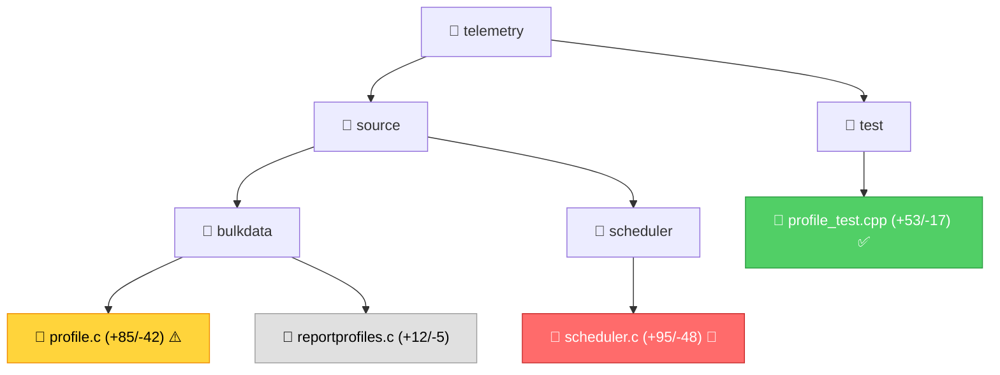

# Code Review Skill

Comprehensive code review assistant for embedded C/C++ pull requests in the Telemetry 2.0 framework.

## Quick Start

```
@workspace /code-review https://github.com/rdkcentral/telemetry/pull/123
```

or

```
@workspace /code-review #123
```

## What It Does

The code review skill analyzes GitHub pull requests and generates a comprehensive `REVIEW.md` file that includes:

- **Coverity defect integration** - Extracts and prioritizes static analysis findings from PR comments
- **Visual diff summary** with Mermaid diagrams
- **Module-by-module impact analysis**
- **Memory safety assessment** (leaks, use-after-free, buffer overflows)
- **Thread safety analysis** (race conditions, deadlocks)
- **Regression risk scoring** (LOW, MEDIUM, HIGH, CRITICAL)
- **Actionable recommendations** with line references
- **Testing coverage gaps** identification
- **Cross-cutting concerns** (build, config, docs)

## Features

### Coverity Integration
Automatically detects and incorporates Coverity static analysis results:
- Scans PR comments from **rdkcmf-jenkins** user
- Identifies comments with **"Coverity Issue"** title prefix
- Extracts defect type, severity, file/line locations
- Integrates findings into risk assessment and recommendations
- Prioritizes HIGH severity defects as blocking issues

## Output Structure

```
reviews/PR-<number>-REVIEW.md
```

The generated review includes:
1. **Executive Summary** - 2-3 sentence overview with risk level
2. **Coverity Analysis** - Static analysis defects from PR comments (if present)
3. **Change Visualization** - Mermaid diagram with change indicators
4. **Module Analysis** - Memory/thread safety per module
5. **Regression Risks** - Specific concerns with file:line references
6. **Recommendations** - Prioritized action items
7. **Checklist** - Verification tasks before merge

## Example Output

```markdown
# Code Review: Add profile reload support

## Overview
- PR: #123
- Files Changed: 8 files, +245/-112 lines
- Risk Level: MEDIUM ⚠️

## Executive Summary
Adds dynamic profile reload capability via rbus method. Changes touch scheduler 
and profile management with new mutex. Memory safety looks good but potential 
race condition in reload path needs attention.

## Changes by Module



## Detailed Analysis

### Bulk Data Collection Module

#### Files Modified
- [source/bulkdata/profile.c](source/bulkdata/profile.c#L145-L230) (+85/-42)
- [source/bulkdata/reportprofiles.c](source/bulkdata/reportprofiles.c#L88-L100)

#### Key Changes
- New `reloadProfile()` function to update profile configuration
- Added mutex `g_profile_reload_mutex` for protection during reload
- Profile state validation before applying changes

#### Impact Assessment

**Memory Safety**: ✅ GOOD
- All malloc calls have NULL checks
- Error paths properly free resources
- Old profile data freed before replacing

**Thread Safety**: ⚠️ CONCERN
- Line 167: `reloadProfile()` acquires `g_profile_reload_mutex` but also 
  calls `updateScheduler()` which acquires `g_scheduler_mutex`
- Potential deadlock if scheduler tries to access profile during reload
- **Recommendation**: Document lock ordering or refactor to single lock

**API Compatibility**: ✅ MAINTAINED
- No changes to public function signatures
- New function is additive

**Error Handling**: ✅ GOOD
- Schema validation before applying profile
- Rollback on partial failure
- Appropriate error logging

#### Regression Risks
⚠️ **Race condition in profile access** ([profile.c:167](source/bulkdata/profile.c#L167))
   - TimeoutThread may access profile fields while reload is updating them
   - Recommend: Hold profile mutex during entire reload operation

...
```

## Integration with Other Skills

The code review skill complements:
- **quality-checker**: Run static analysis and tests after review
- **memory-safety-analyzer**: Deep dive on specific memory issues
- **thread-safety-analyzer**: Detailed concurrency analysis
- **platform-portability-checker**: Cross-platform validation

## Tips

1. **Run early**: Review PRs before extensive commenting to guide discussion
2. **Focus on risk**: Pay special attention to HIGH/CRITICAL risk items
3. **Verify with tools**: Follow up with `/quality-checker` for validation
4. **Iterate**: Re-run as PR evolves to track risk changes
5. **Custom focus**: Add specific concerns like "focus on memory safety"

## Reference Files

The skill uses these references for analysis:
- [review-checklist.md](references/review-checklist.md) - Comprehensive review standards
- [memory-patterns.md](references/memory-patterns.md) - Memory safety patterns
- [thread-patterns.md](references/thread-patterns.md) - Thread safety patterns  
- [common-pitfalls.md](references/common-pitfalls.md) - Known anti-patterns

## Limitations

- Requires GitHub access for remote PRs
- Heuristic-based risk assessment (not perfect)
- Cannot detect all semantic bugs
- Best for C/C++ embedded code
- Manual judgment still required for complex logic

## Contributing

To improve the skill:
1. Update [common-pitfalls.md](references/common-pitfalls.md) with new anti-patterns
2. Add project-specific patterns to reference files
3. Refine risk scoring algorithm in SKILL.md
4. Add test cases for skill validation
