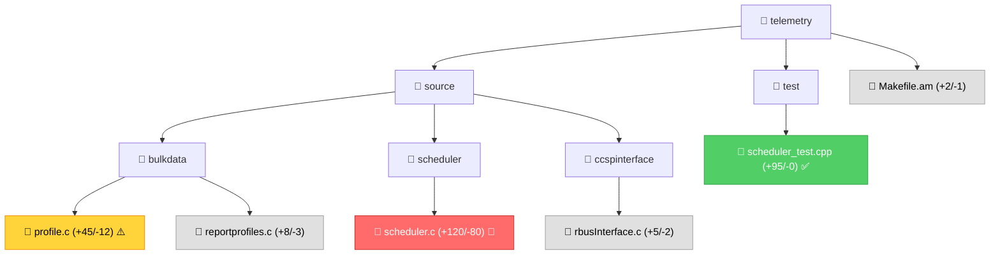

# Code Review for Embedded Systems

## Purpose

Generate a comprehensive `REVIEW.md` report for GitHub pull requests that helps senior engineers quickly understand changes, assess impact, and identify potential functional regressions in embedded C/C++ codebases.

## Usage

Invoke this skill when:
- Reviewing a pull request before merge
- Analyzing code changes for regression risk
- Understanding the scope and impact of modifications
- Validating memory safety, thread safety, or API compatibility
- Preparing for code review meetings
- Investigating functional issues introduced by recent changes

**Invocation**: `@workspace /code-review <PR_URL>` or `@workspace /code-review #<PR_NUMBER>`

---

## Output: REVIEW.md Structure

The skill generates a markdown report with the following sections:

```markdown
# Code Review: [PR Title]

## Overview
- PR: #<number>
- Author: <username>
- Files Changed: X files, +Y/-Z lines
- Risk Level: [LOW | MEDIUM | HIGH | CRITICAL]

## Executive Summary
[2-3 sentence summary of changes and overall risk assessment]

## Coverity Static Analysis (if applicable)
[Table of Coverity defects found in PR comments]

## Changes by Module
[Visual tree showing impacted modules with change indicators]

## Detailed Analysis

### [Module 1]
#### Files Modified
- file1.c (+X/-Y)
- file2.h (+X/-Y)

#### Key Changes
[Bulleted summary of functional changes]

#### Impact Assessment
- **Memory Safety**: [Analysis]
- **Thread Safety**: [Analysis]
- **API Compatibility**: [Analysis]
- **Error Handling**: [Analysis]

#### Regression Risks
⚠️ [Specific risks with line references]

### [Module 2]
...

## Cross-Cutting Concerns
- Build System Impact
- Configuration Changes
- Test Coverage Gaps
- Documentation Updates

## Recommendations
1. [Priority action items]
2. [Suggested additional tests]
3. [Areas requiring closer inspection]

## Checklist
- [ ] Memory leaks verified (valgrind)
- [ ] Thread safety validated
- [ ] API compatibility maintained
- [ ] Error paths tested
- [ ] Unit tests added/updated
- [ ] Integration tests pass
- [ ] Documentation updated
```

---

## Analysis Process

### Step 1: Fetch PR Metadata

Use GitHub tools to retrieve:
1. PR number, title, description
2. Author and reviewers
3. File change list with line counts
4. Review comments (if any)
5. Status checks (CI results)

```
Tools: github-pull-request_issue_fetch, github-pull-request_openPullRequest
```

**Check for Coverity Defects:**

After fetching PR metadata, scan the comments for Coverity static analysis reports:
- Look for comments from user **"rdkcmf-jenkins"**
- Look for comments with titles starting with **"Coverity Issue"**
- Extract defect information:
  - Defect type (e.g., DEADLOCK, RESOURCE_LEAK, ATOMICITY, USE_AFTER_FREE)
  - File and line number
  - Severity (High, Medium, Low)
  - Checker description

If Coverity defects are found:
1. Add a **"Coverity Analysis"** section to the REVIEW.md
2. List each defect with location and severity
3. Cross-reference these defects in module analysis
4. Flag defects as **MUST FIX** in recommendations if they are High severity
5. Include in risk assessment (higher safety score if critical defects present)

Example Coverity section:
```markdown
## Coverity Static Analysis Results

**Defects Found**: X issue(s)

| Severity | Type | File:Line | Description |
|----------|------|-----------|-------------|
| HIGH | DEADLOCK | datamodel.c:120 | Lock ordering violation |
| MEDIUM | RESOURCE_LEAK | profile.c:456 | Memory not freed on error path |
```

### Step 2: Get PR Diff

Retrieve the complete diff for analysis using standard tools available in the review environment:
- For a local checkout, use `git diff` against the target branch (for example, `git diff origin/main...HEAD`)
- For a GitHub pull request, use `gh pr diff <PR_NUMBER_OR_URL>`
- If neither is available, obtain the unified diff from the PR page and review the changed files directly
- Parse diff hunks to identify:
  - Added lines (new functionality)
  - Removed lines (deleted code)
  - Modified lines (behavior changes)

### Step 3: Categorize Changes by Module

Map changed files to architectural modules:

| Pattern | Module |
|---------|--------|
| `source/bulkdata/*` | Bulk Data Collection |
| `source/scheduler/*` | Scheduling Engine |
| `source/reportgen/*` | Report Generation |
| `source/ccspinterface/*` | Bus Interface (CCSP/rbus) |
| `source/protocol/*` | Transport (HTTP/rbus) |
| `source/t2parser/*` | Profile Parser |
| `source/dcautil/*` | DCA Utilities |
| `source/utils/*` | Common Utilities |
| `source/privacycontrol/*` | Privacy Control |
| `source/test/*` | Test Infrastructure |
| `*.am`, `*.ac` | Build System |
| `config/*` | Configuration |
| `schemas/*` | JSON Schemas |

### Step 4: Analyze Each Changed File

For each file, apply domain-specific analysis using [reference checklists](./references/review-checklist.md):

#### C Source Files (*.c)
1. **Memory Safety** (reference: [memory-patterns.md](./references/memory-patterns.md))
   - New allocations → verify corresponding free
   - Pointer assignments → check NULL before dereference
   - String operations → bounds checking
   - Error paths → resource cleanup

2. **Thread Safety** (reference: [thread-patterns.md](./references/thread-patterns.md))
   - Shared data access → mutex protection
   - Lock acquisitions → deadlock potential
   - Condition variables → proper usage pattern
   - Thread creation → stack size specified

3. **Error Handling**
   - Return values checked
   - Error codes meaningful
   - Logging sufficient for debugging
   - Failure modes handled

4. **Resource Constraints**
   - Stack vs heap allocation
   - Memory footprint impact
   - CPU impact (loops, algorithms)

#### Header Files (*.h)
1. API changes → backward compatibility
2. Struct modifications → ABI compatibility
3. New functions → documentation complete
4. Constants/enums → semantic correctness

#### Build Files (*.am, *.ac)
1. New dependencies → justified and minimal
2. Compiler flags → appropriate for embedded
3. Link order → correct
4. Conditional compilation → platform coverage

#### Test Files (*.cpp, test/*)
1. Test coverage → adequate for changes
2. Mock usage → appropriate
3. Edge cases covered
4. Negative tests included

### Step 5: Assess Regression Risk

Calculate risk score based on:

| Factor | Weight | Indicators |
|--------|--------|-----------|
| **Scope** | 30% | # files, # modules, LOC changed |
| **Criticality** | 25% | Core logic vs peripheral, production path |
| **Complexity** | 20% | Control flow changes, algorithm modifications |
| **Safety** | 15% | Memory/thread safety issues identified |
| **Testing** | 10% | Test coverage, CI status |

**Risk Levels:**
- **LOW**: <10 files, single module, tests added, no safety concerns
- **MEDIUM**: 10-30 files, 2-3 modules, or minor safety concerns
- **HIGH**: >30 files, cross-module, or safety issues present
- **CRITICAL**: Core scheduler/bus/report logic, no tests, or confirmed safety issues

### Step 6: Generate Visual Diff Summary

Create Mermaid diagram showing changes:



**Legend:**
- 🔴 High regression risk (red)
- ⚠️ Safety concern flagged (yellow)
- ✅ Test coverage added (green)
- Neutral changes (gray)

### Step 7: Cross-Reference with Project Context

Load project-specific context:
1. [Review checklist](./references/review-checklist.md) - Project standards
2. [Common pitfalls](./references/common-pitfalls.md) - Known anti-patterns
3. Architecture docs (`docs/architecture/overview.md`)
4. Build instructions (`.github/instructions/*.instructions.md`)

Check against:
- Coding standards (naming, style)
- Project architecture principles
- Known anti-patterns for this codebase
- Historical issues (if session memory available)

### Step 8: Generate Recommendations

Prioritize action items:

1. **MUST FIX** (blocking issues)
   - Memory leaks
   - Race conditions
   - API/ABI breakage
   - Missing critical error handling

2. **SHOULD FIX** (before merge)
   - Test coverage gaps
   - Missing documentation
   - Non-optimal patterns
   - Minor safety concerns

3. **CONSIDER** (future improvements)
   - Refactoring opportunities
   - Performance optimizations
   - Code duplication

---

## Example Invocations

### Review a PR by URL
```
@workspace /code-review https://github.com/rdkcentral/telemetry/pull/42
```

### Review a PR by number (assumes current repo)
```
@workspace /code-review #42
```

### Review with specific focus
```
@workspace /code-review #42 focus on thread safety
```

**Note**: The skill generates Mermaid diagrams for change visualization. GitHub, VS Code, and most modern markdown viewers render these automatically.

---

## Quality Checks Integration

After generating the REVIEW.md, suggest running quality checks:

```bash
# Use the quality-checker skill for comprehensive validation
@workspace /quality-checker
```

This will run:
- Static analysis (cppcheck)
- Memory safety (valgrind)
- Thread safety (helgrind, TSan)
- Build verification
- Unit tests

---

## Output Location

The REVIEW.md file is generated in:
- **Active PR**: `reviews/PR-<number>-REVIEW.md`
- **Quick review**: `REVIEW.md` (workspace root)

Files use the paths above and are git-ignored by default (added to `.gitignore` if not present). Any timestamp is recorded inside the report content rather than in the filename.

---

## Limitations

- Requires GitHub access for remote PRs
- Complex logic changes need manual inspection
- Cannot detect all semantic bugs
- Risk assessment is heuristic-based
- Integration test impact requires human judgment

---

## Tips for Best Results

1. **Provide context**: If the PR fixes a specific issue, mention it
2. **Focus areas**: Specify if you want deep-dive on specific aspects
3. **Compare branches**: For local changes, ensure proper git state
4. **Supplement with testing**: Use `/quality-checker` for validation
5. **Review iteratively**: Run skill multiple times as PR evolves

---

## Related Skills

- **quality-checker**: Run comprehensive quality checks
- **memory-safety-analyzer**: Deep dive on memory issues
- **thread-safety-analyzer**: Deep dive on concurrency
- **platform-portability-checker**: Validate cross-platform code
