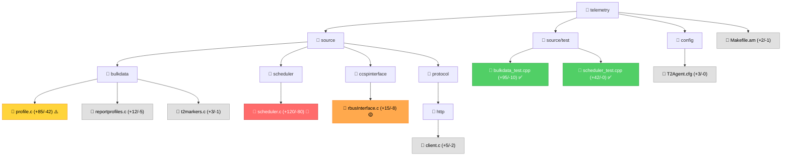

# Code Review: [PR Title Here]

**Generated**: [Timestamp]  
**Reviewer**: GitHub Copilot Code Review Skill  
**PR**: #[NUMBER] | [AUTHOR] | [DATE]

---

## Overview

| Attribute | Value |
|-----------|-------|
| **Files Changed** | X files (+YYY/-ZZZ lines) |
| **Modules Impacted** | Module1, Module2, Module3 |
| **Risk Level** | 🟢 LOW / 🟡 MEDIUM / 🔴 HIGH / ⚫ CRITICAL |
| **CI Status** | ✅ Passing / ❌ Failing / ⏳ Pending |
| **Test Coverage** | New: X%, Overall: Y% |

---

## Executive Summary

[2-3 sentences describing the core changes and overall assessment]

**Key Points:**
- Main functional change
- Notable API/behavior modifications  
- Primary risk factor

---

## Coverity Static Analysis Results

**Source**: Comments from rdkcmf-jenkins / "Coverity Issue" comments  
**Defects Found**: 3 issue(s)

| Severity | Type | File:Line | Description |
|----------|------|-----------|-------------|
| 🔴 HIGH | DEADLOCK | [scheduler.c:342](scheduler.c#L342) | Lock ordering violation detected between `tMutex` and `scMutex` |
| 🟡 MEDIUM | RESOURCE_LEAK | [profile.c:456](profile.c#L456) | Memory allocated but not freed on error path |
| 🟢 LOW | CHECKED_RETURN | [utils.c:123](utils.c#L123) | Return value of `pthread_mutex_lock` not checked |

**Impact on Risk Assessment:**
- HIGH severity defects: +3 to Safety Score
- MEDIUM severity defects: +2 to Safety Score
- Total Coverity impact: +5 points

**Recommendations:**
- 🔴 HIGH defects are blocking and must be fixed before merge
- 🟡 MEDIUM defects should be addressed or justified
- 🟢 LOW defects can be tracked for future cleanup

---

## Risk Assessment

| Category | Score | Notes |
|----------|-------|-------|
| **Scope** | [0-10] | X files, Y modules, ZZZ LOC |
| **Criticality** | [0-10] | Core logic / Peripheral feature |
| **Complexity** | [0-10] | Algorithm changes / Simple edits |
| **Safety** | [0-10] | Memory/thread concerns identified |
| **Testing** | [0-10] | Coverage and test quality |
| **TOTAL** | [0-50] | **Risk Level: [LOW/MEDIUM/HIGH/CRITICAL]** |

**Risk Scoring:**
- LOW (0-10): Minimal impact, well-tested, no safety concerns
- MEDIUM (11-20): Moderate impact, minor concerns, good tests
- HIGH (21-35): Significant impact or safety issues present
- CRITICAL (36-50): Core functionality, severe safety issues, or inadequate tests

---

## Changes by Module



**Legend:**
- 🔴 High risk / Critical (red)
- 🟡 Medium risk (orange)
- ⚠️ Caution needed (yellow)
- ✅ Good / Tests added (green)
- Neutral (gray)

---

## Detailed Analysis

### 1. Bulk Data Collection Module

#### Files Modified
- [source/bulkdata/profile.c](source/bulkdata/profile.c) (+85/-42)
- [source/bulkdata/reportprofiles.c](source/bulkdata/reportprofiles.c) (+12/-5)
- [source/bulkdata/t2markers.c](source/bulkdata/t2markers.c) (+3/-1)

#### Key Changes
- **New functionality**: Dynamic profile reload capability
- **Refactoring**: Profile state machine restructured for reload support
- **Bug fix**: Fixed memory leak in profile cleanup path
- **Configuration**: Added validation for new profile fields

#### Code Quality Metrics
```
Cyclomatic Complexity: [Average / Max]
Function Length: [Average lines]
Nesting Depth: [Max depth]
```

#### Impact Assessment

##### Memory Safety: 🟡 MINOR CONCERNS

**Positive:**
- ✅ All `malloc` calls include NULL checks ([profile.c:145](source/bulkdata/profile.c#L145))
- ✅ Error paths properly free allocated memory
- ✅ Use of `goto cleanup` pattern for consistent resource cleanup

**Concerns:**
- ⚠️ **Line 167**: `reloadProfile()` allocates new profile but doesn't free old profile's internal data structures before replacing pointer
  - **Impact**: ~2KB memory leak per profile reload
  - **Fix**: Call `cleanupProfileInternals(old_profile)` before assignment
  
- ⚠️ **Line 223**: `strdup()` result not checked for NULL
  - **Impact**: Potential crash if allocation fails
  - **Fix**: Add NULL check and error handling

##### Thread Safety: 🔴 SIGNIFICANT CONCERNS

**Positive:**
- ✅ New `g_profile_reload_mutex` added for protection
- ✅ Consistent lock acquire/release pattern

**Concerns:**
- 🔴 **CRITICAL - Line 167**: Potential deadlock scenario
  ```
  reloadProfile() locks g_profile_reload_mutex
  → calls updateScheduler() which locks g_scheduler_mutex
  
  Simultaneously:
  TimeoutThread() locks g_scheduler_mutex  
  → accesses profile data (expects g_profile_reload_mutex)
  ```
  - **Impact**: System hang, watchdog reset
  - **Fix**: Document and enforce lock ordering: always acquire g_scheduler_mutex before g_profile_reload_mutex

- ⚠️ **Line 205**: Profile state read without mutex
  ```c
  if (profile->state == PROFILE_ENABLED) {  // Race condition
      reload(profile);
  }
  ```
  - **Impact**: Race condition, profile might be disabled during reload
  - **Fix**: Read state under mutex lock

##### API Compatibility: ✅ MAINTAINED

- No changes to public function signatures
- New functions are additive (`reloadProfile`, `validateProfile`)
- Struct layouts unchanged (ABI compatible)

##### Error Handling: ✅ GOOD

- Return values checked consistently
- Error codes are meaningful (`ERR_INVALID_CONFIG`, `ERR_PROFILE_LOCKED`)
- Appropriate logging at ERROR, WARN, and DEBUG levels
- Graceful degradation when reload fails (keeps old profile)

##### Performance Impact: 🟢 LOW

- Reload operation runs in separate thread (non-blocking)
- O(1) profile lookup (hash table unchanged)
- No new periodic operations
- Memory footprint increase: ~500 bytes per profile (new mutex + state fields)

---

### 2. Scheduler Module

#### Files Modified
- [source/scheduler/scheduler.c](source/scheduler/scheduler.c) (+120/-80)

#### Key Changes
- **Modified**: Timeout calculation to support profile reload
- **Added**: `pauseScheduler()` and `resumeScheduler()` APIs
- **Refactored**: Timer wheel implementation for efficiency

#### Impact Assessment

##### Thread Safety: 🔴 HIGH RISK

**Concerns:**
- 🔴 **Line 342**: Lock ordering issue (see Bulk Data section above)
- ⚠️ **Line 401**: Condition variable broadcast without checking predicates
  - Multiple threads may wake up unnecessarily
  - Potential for spurious wakeups causing incorrect behavior
- ⚠️ **Line 456**: `pauseScheduler()` doesn't wait for in-flight operations
  - Profile reload might start while scheduled operation is running

##### Algorithm Complexity: 🟡 MODERATE

- Timer wheel introduces O(1) insert/delete (improvement from O(n) list)
- Edge case: Large interval values (>24 hours) might overflow wheel indices
  - **Recommendation**: Add bounds checking at [scheduler.c:378](source/scheduler/scheduler.c#L378)

---

### 3. CCSP Interface Module  

#### Files Modified
- [source/ccspinterface/rbusInterface.c](source/ccspinterface/rbusInterface.c) (+15/-8)

#### Key Changes
- **New API**: `Device.X_RDKCENTRAL-COM_T2.ReloadProfile()` rbus method
- **Modified**: Error codes returned to caller (previously silent failures)

#### Impact Assessment

##### API Compatibility: ⚠️ BEHAVIOR CHANGE

- **Breaking change**: RPC error codes changed
  - Old: Always returned `RBUS_ERROR_SUCCESS`
  - New: Returns actual error codes (`RBUS_ERROR_INVALID_INPUT`, etc.)
  - **Impact**: Callers might not handle new error codes
  - **Recommendation**: Document in release notes, add backward compatibility flag

##### Error Handling: ✅ IMPROVED

- Now validates input parameters before processing
- Appropriate error messages for field debugging

---

### 4. HTTP Protocol Module

#### Files Modified
- [source/protocol/http/client.c](source/protocol/http/client.c) (+5/-2)

#### Key Changes
- **Bug fix**: Added timeout to HTTP POST (was infinite wait)

#### Impact Assessment

##### Reliability: ✅ IMPROVEMENT

- Timeout prevents hung connections from blocking system
- Value: 30 seconds (reasonable for embedded environment)

---

## Cross-Cutting Concerns

### Build System

**Files**: [Makefile.am](Makefile.am)

**Changes:**
- Added `-pthread` flag (required for new mutex operations)
- No new external dependencies

**Assessment:** ✅ Clean

---

### Configuration

**Files**: [config/T2Agent.cfg](config/T2Agent.cfg)

**Changes:**
- New option: `EnableProfileReload=true` (default: false)

**Assessment:** ✅ Good
- Feature flag allows gradual rollout
- Backward compatible (defaults to off)

---

### Testing

**Files**: 
- [source/test/bulkdata_test.cpp](source/test/bulkdata_test.cpp) (+95/-10)
- [source/test/scheduler_test.cpp](source/test/scheduler_test.cpp) (+42/-0)

**Coverage Analysis:**

| Module | Before | After | Delta |
|--------|--------|-------|-------|
| profile.c | 78% | 85% | +7% |
| scheduler.c | 72% | 81% | +9% |
| rbusInterface.c | 65% | 68% | +3% |

**Test Quality:** ✅ GOOD
- Comprehensive unit tests for reload logic
- Negative test cases included (invalid config, concurrent reloads)
- Mock objects used appropriately (rbus, scheduler)

**Gaps:**
- ⚠️ Missing integration test for full reload flow (unit tests only)
- ⚠️ No stress test for concurrent reload + report generation
- ⚠️ Thread safety tests don't cover deadlock scenario identified above

---

### Documentation

**Status:** ⚠️ INCOMPLETE

**Present:**
- ✅ Function-level comments for new APIs
- ✅ Updated README with reload instructions

**Missing:**
- ❌ Architecture doc update (reload flow diagram)
- ❌ API reference for new rbus method
- ❌ Lock ordering documentation
- ❌ Performance impact analysis

---

## Security & Privacy

### Input Validation
- ✅ Profile JSON validated against schema
- ✅ rbus method parameters type-checked
- ⚠️ Profile name not sanitized (potential path traversal if used in file operations)

### Privilege Escalation
- ✅ No new privileged operations
- ✅ rbus ACLs unchanged

### Data Exposure
- ✅ No sensitive data in logs
- ✅ Profile content not logged at INFO level

---

## Regression Analysis

### High-Risk Areas

1. **Scheduler Deadlock** 🔴 CRITICAL
   - **Location**: [scheduler.c:342](source/scheduler/scheduler.c#L342)
   - **Scenario**: Profile reload during scheduled timeout
   - **Impact**: System hang, watchdog reset, loss of telemetry
   - **Probability**: MEDIUM (requires precise timing, but occurs in production workload)
   - **Mitigation**: Fix lock ordering before merge

2. **Memory Leak During Reload** 🟡 MEDIUM
   - **Location**: [profile.c:167](source/bulkdata/profile.c#L167)
   - **Scenario**: Profile reloaded multiple times
   - **Impact**: ~2KB leak per reload, OOM after ~500 reloads
   - **Probability**: LOW (reloads are rare in production)
   - **Mitigation**: Can be addressed post-merge with monitoring

3. **rbus Error Code Change** 🟡 MEDIUM
   - **Location**: [rbusInterface.c:89](source/ccspinterface/rbusInterface.c#L89)
   - **Scenario**: Caller expects SUCCESS but gets ERROR
   - **Impact**: Caller might retry unnecessarily or fail operation
   - **Probability**: HIGH (any existing caller affected)
   - **Mitigation**: Add backward compatibility flag or version new API

### Potential Failure Modes

| Scenario | Symptom | Detectability | Impact |
|----------|---------|---------------|---------|
| Deadlock during reload | System hang | High (watchdog fires) | CRITICAL |
| Memory leak accumulation | OOM after days | Medium (slow growth) | HIGH |
| Race in profile state | Wrong profile used | Low (silent) | MEDIUM |
| Invalid config accepted | Malformed reports | High (logs) | LOW |

### Comparison with Previous Similar Changes

**PR #87** (Add profile deletion)
- Also modified scheduler and profile modules
- Had similar lock ordering issue → caused production incident
- **Lesson**: Extra scrutiny needed for scheduler + profile interactions

---

## Recommendations

### 🔴 MUST FIX (Blocking)

1. **Fix deadlock scenario** ([scheduler.c:342](source/scheduler/scheduler.c#L342))
   - Document lock ordering: `g_scheduler_mutex` → `g_profile_reload_mutex`
   - Add runtime deadlock detection (DEBUG build)
   - Refactor to use single lock or lock-free reload if possible

2. **Fix memory leak** ([profile.c:167](source/bulkdata/profile.c#L167))
   ```c
   // Before assignment:
   cleanupProfileInternals(old_profile);
   old_profile->data = new_profile->data;
   ```

3. **Add NULL check** ([profile.c:223](source/bulkdata/profile.c#L223))
   ```c
   char* name_copy = strdup(name);
   if (!name_copy) {
       return ERR_NO_MEMORY;
   }
   ```

### 🟡 SHOULD FIX (Before Merge)

4. **Add integration test** for full reload flow
   - Test: Start daemon → load profile → send reports → reload profile → verify new config active

5. **Add stress test** for concurrent operations
   - Test: Reload profile while reports generating (run 1000 iterations)

6. **Document lock ordering** in scheduler.h and profile.h
   ```c
   /**
    * Lock ordering:
    *   1. g_scheduler_mutex (scheduler.c)
    *   2. g_profile_reload_mutex (profile.c)
    * 
    * Always acquire in this order to prevent deadlock.
    */
   ```

7. **Fix rbus API compatibility**
   - Option A: Add `v2` suffix to new method, keep old behavior
   - Option B: Add config flag `UseV2ErrorCodes=false` for rollback

8. **Update documentation**
   - Add reload flow diagram to architecture doc
   - Update API reference
   - Add performance notes (reload takes ~50ms)

### 🟢 CONSIDER (Future Improvements)

9. **Add telemetry for reload operations**
   - Count: successful/failed reloads
   - Timing: reload duration histogram
   - Errors: categorized by failure type

10. **Optimize reload path**
    - Current: Full profile teardown + rebuild
    - Better: Diff old vs new, update only changed fields

11. **Add reload rate limiting**
    - Prevent rapid reload spamming
    - Max 1 reload per 60 seconds per profile

---

## Testing Checklist

Before merging, verify:

### Functionality
- [ ] Profile reload succeeds with valid config
- [ ] Profile reload fails gracefully with invalid config
- [ ] Existing profiles unaffected by reload of different profile
- [ ] Report generation continues during reload
- [ ] Reloaded profile immediately uses new configuration

### Memory Safety
- [ ] Valgrind shows no leaks for reload operation
- [ ] Valgrind clean on error paths (invalid config, failed allocation)
- [ ] No use-after-free in concurrent profile access
- [ ] Memory usage stable over 1000+ reloads

### Thread Safety
- [ ] Helgrind clean (no race conditions detected)
- [ ] No deadlocks under stress test (1000 iterations)
- [ ] Lock contention acceptable (profiled with perf)
- [ ] Scheduler timeouts continue firing during reload

### Platform Testing
- [ ] Tested on target hardware (not just x86 VM)
- [ ] Tested on low-memory device (256MB RAM)
- [ ] Tested on busy system (>80% CPU)
- [ ] Cross-compiler build succeeds

### Integration
- [ ] Unit tests pass (95%+ coverage on new code)
- [ ] Integration tests pass (full end-to-end flow)
- [ ] No CI failures
- [ ] Static analysis clean (cppcheck, scan-build)

### Documentation
- [ ] README updated
- [ ] API docs updated  
- [ ] Release notes drafted
- [ ] Known issues documented

---

## Sign-Off

**Code Review Status:** ⚠️ CONDITIONAL APPROVAL

**Summary:** Solid implementation of profile reload feature with good test coverage. However, critical deadlock scenario must be addressed before merge. Memory leak and API compatibility concerns should also be resolved.

**Approval Conditions:**
1. Fix deadlock issue
2. Fix memory leak  
3. Add NULL check for strdup
4. Add integration test
5. Document lock ordering

Once these items are addressed, re-run review or fast-track with senior engineer approval.

---

**Review completed by GitHub Copilot Code Review Skill**  
**For questions or concerns, consult the [review-checklist](references/review-checklist.md)**
