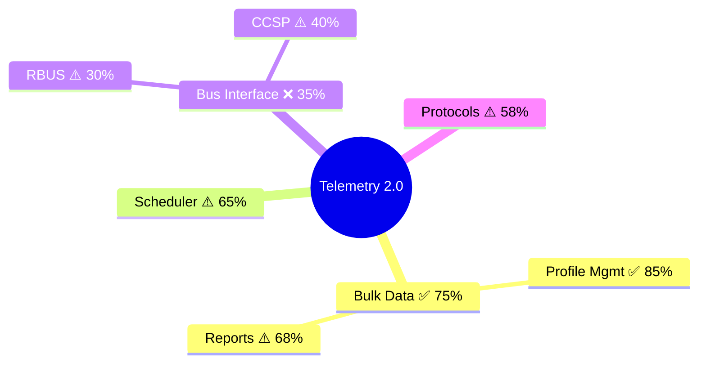

# L2 Test Gap Analyzer Skill

This skill analyzes L2 functional test coverage and generates comprehensive gap analysis reports with visual mindmaps.

## Purpose

Identify testing gaps by comparing:
1. Feature specifications (`.feature` files) with test implementations (`.py` files)
2. Source code functionality with existing test coverage
3. Generate actionable recommendations for test development

## Quick Start

### Using the Skill via Copilot

```
@workspace /l2-test-gap-analyzer
```

This will:
1. Analyze all modules in `source/`
2. Compare with tests in `test/functional-tests/`
3. Generate `test/functional-tests/L2_TEST_GAP.md`

### Using the Python Script Directly

**Gap Analysis Mode (Default):**
```bash
cd /path/to/telemetry
python .github/skills/l2-test-gap-analyzer/analyze.py
```

Output: `test/functional-tests/L2_TEST_GAP.md`

**Feature Sync Mode:**
```bash
python .github/skills/l2-test-gap-analyzer/analyze.py --sync-features
```

Generates `.feature` files for orphaned tests (tests without feature documentation).

**What Feature Sync Does:**
1. Scans all `test_*.py` files in `test/functional-tests/tests/`
2. Extracts test functions and docstrings
3. Generates corresponding `.feature` files in Gherkin format
4. Skips files that already have feature documentation

Example:
```
test/functional-tests/tests/test_profile_race_conditions.py
  ↓ generates ↓
test/functional-tests/features/profile_race_conditions.feature
```

### Analyzing Specific Module

```
@workspace /l2-test-gap-analyzer bulkdata
```

Focus analysis on `source/bulkdata/` only.

## What Gets Analyzed

### Feature-Test Sync
- Compares `.feature` files in `test/functional-tests/features/`
- With `.py` test files in `test/functional-tests/tests/`
- Identifies:
  - ✅ Features fully implemented
  - ⚠️ Features partially implemented
  - ❌ Features not implemented
  - 🔄 Tests without feature documentation

### Source-Test Coverage
- Analyzes source modules in `source/`
- Maps public APIs to test references
- Calculates coverage percentage
- Identifies untested functions

### Visual Mindmaps
- Color-coded coverage maps
- Module hierarchy visualization
- Gap prioritization

## Output Structure

Generated `L2_TEST_GAP.md` contains:

```markdown
# L2 Test Coverage Gap Analysis

## Executive Summary
- Overall coverage statistics
- Gap distribution by severity

## Visual Coverage Map
[Mermaid mindmaps with color coding]

## Feature-Test Synchronization
- Missing implementations
- Orphaned tests

## Critical Gaps
- Detailed gap analysis
- Priority ranking
- Recommended tests

## Test Development Roadmap
- Sprint planning
- Effort estimates
- Coverage targets

## Recommendations
- Immediate actions
- Short-term goals
- Long-term strategy
```

## Example Output

See [references/example-output.md](references/example-output.md) for complete sample report.

### Sample Mindmap



**Legend**:
- 🟢 ✅ >75% - Well tested
- 🟡 ⚠️ 40-75% - Partial coverage
- 🔴 ❌ <40% - Critical gap

## Coverage Calculation

### Formula

```
Coverage % = (Tested APIs / Total Public APIs) × 100
```

### Priority Assignment

| Coverage | Module Type | Priority |
|----------|-------------|----------|
| <40% | Critical (scheduler, bulkdata, bus) | 🔴 CRITICAL |
| 40-75% | Critical | 🟡 HIGH |
| <40% | Non-critical | 🟡 HIGH |
| 40-60% | Non-critical | 🟠 MEDIUM |
| 60-75% | Non-critical | 🟢 LOW |
| >75% | Any | ✅ Good |

**Critical Modules**: bulkdata, scheduler, ccspinterface

## Workflow Integration

### Sprint Planning

1. Run gap analysis
2. Review prioritized gaps
3. Select tests for sprint
4. Estimate effort

### Code Review

1. Check if PR has tests
2. Run gap analysis
3. Verify coverage improved
4. Update feature files

### Release Gate

1. Run full analysis
2. Verify critical modules >80%
3. Document known gaps
4. Plan post-release improvements

## Customization

### Modify Critical Modules

Edit `analyze.py`:

```python
critical_modules = ['bulkdata', 'scheduler', 'ccspinterface', 'your_module']
```

### Adjust Coverage Thresholds

```python
# In _calculate_priority()
if coverage_pct < 40:  # Change threshold
    return 'CRITICAL'
```

### Add Module-Specific Analysis

```python
def _analyze_custom_module(self, module_dir: Path):
    # Custom analysis logic
    pass
```

## Files in This Skill

```
l2-test-gap-analyzer/
├── SKILL.md                    # Main skill documentation
├── README.md                   # This file
├── analyze.py                  # Implementation script
└── references/
    └── example-output.md       # Sample report
```

## Requirements

### Python Dependencies

```bash
pip install pathlib  # Usually built-in
```

No external dependencies required - uses only Python standard library.

### Workspace Structure

Expected directory layout:

```
telemetry/
├── source/              # Source code
│   ├── bulkdata/
│   ├── scheduler/
│   └── ...
└── test/
    └── functional-tests/
        ├── features/    # .feature files (optional)
        └── tests/       # test_*.py files
```

## Tips for Best Results

### 1. Use Consistent Naming

**Feature to Test Mapping**:
- `bootup.feature` → `test_bootup_sequence.py`
- `xconf.feature` → `test_xconf_communications.py`

### 2. Document Public APIs

Add clear function declarations in header files:

```c
// Good - will be detected
T2ERROR createProfile(const char* name);

// Also good
Profile* getProfile(const char* name);
```

### 3. Reference APIs in Tests

Make API names visible in test code:

```python
def test_profile_creation():
    # Function name "createProfile" will be matched
    result = create_profile("test_profile")
```

### 4. Keep Feature Files Updated

When adding tests, update corresponding feature file:

```gherkin
Scenario: New test scenario
  Given precondition
  When action
  Then expected result
```

## Troubleshooting

### Issue: Low coverage reported incorrectly

**Cause**: API names not appearing in test code  
**Fix**: Ensure test code references API names directly

### Issue: Tests not discovered

**Cause**: Test files not following `test_*.py` convention  
**Fix**: Rename files or update discovery pattern in `analyze.py`

### Issue: Module not analyzed

**Cause**: Directory structure doesn't match expected layout  
**Fix**: Check `source/` directory exists and contains modules

### Issue: Mermaid diagrams not rendering

**Cause**: Markdown viewer doesn't support Mermaid  
**Fix**: View in GitHub, VS Code with Mermaid extension, or mermaid.live

## Advanced Usage

### Generate JSON Data Only

```python
analyzer = TestGapAnalyzer(workspace)
analyzer.run_analysis()

# Export raw data
with open('coverage_data.json', 'w') as f:
    json.dump(analyzer.coverage_data, f, indent=2)
```

### Integrate with CI/CD

```yaml
# .github/workflows/coverage-analysis.yml
- name: Run gap analysis
  run: python .github/skills/l2-test-gap-analyzer/analyze.py

- name: Upload report
  uses: actions/upload-artifact@v2
  with:
    name: coverage-report
    path: test/functional-tests/L2_TEST_GAP.md

- name: Check coverage threshold
  run: |
    coverage=$(python -c "import json; print(json.load(open('coverage.json'))['avg_coverage'])")
    if (( $(echo "$coverage < 60" | bc -l) )); then
      echo "Coverage $coverage% below 60% threshold"
      exit 1
    fi
```

### Track Coverage Trends

```python
# Save historical data
import json
from datetime import datetime

history_file = 'test/functional-tests/gap_history/history.json'

# Load existing history
with open(history_file, 'r') as f:
    history = json.load(f)

# Add current data
history.append({
    'date': datetime.now().isoformat(),
    'coverage': analyzer.coverage_data,
    'gaps': len(analyzer.gaps)
})

# Save updated history
with open(history_file, 'w') as f:
    json.dump(history, f, indent=2)
```

## Related Skills

- **code-review**: Review PRs for test coverage
- **quality-checker**: Run comprehensive quality checks
- **technical-documentation-writer**: Document testing strategy

## Support

For questions or issues:
1. Check [SKILL.md](SKILL.md) for detailed documentation
2. Review [example-output.md](references/example-output.md)
3. Examine [analyze.py](analyze.py) for implementation details

## Version History

- **v1.0** (April 2026): Initial release
  - Feature-test synchronization
  - Source-test coverage mapping
  - Visual mindmap generation
  - Gap prioritization
  - Report generation

## License

Part of the Telemetry 2.0 project.  
See repository LICENSE file.
