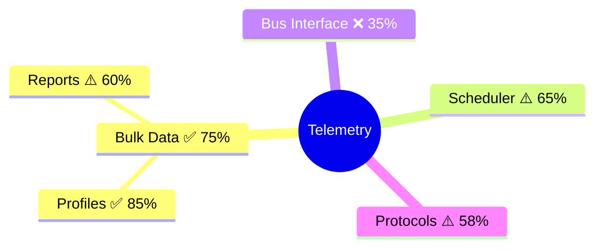

# L2 Test Gap Analyzer

## Purpose

Analyze L2 functional test coverage and generate a concise gap analysis report with visual mindmaps showing tested vs untested functionality.

## Usage

**Invocation**: `@workspace /l2-test-gap-analyzer [module]`

### Analysis Mode (Default)
- Analyzes feature files (`.feature`) vs test implementations (`.py`)
- Maps source code APIs to test coverage
- Generates `L2_TEST_GAP.md` with color-coded mindmaps
- Provides prioritized gap recommendations

### Feature Sync Mode
- **Purpose**: Update `.feature` files from existing test implementations
- **When to use**: Close the gap between orphaned tests and feature documentation
- **Command**: `python analyze.py --sync-features`
- **Result**: Creates missing `.feature` files for all `test_*.py` files
- **⚠️ Note**: Uses fuzzy matching to detect existing files; manual review recommended to remove any duplicates

---

## Analysis Coverage

### 1. Feature-Test Sync
- Compares `test/functional-tests/features/*.feature` with `test/functional-tests/tests/test_*.py`
- Identifies: ✅ Complete, ⚠️ Partial, ❌ Missing implementations, 🔄 Orphaned tests

### 2. Source-Test Mapping
- Analyzes `source/**/*.c` mapped to test references
- Calculates coverage percentage per module
- Lists untested functionality

### 3. Visual Mindmaps
- Color-coded module hierarchy (🟢 >95%, 🟡 40-75%, 🔴 <30%)
- Gap prioritization (CRITICAL/HIGH/MEDIUM/LOW)

---

## Execution Process

### Step 1: Parse Feature Files
Extract scenarios from `.feature` files using Gherkin pattern matching.

### Step 2: Discover Tests
Find `test_*.py` files and extract test function names.

### Step 3: Analyze Source
Extract public APIs from `source/**/*.c` files.

### Step 4: Map Coverage
Cross-reference source APIs with test file content to calculate coverage %.

### Step 5: Generate Mindmap
Create Mermaid visualization:



**Legend**: 🟢 ✅ >95% | 🟡 ⚠️ 40-75% | 🔴 ❌ <30%

### Step 6: Generate Concise Report

Single-page `L2_TEST_GAP.md` with:
- Executive summary (coverage %, gap count)
- Visual mindmap
- Top 5 critical gaps
- Quick action items
## Implementation Notes

The skill uses:
- Regex parsing for Gherkin scenarios and C function declarations
- AST parsing for Python test discovery
- Simple text matching for API-to-test mapping
- Priority heuristics (critical modules: bulkdata, scheduler, ccspinterface)
- Coverage threshold: 🔴 <40%, 🟡 40-75%, 🟢 >75%

See `analyze.py` for full implementation.

---

## Usage Examples

**Analysis Mode (Generate Gap Report):**
```
@workspace /l2-test-gap-analyzer
```
Analyzes entire codebase, generates one-page gap analysis report.

```
@workspace /l2-test-gap-analyzer bulkdata
```
Focuses on `source/bulkdata/` module only.

**Feature Sync Mode (Update .feature files):**
```bash
python3 .github/skills/l2-test-gap-analyzer/analyze.py --sync-features
```
Creates `.feature` files for all orphaned tests (tests without feature documentation).

**Example Output:**
```
Feature File Synchronization Mode
================================================================================

[1/3] Discovering test implementations...
  Found 6 test files

[2/3] Parsing existing feature files...
  Found 3 feature files

[3/3] Generating/updating feature files...
  ✓ Created profile_race_conditions.feature
  ✓ Created temp_profile.feature
  ✓ Created xconf_communications.feature

✓ Synchronization complete: 3 features created
```

---

## Output Location

`test/functional-tests/L2_TEST_GAP.md` (one-page format)

---

## Related Skills

- **code-review**: Validate test coverage in PRs
- **quality-checker**: Run comprehensive validation