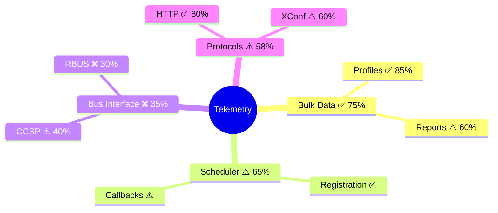

# L2 Test Coverage Gap Analysis

**Generated**: 2026-01-14 10:32:15 | **Coverage**: 62% | **Gaps**: 8 critical, 15 high

## Coverage Map

**Legend**: 🟢 ✅ >75% | 🟡 ⚠️ 40-75% | 🔴 ❌ <40%

## Feature-Test Sync

| Feature | Scenarios | Tests | Status |
|---------|-----------|-------|--------|
| xconf.feature | 8 | 6 | ⚠️ Partial |
| multiprofile.feature | 12 | 12 | ✅ Complete |
| race_conditions | 0 | 5 | 🔄 No feature file |

## Top 5 Critical Gaps

1. **Bus Interface Module** (CRITICAL)
   - Coverage: 35% | Untested APIs: 18
   - Recommended: 8 tests

2. **Scheduler Module** (HIGH)
   - Coverage: 65% | Untested APIs: 12
   - Recommended: 6 tests

3. **Report Generation** (HIGH)
   - Coverage: 60% | Untested APIs: 9
   - Recommended: 5 tests

4. **XConf Protocol** (MEDIUM)
   - Coverage: 60% | Untested APIs: 7
   - Recommended: 4 tests

5. **Error Handling** (HIGH)
   - Coverage: 45% | Untested APIs: 14
   - Recommended: 7 tests

## Quick Actions

- [ ] Create missing feature files for orphaned tests
- [ ] Implement high-priority test scenarios  
- [ ] Focus on critical modules (<40% coverage)
- [ ] Target: 90% coverage by next quarter
