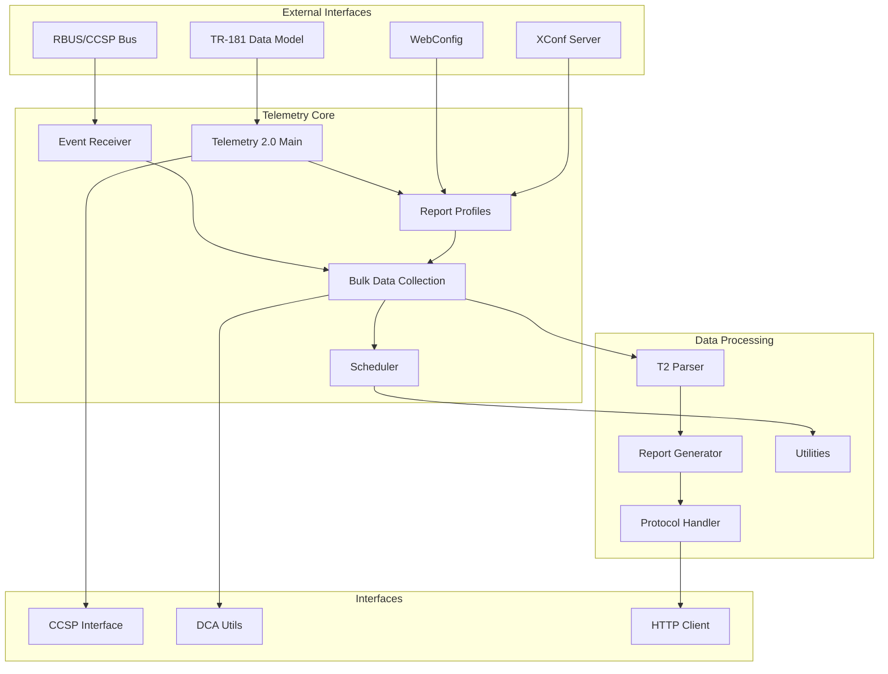
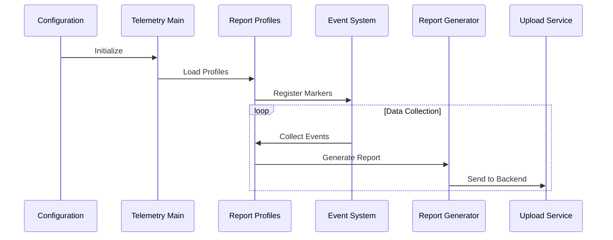

# RDK Telemetry 2.0

A comprehensive telemetry framework for RDK devices that collects, processes, and reports device metrics and events.

## Architecture Overview



## Component Flow



## Key Components

- **Telemetry 2.0 Main** (`source/telemetry2_0.c`) - Core daemon and signal handling
- **Bulk Data** (`source/bulkdata/`) - Profile management and data collection
- **Report Generator** (`source/reportgen/`) - Format and generate telemetry reports
- **Event Receiver** (`source/bulkdata/t2eventreceiver.c`) - Asynchronous event processing
- **Scheduler** (`source/scheduler/`) - Timed report generation
- **CCSP Interface** (`source/ccspinterface/`) - CCSP/RBUS communication
- **Protocol Handler** (`source/protocol/`) - HTTP/HTTPS upload protocols

## Testing

### L1 Tests (Unit Tests)
Located in `source/test/` directory with individual component tests.

```bash
# Run all unit tests
./test/run_ut.sh

# Run with coverage
./test/run_ut.sh --enable-cov
```

**Test Coverage:**
- Bulk data operations
- Data model processing  
- Profile management
- Report generation
- Scheduler functionality
- DCA utilities
- CCSP interface

### L2 Tests (Integration Tests)
Located in `test/functional-tests/` directory with end-to-end scenarios.

```bash
# Run integration tests
./test/run_l2.sh
```

**Test Scenarios:**
- Daemon lifecycle and process management
- Bootup sequence validation
- XConf server communication
- Multi-profile message packet handling

## Quick Start

### Build
```bash
autoreconf --install
./configure
make
```

### Run
```bash
# Start telemetry daemon
./source/telemetry2_0

# Set report profile
./test/set_report_profile.sh
```

### Container Support
```bash
# Build and run in container
./containers/build.sh
docker-compose -f containers/compose.yaml up
```

## Configuration

- **Main Config**: `config/T2Agent.cfg` - CCSP component configuration
- **Default Profile**: `config/Default_T2_ReportProfile.json` - Sample report profile
- **TR-181 Schema**: `config/TR181-T2-USGv2.XML` - Data model definition

## Data Formats

- **JSON** - Modern API format
- **MessagePack** - Binary serialization for efficiency  
- **XML/XDR** - Legacy format support
- **CSV** - Simple export format

## License

Licensed under Apache License 2.0. See `LICENSE` file for details.
