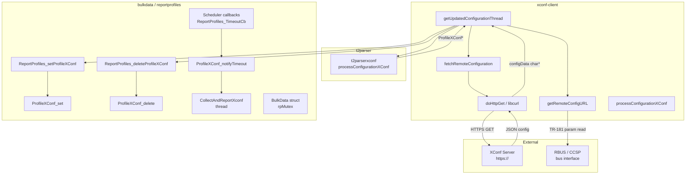
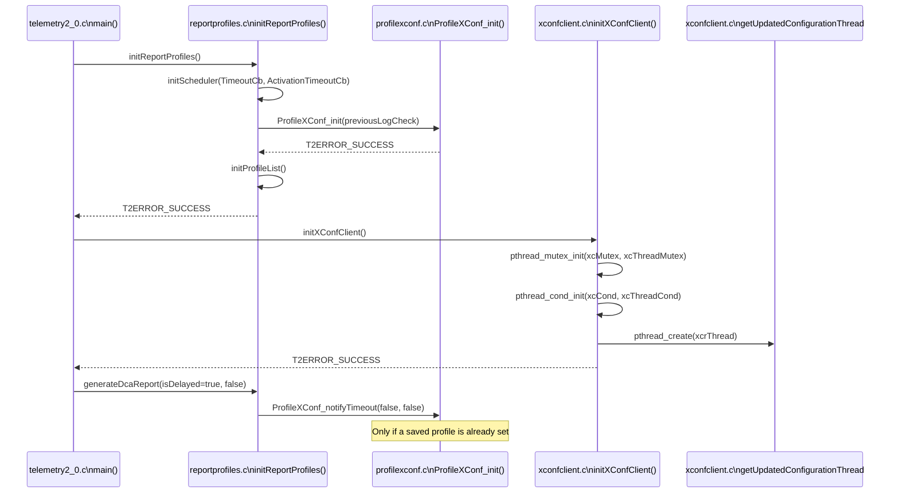
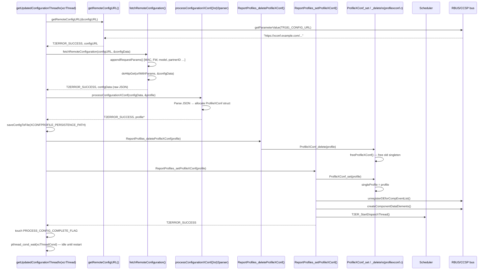
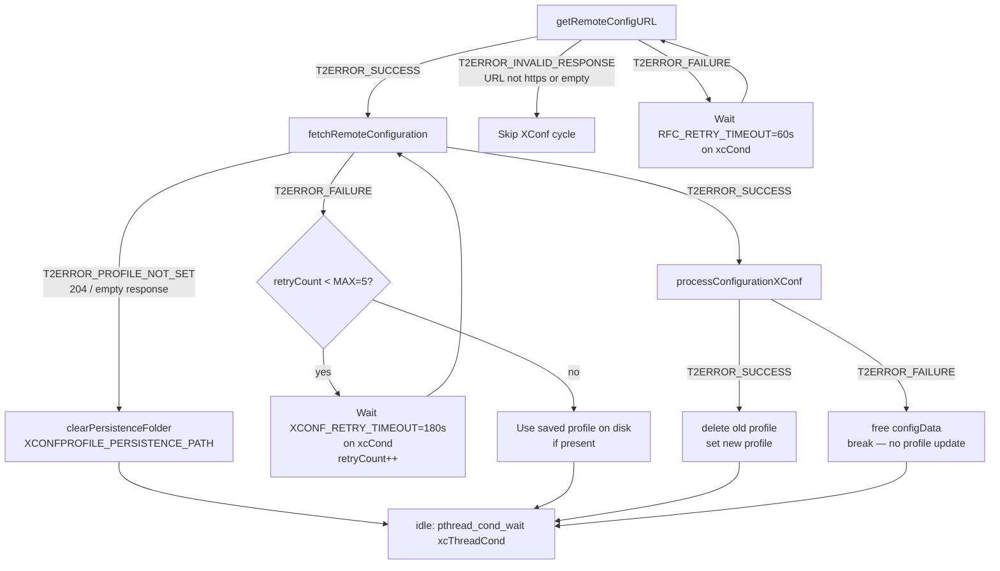
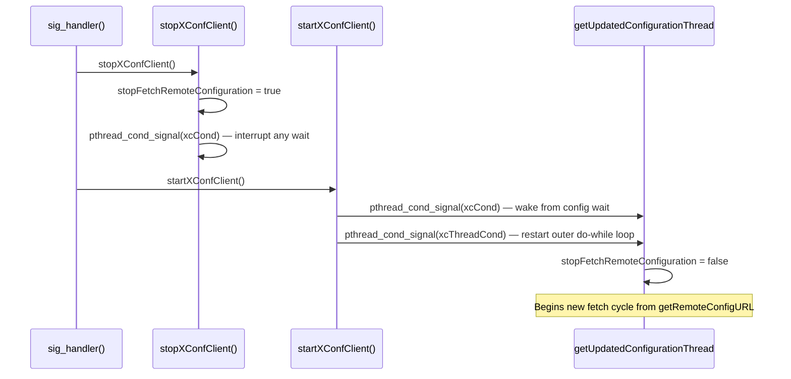
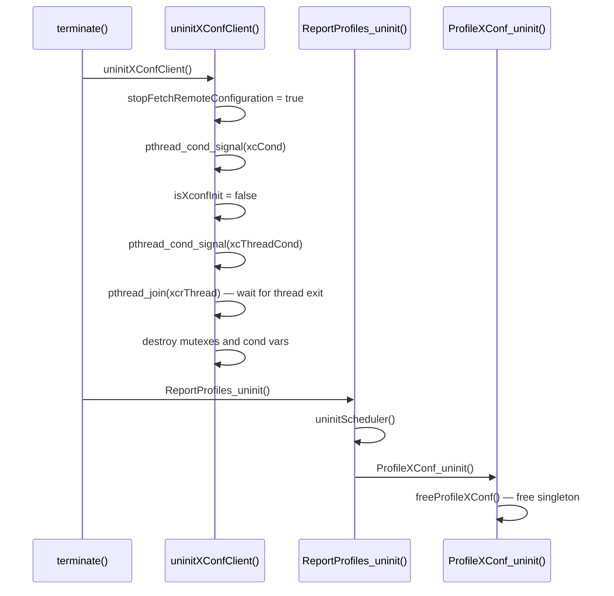
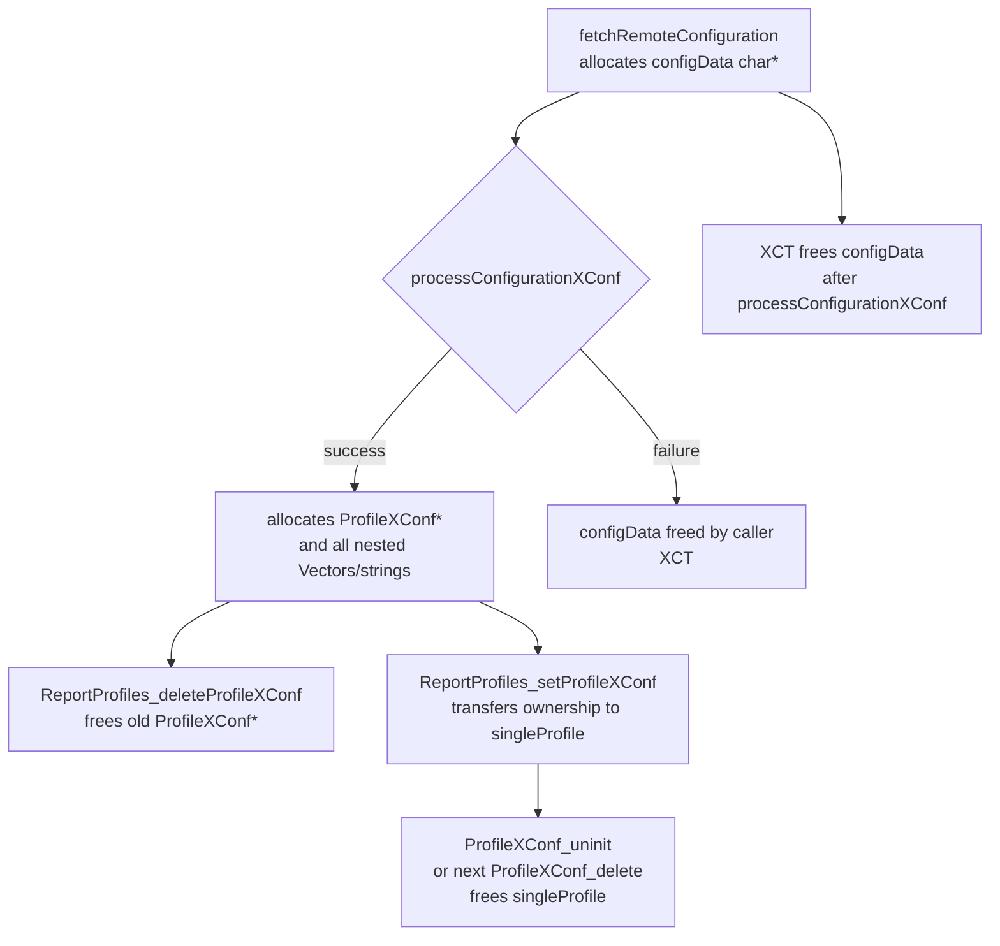
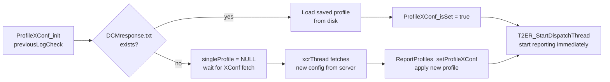

# BulkData ↔ XConf Client Component Interaction

## Overview

The **bulkdata** and **xconf-client** components form the core configuration-and-reporting pipeline of
Telemetry 2.0. XConf Client is responsible for fetching device-specific telemetry configuration from a
remote XConf server and delivering it to Bulkdata, which owns the active `ProfileXConf` singleton and
drives all report generation. The two components interact exclusively through the `reportprofiles` façade
layer: XConf Client never calls bulkdata internals directly, and bulkdata never calls xconf-client
functions during normal operation.

## Architecture

### Component Diagram



### Layers of Responsibility

| Layer | Component | Role |
|-------|-----------|------|
| Configuration fetch | `xconf-client` | Resolves XConf URL, builds HTTP query, fetches and retries |
| Configuration parse | `t2parser` | Converts raw JSON string into a `ProfileXConf*` struct |
| Profile lifecycle | `bulkdata/reportprofiles` | Façade: delete-old → set-new, manages RBUS registration |
| Profile state | `bulkdata/profilexconf` | Owns the singleton `ProfileXConf`, drives `CollectAndReportXconf` |
| Reporting | `bulkdata/profile + reportgen` | Collect log grep / TR-181 values, encode JSON, send over HTTP |

## Data Structures

### ProfileXConf (bulkdata/profilexconf.h)

The single active XConf-sourced profile. Owned by `profilexconf.c`; a pointer is handed from
xconf-client through the façade.

```c
typedef struct _ProfileXConf {
    bool isUpdated;           // Set when a new config arrives mid-cycle
    bool reportInProgress;
    bool bClearSeekMap;
    bool checkPreviousSeek;   // Report previous-log data post reboot
    bool saveSeekConfig;      // Persist grep seek map to storage
    char* name;
    char* protocol;           // "HTTP"
    char* encodingType;       // "JSON"
    unsigned int reportingInterval;
    unsigned int timeRef;
    unsigned int paramNumOfEntries;
    Vector *paramList;        // TR-181 parameter markers
    T2HTTP *t2HTTPDest;       // Destination URL
    Vector *eMarkerList;      // Event markers
    Vector *gMarkerList;      // Grep markers
    Vector *topMarkerList;    // Top-process markers
    Vector *cachedReportList; // Up to MAX_CACHED_REPORTS (5) cached JSON strings
    cJSON *jsonReportObj;
    pthread_t reportThread;
    GrepSeekProfile *grepSeekProfile;
} ProfileXConf;
```

### rdkParams_struct / BulkData (xconfclient.h / reportprofiles.h)

`BulkData` is a module-level configuration struct initialized by `initReportProfiles()` and never
modified by xconf-client.

```c
typedef struct _BulkData {
    bool enable;
    unsigned int minReportInterval;   // 10 seconds minimum
    char *protocols;                  // "HTTP"
    char *encodingTypes;              // "JSON"
    bool parameterWildcardSupported;
    int maxNoOfParamReferences;       // 100
    unsigned int maxReportSize;       // 51200 bytes
} BulkData;
```

## Initialization Sequence

The following sequence shows how the two components are wired together at boot.



## Configuration Fetch and Apply Sequence

This is the primary runtime interaction: xconf-client fetches configuration and hands it to bulkdata.



## Retry and Error Handling



### Retry Parameters

| Constant | Value | Location | Purpose |
|----------|-------|----------|---------|
| `RFC_RETRY_TIMEOUT` | 60 s | `xconfclient.c` | Wait between RFC URL fetch retries |
| `XCONF_RETRY_TIMEOUT` | 180 s | `xconfclient.c` | Wait between XConf HTTP fetch retries |
| `MAX_XCONF_RETRY_COUNT` | 5 | `xconfclient.c` | Maximum HTTP fetch attempts per cycle |

## Reload and Shutdown Sequences

### Configuration Reload (`EXEC_RELOAD` / SIGUSR2)

Triggered by the daemon's signal handler in `telemetry2_0.c`.



### Graceful Shutdown



## Threading Model

### Threads

| Thread | Owner | Name | Created in | Purpose |
|--------|-------|------|-----------|---------|
| `xcrThread` | `xconf-client` | `getUpdatedConfigurationThread` | `initXConfClient()` | Fetch config from XConf server, deliver to bulkdata |
| `reportThread` | `profilexconf.c` | `CollectAndReportXconf` | On each `ProfileXConf_notifyTimeout()` | Collect grep/TR-181 data, build JSON, send via HTTP |
| `dcmThread` | `xconf-client` | `nofifyDCMThread` | `startDCMClient()` (DCMAGENT builds only) | Notify DCM agent after config is set |

### Synchronization Primitives

```c
/* xconf-client (xconfclient.c) */
static pthread_mutex_t xcMutex;       // Guards fetch retry waits (xcCond)
static pthread_mutex_t xcThreadMutex; // Guards the outer do-while loop (xcThreadCond)
static pthread_cond_t  xcCond;        // Signalled to interrupt fetch retry sleep
static pthread_cond_t  xcThreadCond;  // Signalled on stop/restart to wake outer loop

/* bulkdata/reportprofiles (reportprofiles.c) */
pthread_mutex_t rpMutex;              // Guards BulkData struct and profile list state

/* bulkdata/profilexconf (profilexconf.c) */
static pthread_mutex_t plMutex;       // Guards singleProfile pointer during report thread
static pthread_cond_t  reuseThread;   // Allows report thread reuse between intervals
```

### Lock Ordering

To avoid deadlocks, acquire locks in this order when multiple are needed:

1. `xcThreadMutex` (outer XConf fetch loop)
2. `xcMutex` (inner XConf fetch retry)
3. `rpMutex` (bulkdata profile list)
4. `plMutex` (ProfileXConf singleton)

> **Note**: `xcMutex` and `plMutex` are never held simultaneously in the current code. `rpMutex` is
> held briefly within the `reportprofiles` façade calls and released before `plMutex` is taken.

### Thread Safety Guarantees

| Function | Thread Safety | Notes |
|----------|---------------|-------|
| `initXConfClient()` | Not thread-safe | Call once at startup |
| `stopXConfClient()` | Thread-safe | Signals `xcCond` under `xcMutex` |
| `startXConfClient()` | Thread-safe | Signals both cond vars under respective mutexes |
| `uninitXConfClient()` | Thread-safe | Joins `xcrThread`; call once at shutdown |
| `ReportProfiles_setProfileXConf()` | Thread-safe | Guards via `rpMutex` + `plMutex` |
| `ReportProfiles_deleteProfileXConf()` | Thread-safe | Guards via `plMutex` |
| `ProfileXConf_notifyTimeout()` | Thread-safe | Spawns/reuses `reportThread` under `plMutex` |
| `ProfileXConf_isSet()` | Thread-safe (read) | No write path during steady state |

## Memory Management

### Ownership Map



### Allocation Lifecycle

```c
// 1. xconf-client allocates raw config string
char *configData = NULL;
fetchRemoteConfiguration(configURL, &configData);    // heap-alloc inside doHttpGet

// 2. t2parser allocates the ProfileXConf struct tree
ProfileXConf *profile = NULL;
processConfigurationXConf(configData, &profile);     // deep allocation

free(configData); configData = NULL;                 // XCT frees raw string immediately

// 3. bulkdata deletes previous profile (if any)
ReportProfiles_deleteProfileXConf(profile);          // frees old singleProfile

// 4. bulkdata takes ownership of new profile
ReportProfiles_setProfileXConf(profile);             // singleProfile = profile

// 5. On uninit or next update: bulkdata frees
ProfileXConf_uninit();                               // calls freeProfileXConf()
// -> free(name), Vectors, t2HTTPDest, grepSeekProfile, ...
```

### Memory Budget

| Item | Approximate Size | Notes |
|------|-----------------|-------|
| `ProfileXConf` struct | ~256 bytes | Stack of booleans, pointers, pthread_t |
| `grepSeekProfile` | ~128 bytes + seek entries | Persisted to disk |
| `eMarkerList` / `gMarkerList` entries | ~64–128 bytes each | Depends on string lengths |
| `paramList` entries | ~96 bytes each | TR-181 parameter paths |
| `cachedReportList` entries | Up to 64 KB each | Max 5 cached (`MAX_CACHED_REPORTS`) |
| `configData` (raw JSON) | ~4–32 KB | Freed immediately after parsing |
| Peak during fetch + parse | ~100–200 KB | `configData` + `ProfileXConf` tree co-exist briefly |

## API Reference

### xconf-client Public API (`xconfclient.h`)

#### `initXConfClient()`

```c
T2ERROR initXConfClient(void);
```

Initializes synchronization primitives and creates the `xcrThread` background fetch thread.
Must be called after `initReportProfiles()`.

**Returns:** `T2ERROR_SUCCESS` always (thread creation is best-effort).

**Thread safety:** Not thread-safe; call once at startup.

---

#### `stopXConfClient()`

```c
T2ERROR stopXConfClient(void);
```

Signals the fetch thread to stop its current retry loop without terminating the thread.
Used as the first step of a configuration reload.

**Thread safety:** Thread-safe.

---

#### `startXConfClient()`

```c
T2ERROR startXConfClient(void);
```

Wakes the fetch thread to start a new full fetch cycle (URL resolution → HTTP fetch → apply).
Paired with `stopXConfClient()` for reload.

**Thread safety:** Thread-safe.

---

#### `uninitXConfClient()`

```c
void uninitXConfClient(void);
```

Signals the fetch thread to exit, joins `xcrThread`, and destroys all synchronization objects.
Must be called at shutdown before `ReportProfiles_uninit()`.

**Thread safety:** Thread-safe; call once.

---

#### `fetchRemoteConfiguration()`

```c
T2ERROR fetchRemoteConfiguration(char *configURL, char **configData);
```

Performs the HTTPS GET to the XConf server. Appends device-identifying query parameters
(MAC address, firmware version, model, partner ID, account ID, build type).

**Parameters:**
- `configURL` — Base HTTPS URL (must begin with `https://`, non-NULL)
- `configData` — Receives heap-allocated JSON response string; caller must `free()`

**Returns:** `T2ERROR_SUCCESS`, `T2ERROR_PROFILE_NOT_SET` (empty/204 response),
or `T2ERROR_FAILURE`.

---

#### `getRemoteConfigURL()`

```c
T2ERROR getRemoteConfigURL(char **configURL);
```

Reads `Device.DeviceInfo.X_RDKCENTRAL-COM_RFC.Feature.Telemetry.ConfigURL` via the bus
interface. Enforces `https://` prefix. Retries up to 3 times on transient TR-181 errors.

**Returns:** `T2ERROR_SUCCESS`, `T2ERROR_INVALID_RESPONSE` (non-https URL),
or `T2ERROR_FAILURE`.

---

### bulkdata/reportprofiles Façade API (`reportprofiles.h`)

#### `initReportProfiles()`

```c
T2ERROR initReportProfiles(void);
```

Initializes the entire bulkdata subsystem: scheduler, marker maps, event receiver, `ProfileXConf`,
`ProfileList`, and optionally RBUS data model elements. Must be called before `initXConfClient()`.

---

#### `ReportProfiles_setProfileXConf()`

```c
T2ERROR ReportProfiles_setProfileXConf(ProfileXConf *profile);
```

Sets the singleton `ProfileXConf` and restarts the dispatch/event thread. Called by xconf-client
after a successful configuration fetch and parse.

**Memory:** Takes ownership of `profile`. Do not free after a successful call.

**Thread safety:** Thread-safe.

---

#### `ReportProfiles_deleteProfileXConf()`

```c
T2ERROR ReportProfiles_deleteProfileXConf(ProfileXConf *profile);
```

Stops the dispatch thread, clears the marker component map, then calls `ProfileXConf_delete()`
to free the current singleton. Called by xconf-client immediately before
`ReportProfiles_setProfileXConf()` with the new config.

**Thread safety:** Thread-safe.

---

#### `generateDcaReport()`

```c
void generateDcaReport(bool isDelayed, bool isOnDemand);
```

Triggers an immediate `ProfileXConf_notifyTimeout()` call. Called by `telemetry2_0.c` at boot
(with `isDelayed=true`) to generate the first XConf report after a 120-second stabilization delay.

---

#### `ReportProfiles_uninit()`

```c
T2ERROR ReportProfiles_uninit(void);
```

Tears down the bulkdata subsystem: stops all threads, calls `ProfileXConf_uninit()`, frees all
profiles and resources. Must be called after `uninitXConfClient()`.

## Persistence

Both components interact with the filesystem for resilience across reboots.

| Path | Owner | Purpose |
|------|-------|---------|
| `XCONFPROFILE_PERSISTENCE_PATH/DCMresponse.txt` | xconf-client writes | Saved raw XConf JSON response |
| `XCONFPROFILE_PERSISTENCE_PATH/` | profilexconf reads at init | Restore previous XConf profile on reboot |
| `REPORTPROFILES_PERSISTENCE_PATH/` | bulkdata | Saved TR-181-sourced report profiles |
| `CACHED_MESSAGE_PATH/<profileName>/` | profilexconf | Cached reports pending upload |
| `SEEKFOLDER/` | profilexconf | Grep seek map for log monitoring continuity |
| `/tmp/t2DcmComplete` | xconf-client touches | Signals DCM-dependent scripts |

### Boot Recovery Flow



## Error Scenarios

### XConf Server Unreachable

1. `fetchRemoteConfiguration()` returns `T2ERROR_FAILURE`.
2. `xcrThread` waits `XCONF_RETRY_TIMEOUT` (180 s) on `xcCond`.
3. Retries up to `MAX_XCONF_RETRY_COUNT` (5) times.
4. After 5 failures: uses saved `DCMresponse.txt` from disk if available; otherwise no
   XConf profile is active until the next reload.

### Config URL Not Configured

1. `getRemoteConfigURL()` returns `T2ERROR_INVALID_RESPONSE`.
2. `xcrThread` skips the fetch cycle entirely (`T2ERROR_PROFILE_NOT_SET` path).
3. No profile is deleted; existing active profile continues.

### Malformed Configuration JSON

1. `processConfigurationXConf()` returns `T2ERROR_FAILURE`.
2. `configData` is freed; `profile` pointer is NULL.
3. `xcrThread` breaks out of the inner loop without calling `setProfileXConf`.
4. Existing active profile continues unchanged.

### Profile Update During Report Generation

1. New config arrives while `CollectAndReportXconf` is running.
2. `ProfileXConf_set()` sets `singleProfile->isUpdated = true`.
3. `CollectAndReportXconf` detects `isUpdated`, caches the in-progress report in
   `cachedReportList` instead of sending it.
4. Report is sent on the next timeout cycle with the updated profile.

## Platform Notes

### RDKB

- Waits for `/tmp/pam_initialized` before calling `getRemoteConfigURL()` to avoid PAM
  deadlocks (up to 20 × 6-second retries).
- Uses `Device.DeviceInfo.SoftwareVersion` for firmware version in XConf query params.
- `DEVICE_EXTENDER` builds skip xconf-client entirely; profile management uses only
  TR-181 data model path.

### RDKV / RDKC

- Fetches timezone from `/opt/output.json` or `/opt/persistent/timeZoneDST` and includes
  it as a `timezone=` query parameter in the XConf request.
- Uses `Device.DeviceInfo.X_COMCAST-COM_FirmwareFilename` for firmware version.

### WhoAmi-Enabled Builds

- Appends `osClass=` and `partnerId=` (from `PartnerName` TR-181 path) to XConf query
  when `isWhoAmiEnabled()` returns true.

## Testing

Unit tests for both components live in `source/test/`:

| Test File | Tests |
|-----------|-------|
| `source/test/xconf-client/` | Mock-based tests for URL building, HTTP retries, and profile handoff |
| `source/test/bulkdata/profilexconfMock.cpp` | Mock for `processConfigurationXConf` used by xconf-client tests |
| `source/test/t2parser/t2parserTest.cpp` | `processConfigurationXConf` parse correctness tests |

### Key Mock Points

- `processConfigurationXConf` — intercepted in `xconfclientMock.cpp` via `dlsym(RTLD_NEXT)` to
  test xconf-client logic without real JSON parsing.
- `curl_easy_setopt` / `curl_easy_getinfo` — replaced by mock stubs in `GTEST_ENABLE` builds.
- `sendReportOverHTTP` / `sendCachedReportsOverHTTP` — wrapped in `GTEST_ENABLE` builds to
  test report caching without network I/O.

## See Also

- [Architecture Overview](overview.md) — System-wide component map
- [Threading Model](threading-model.md) — Full process-wide thread inventory
- [Public API Reference](../api/public-api.md) — External telemetry client API
- [source/xconf-client/xconfclient.c](../../source/xconf-client/xconfclient.c) — XConf Client implementation
- [source/bulkdata/reportprofiles.c](../../source/bulkdata/reportprofiles.c) — ReportProfiles façade
- [source/bulkdata/profilexconf.c](../../source/bulkdata/profilexconf.c) — ProfileXConf singleton and report thread
- [source/t2parser/t2parserxconf.c](../../source/t2parser/t2parserxconf.c) — XConf JSON parser
