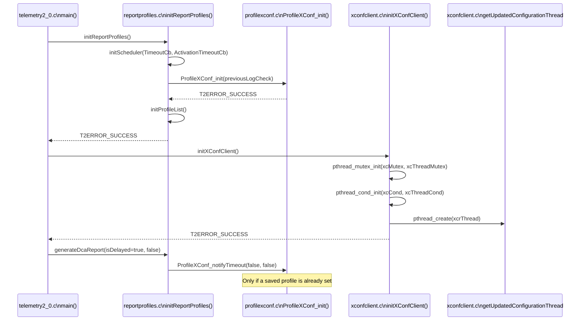
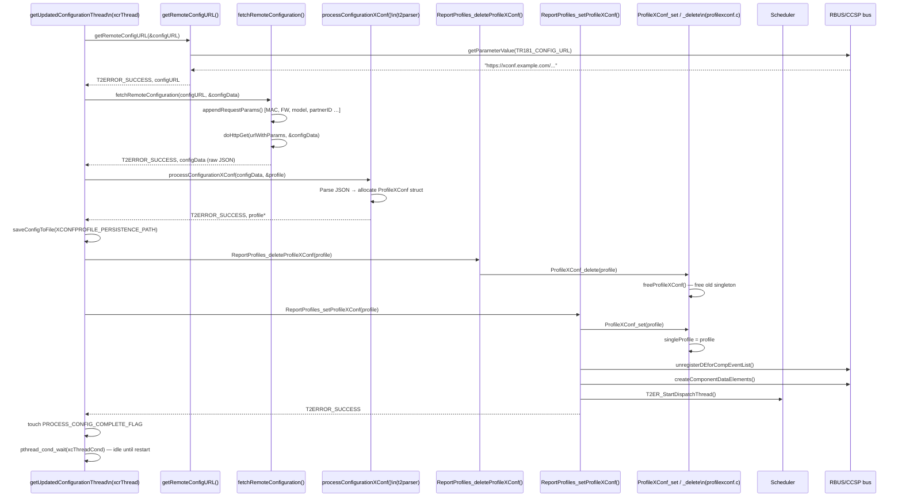
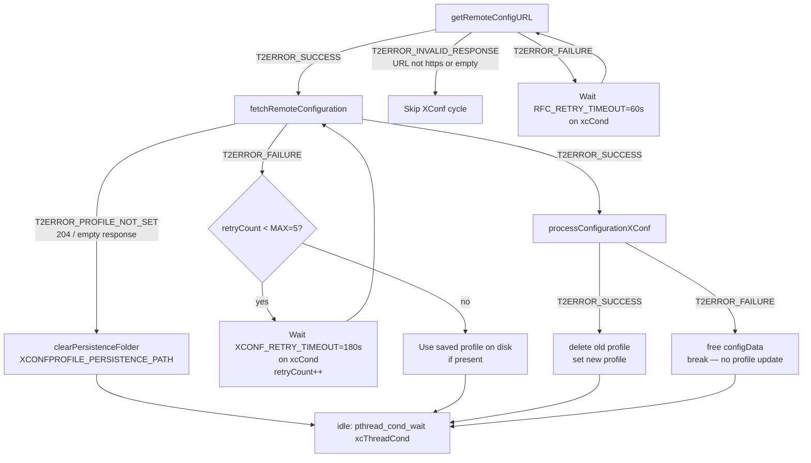
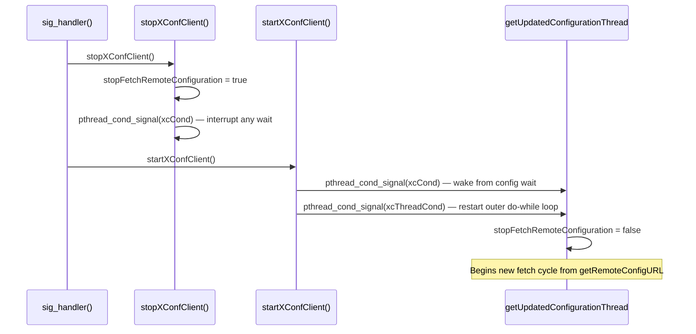
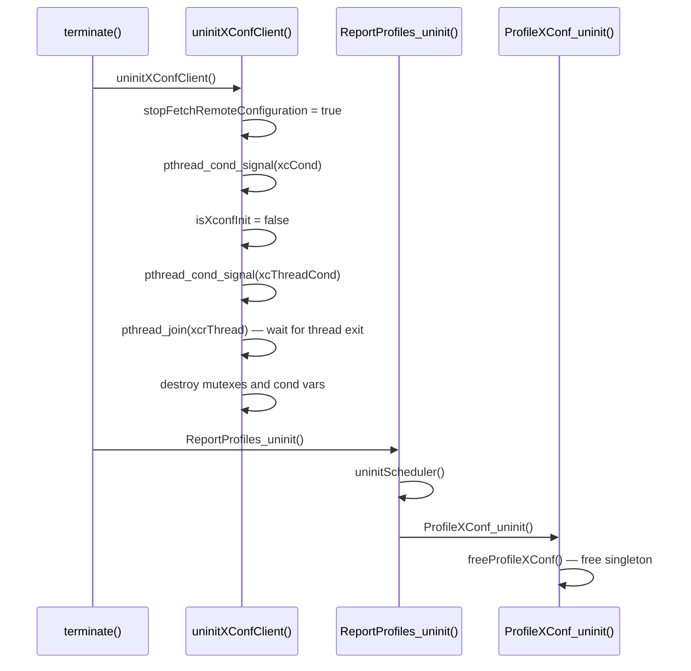
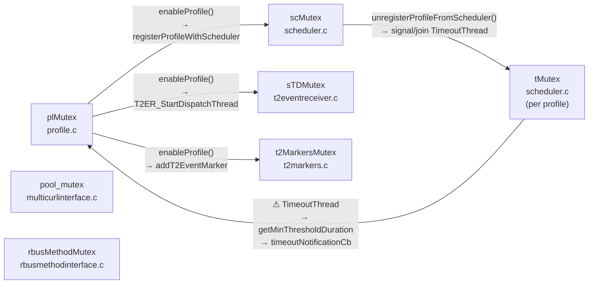
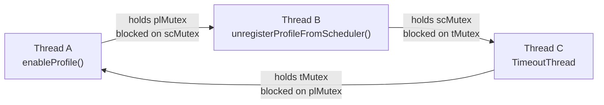
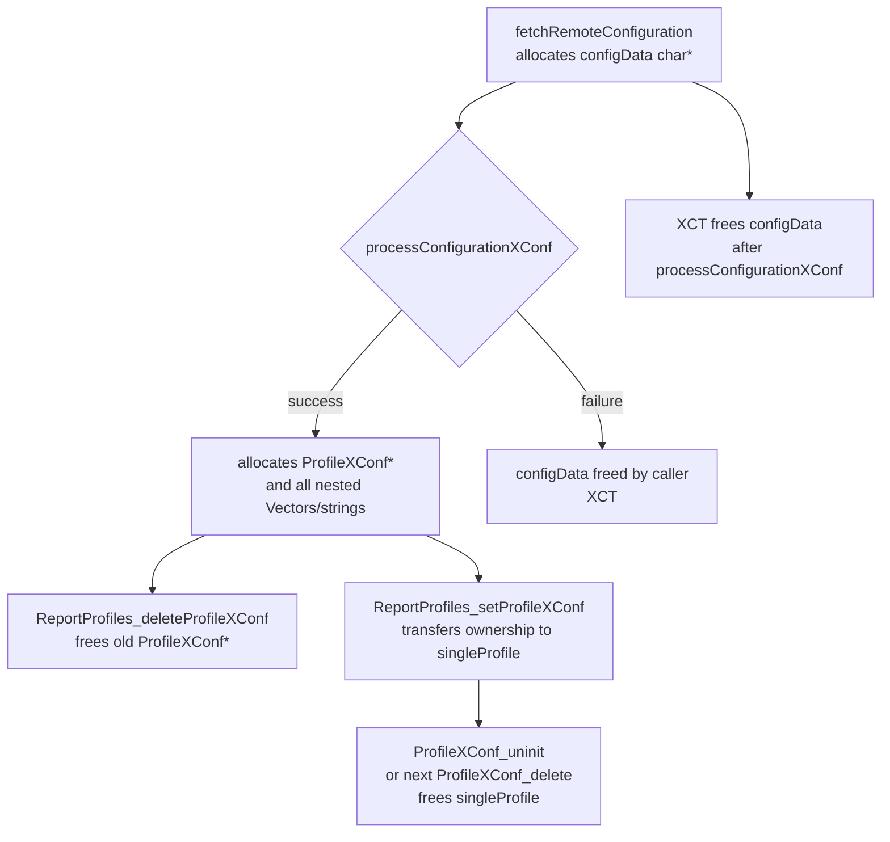
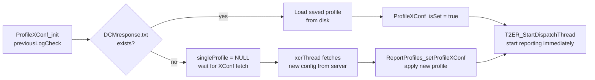

# BulkData ↔ XConf Client Component Interaction

## Overview

The **bulkdata** and **xconf-client** components form the core configuration-and-reporting pipeline of
Telemetry 2.0. XConf Client is responsible for fetching device-specific telemetry configuration from a
remote XConf server and delivering it to Bulkdata, which owns the active `ProfileXConf` singleton and
drives all report generation. The two components interact exclusively through the `reportprofiles` façade
layer: XConf Client never calls bulkdata internals directly, and bulkdata never calls xconf-client
functions during normal operation.

## Architecture

### Component Diagram

This diagram shows all six major subsystems and the call paths between them. Dashed arrows
(⚠) mark paths where a callback fires **with a scheduler lock already held**, creating the
circular dependency described in the [Deadlock Analysis](#deadlock-analysis) section.

```mermaid
graph TB
    subgraph XC["xconf-client"]
        XCT["getUpdatedConfigurationThread\nxcMutex / xcThreadMutex"]
        GRC[getRemoteConfigURL]
        FRC["fetchRemoteConfiguration\nretry loop"]
    end

    subgraph PARSER["t2parser"]
        PRX[processConfigurationXConf]
    end

    subgraph BD["bulkdata"]
        RP["reportprofiles façade\nrpMutex"]
        PXF["profilexconf singleton\nplMutex · reuseThread"]
        PRF["profile list\nplMutex · per-profile locks"]
    end

    subgraph TER["t2eventreceiver / t2markers"]
        TM["t2markers\nt2MarkersMutex / t2CompListMutex"]
        ER["t2eventreceiver\nsTDMutex · erMutex"]
    end

    subgraph SCH["scheduler"]
        SCHED["profileList · scMutex"]
        TTO["TimeoutThread (per profile)\ntMutex"]
    end

    subgraph RG["reportgen"]
        ENC["encode* / prepareJSONReport\n(no locks — pure encoding)"]
    end

    subgraph CCSP["ccspinterface"]
        BUS["busInterface / rbusInterface\nasyncMutex (RBUS-get only)"]
    end

    subgraph PROTO["protocol"]
        HTTP["http pool\npool_mutex"]
        RBUSM["rbus method\nrbusMethodMutex"]
    end

    subgraph EXT["External"]
        XSRV["XConf Server (HTTPS)"]
        BBUS["RBUS / CCSP bus"]
        RSVR["Report Endpoint (HTTPS)"]
    end

    %% xconf-client internal flow
    XCT --> GRC
    XCT --> FRC
    XCT --> PRX

    %% xconf-client → bulkdata façade
    XCT ==>|"deleteProfileXConf\nsetProfileXConf"| RP

    %% xconf-client → ccspinterface
    GRC -->|"getParameterValue\n(RFC Config URL)"| BUS

    %% xconf-client → external
    FRC <-->|"HTTPS GET"| XSRV

    %% bulkdata façade internal
    RP --> PXF
    RP --> PRF

    %% bulkdata façade → scheduler
    RP -->|"registerProfile / unregisterProfile"| SCHED
    RP -->|"T2ER_StartDispatchThread"| ER
    RP -->|"addT2EventMarker / clearMarkerMap"| TM
    SCHED --> TTO

    %% scheduler → bulkdata CALLBACKS (deadlock zone)
    TTO -. "⚠ TimeoutNotificationCB\n(tMutex held)" .-> RP
    TTO -. "⚠ notifySchedulerstartcb\n(tMutex held)" .-> RP

    %% bulkdata → ccspinterface (from report threads)
    PRF -->|"getProfileParameterValues"| BUS
    PXF -->|"getProfileParameterValues"| BUS
    RP -->|"createDataElements / unregisterDE"| BUS

    %% bulkdata → reportgen (no lock risk)
    PRF -->|"prepareJSONReport\nencodeGrepResultInJSON"| ENC
    PXF -->|"prepareJSONReport\nencodeGrepResultInJSON"| ENC

    %% bulkdata → protocol (from report threads, no lock risk)
    PRF -->|"sendReportOverHTTP"| HTTP
    PXF -->|"sendReportOverHTTP"| HTTP
    PRF -->|"sendReportsOverRBUSMethod"| RBUSM
    PXF -->|"sendReportsOverRBUSMethod"| RBUSM

    %% protocol → external
    HTTP <-->|"HTTPS POST"| RSVR
    RBUSM <-->|"RBUS method call"| BBUS
    BUS <-->|"RBUS / CCSP IPC"| BBUS
```



### Layers of Responsibility

| Layer | Component | Role |
|-------|-----------|------|
| Configuration fetch | `xconf-client` | Resolves XConf URL, builds HTTP query, fetches and retries |
| Configuration parse | `t2parser` | Converts raw JSON string into a `ProfileXConf*` struct |
| Profile lifecycle | `bulkdata/reportprofiles` | Façade: delete-old → set-new, manages RBUS registration |
| Profile state | `bulkdata/profilexconf` | Owns the singleton `ProfileXConf`, drives `CollectAndReportXconf` |
| Multi-profile state | `bulkdata/profile` | Owns the TR-181 profile list, drives per-profile `CollectAndReport` threads |
| Timer dispatch | `scheduler` | Maintains per-profile `TimeoutThread`; fires callbacks into `reportprofiles` |
| Encoding | `reportgen` | Stateless JSON encoder; no locks, called from report threads |
| Bus abstraction | `ccspinterface` | Routes TR-181 get/set calls to RBUS or CCSP; minimal internal locking |
| Transport | `protocol` | HTTP connection pool (`pool_mutex`) and async RBUS method sender |

## Data Structures

### ProfileXConf (bulkdata/profilexconf.h)

The single active XConf-sourced profile. Owned by `profilexconf.c`; a pointer is handed from
xconf-client through the façade.

```c
typedef struct _ProfileXConf {
    bool isUpdated;           // Set when a new config arrives mid-cycle
    bool reportInProgress;
    bool bClearSeekMap;
    bool checkPreviousSeek;   // Report previous-log data post reboot
    bool saveSeekConfig;      // Persist grep seek map to storage
    char* name;
    char* protocol;           // "HTTP"
    char* encodingType;       // "JSON"
    unsigned int reportingInterval;
    unsigned int timeRef;
    unsigned int paramNumOfEntries;
    Vector *paramList;        // TR-181 parameter markers
    T2HTTP *t2HTTPDest;       // Destination URL
    Vector *eMarkerList;      // Event markers
    Vector *gMarkerList;      // Grep markers
    Vector *topMarkerList;    // Top-process markers
    Vector *cachedReportList; // Up to MAX_CACHED_REPORTS (5) cached JSON strings
    cJSON *jsonReportObj;
    pthread_t reportThread;
    GrepSeekProfile *grepSeekProfile;
} ProfileXConf;
```

### rdkParams_struct / BulkData (xconfclient.h / reportprofiles.h)

`BulkData` is a module-level configuration struct initialized by `initReportProfiles()` and never
modified by xconf-client.

```c
typedef struct _BulkData {
    bool enable;
    unsigned int minReportInterval;   // 10 seconds minimum
    char *protocols;                  // "HTTP"
    char *encodingTypes;              // "JSON"
    bool parameterWildcardSupported;
    int maxNoOfParamReferences;       // 100
    unsigned int maxReportSize;       // 51200 bytes
} BulkData;
```

## Initialization Sequence

The following sequence shows how the two components are wired together at boot.



## Configuration Fetch and Apply Sequence

This is the primary runtime interaction: xconf-client fetches configuration and hands it to bulkdata.



## Retry and Error Handling



### Retry Parameters

| Constant | Value | Location | Purpose |
|----------|-------|----------|---------|
| `RFC_RETRY_TIMEOUT` | 60 s | `xconfclient.c` | Wait between RFC URL fetch retries |
| `XCONF_RETRY_TIMEOUT` | 180 s | `xconfclient.c` | Wait between XConf HTTP fetch retries |
| `MAX_XCONF_RETRY_COUNT` | 5 | `xconfclient.c` | Maximum HTTP fetch attempts per cycle |

## Reload and Shutdown Sequences

### Configuration Reload (`EXEC_RELOAD` / SIGUSR2)

Triggered by the daemon's signal handler in `telemetry2_0.c`.



### Graceful Shutdown



## Threading Model

### Threads

| Thread | Owner | Name | Created in | Purpose |
|--------|-------|------|-----------|---------|
| `xcrThread` | `xconf-client` | `getUpdatedConfigurationThread` | `initXConfClient()` | Fetch config from XConf server, deliver to bulkdata |
| `reportThread` | `profilexconf.c` | `CollectAndReportXconf` | On each `ProfileXConf_notifyTimeout()` | Collect grep/TR-181 data, build JSON, send via HTTP || `reportThread` (per profile) | `profile.c` | `CollectAndReport` | On each `Profile_notifyTimeout()` | Collect data and send for TR-181 multi-profile path |
| `TimeoutThread` (per profile) | `scheduler.c` | `TimeoutThread` | `registerProfileWithScheduler()` | Per-profile timed wait; fires `TimeoutNotificationCB` and `notifySchedulerstartcb` |
| Event dispatch | `t2eventreceiver.c` | (internal) | `T2ER_StartDispatchThread()` | Dequeues marker events and dispatches to profiles |
| Datamodel workers (×3) | `datamodel.c` | (internal) | `initProfileTableFromConfiguration()` | Process JSON / msgpack profile-update queues || `dcmThread` | `xconf-client` | `nofifyDCMThread` | `startDCMClient()` (DCMAGENT builds only) | Notify DCM agent after config is set |

### Synchronization Primitives

```c
/* xconf-client (xconfclient.c) */
static pthread_mutex_t xcMutex;              // Guards fetch retry waits (xcCond)
static pthread_mutex_t xcThreadMutex;        // Guards the outer do-while loop (xcThreadCond)
static pthread_cond_t  xcCond;               // Signalled to interrupt fetch retry sleep
static pthread_cond_t  xcThreadCond;         // Signalled on stop/restart to wake outer loop

/* bulkdata/reportprofiles (reportprofiles.c) */
pthread_mutex_t rpMutex;                     // Guards BulkData struct and profile list state

/* bulkdata/profilexconf (profilexconf.c) */
static pthread_mutex_t plMutex;              // Guards singleProfile pointer during report thread
static pthread_cond_t  reuseThread;          // Allows XConf report thread reuse between intervals

/* bulkdata/profile.c — global */
static pthread_mutex_t plMutex;              // Guards multi-profile profileList vector
static pthread_mutex_t triggerConditionQueMutex; // Guards deferred trigger-condition queue

/* bulkdata/profile.h — per Profile instance */
pthread_mutex_t eventMutex;                  // Protects eMarkerList during encoding
pthread_mutex_t reportMutex;                 // Guards max-upload-latency timedwait
pthread_cond_t  reportcond;                  // Wakes report thread at upload deadline
pthread_mutex_t reportInProgressMutex;       // Guards reportInProgress flag
pthread_cond_t  reportInProgressCond;        // Wakes deleteProfile when report finishes
pthread_mutex_t reuseThreadMutex;            // Per-profile thread-reuse loop guard
pthread_cond_t  reuseThread;                 // Wakes reused CollectAndReport thread

/* scheduler (scheduler.c) */
static pthread_mutex_t scMutex;              // Protects global scheduler profileList
/* scheduler (scheduler.h) — per SchedulerProfile */
pthread_mutex_t tMutex;                      // Per-profile timer loop; held across callbacks
pthread_cond_t  tCond;                       // Per-profile timed wait (CLOCK_MONOTONIC)

/* t2markers (t2markers.c) */
static pthread_mutex_t t2MarkersMutex;       // Protects markerCompMap hash
static pthread_mutex_t t2CompListMutex;      // Protects componentList vector

/* t2eventreceiver (t2eventreceiver.c) */
static pthread_mutex_t erMutex;              // Protects event queue
static pthread_cond_t  erCond;               // Wakes dispatch thread on new event
static pthread_mutex_t sTDMutex;             // Serialises dispatch thread start/stop

/* protocol/http (multicurlinterface.c) */
static pthread_mutex_t pool_mutex;           // Guards CURL handle pool state

/* protocol/rbus (rbusmethodinterface.c) */
static pthread_mutex_t rbusMethodMutex;      // Blocks caller until async RBUS method ACK

/* ccspinterface/rbusInterface.c */
static pthread_mutex_t asyncMutex;           // RBUS async-get callback synchronisation

/* bulkdata/datamodel.c */
static pthread_mutex_t rpMutex;              // Protects JSON profile-update queue
static pthread_mutex_t tmpRpMutex;           // Protects temp profile queue
static pthread_mutex_t rpMsgMutex;           // Protects msgpack blob queue
```

### Lock Ordering

Acquire locks in ranked order. **Never acquire a lower-ranked lock while holding a higher-ranked
one from a different chain.** The XConf and scheduler chains must not interleave.

| Rank | Lock | File | Guards |
|------|------|------|--------|
| 1 | `xcThreadMutex` | `xconfclient.c` | XConf thread lifecycle |
| 2 | `xcMutex` | `xconfclient.c` | XConf fetch retry wait |
| 3 | `rpMutex` | `reportprofiles.c` | BulkData struct, high-level profile state |
| 4 | `scMutex` | `scheduler.c` | Scheduler profile list |
| 5 | `plMutex` (profilexconf) | `profilexconf.c` | XConf singleton |
| 6 | `plMutex` (profile) | `profile.c` | Multi-profile list |
| 7 | `tMutex` | `scheduler.c` (per profile) | Per-profile timer loop |
| 8 | Per-profile locks | `profile.h` | `eventMutex`, `reportMutex`, `reuseThreadMutex` |
| 9 | `t2MarkersMutex` | `t2markers.c` | Marker component map |
| 10 | `sTDMutex` | `t2eventreceiver.c` | Dispatch thread start/stop |
| 11 | `pool_mutex` | `multicurlinterface.c` | HTTP connection pool |
| 12 | `rbusMethodMutex` | `rbusmethodinterface.c` | Async RBUS method ACK |

> **Known violation**: `TimeoutThread` holds rank-7 (`tMutex`) and acquires rank-6 (`plMutex`)
> via its callbacks. `profile.c::enableProfile` holds rank-6 (`plMutex`) and acquires rank-4
> (`scMutex`) via `registerProfileWithScheduler`. Together with `unregisterProfileFromScheduler`
> holding rank-4 while waiting on rank-7, this forms the three-thread deadlock cycle documented
> in the [Deadlock Analysis](#deadlock-analysis) section below.
>
> `profilexconf.c::ProfileXConf_set` was already patched to release `plMutex` before calling
> `registerProfileWithScheduler`. The equivalent fix has **not** been applied in `profile.c::enableProfile`.

### Thread Safety Guarantees

| Function | Thread Safety | Notes |
|----------|---------------|-------|
| `initXConfClient()` | Not thread-safe | Call once at startup |
| `stopXConfClient()` | Thread-safe | Signals `xcCond` under `xcMutex` |
| `startXConfClient()` | Thread-safe | Signals both cond vars under respective mutexes |
| `uninitXConfClient()` | Thread-safe | Joins `xcrThread`; call once at shutdown |
| `ReportProfiles_setProfileXConf()` | Thread-safe | Guards via `rpMutex` + `plMutex` |
| `ReportProfiles_deleteProfileXConf()` | Thread-safe | Guards via `plMutex` |
| `ProfileXConf_notifyTimeout()` | Thread-safe | Spawns/reuses `reportThread` under `plMutex` |
| `ProfileXConf_isSet()` | Thread-safe (read) | No write path during steady state |

## Deadlock Analysis

### Lock Dependency Graph

The graph below shows all inter-component lock acquisition paths. Red edges form the circular
dependency that can produce a hard hang.



### Risk 1 — Three-Thread Deadlock Cycle (CRITICAL)

**Files**: `profile.c::enableProfile` ↔ `scheduler.c::unregisterProfileFromScheduler` ↔
`scheduler.c::TimeoutThread`



| Thread | Holds | Waiting For |
|--------|-------|-------------|
| A — `enableProfile()` | `plMutex` | `scMutex` (via `registerProfileWithScheduler`) |
| B — `unregisterProfile()` | `scMutex` | `tMutex` (signal/join `TimeoutThread`) |
| C — `TimeoutThread` | `tMutex` | `plMutex` (via `getMinThresholdDuration` / `timeoutNotificationCb`) |

**Root cause**: `profilexconf.c::ProfileXConf_set` was patched to release `plMutex` before
calling `registerProfileWithScheduler`. The equivalent fix has **not** been applied to
`profile.c::enableProfile`, which also calls `registerProfileWithScheduler` and
`T2ER_StartDispatchThread` while holding `plMutex`.

**Fix**: In `profile.c::enableProfile`, copy the necessary profile pointer out of the list, release
`plMutex`, then call `registerProfileWithScheduler()` and `T2ER_StartDispatchThread()`, mirroring
the pattern already applied in `profilexconf.c::ProfileXConf_set`.

---

### Risk 2 — `deleteProfile` Holds `plMutex` Across `pthread_join` (HIGH)

**File**: `profile.c::deleteProfile`

`deleteProfile` acquires `plMutex` and then calls `pthread_join(reportThread)`, waiting for a
`CollectAndReport` thread that may be executing a long-running operation (log grep, HTTP POST,
rbus parameter fetch — potentially 10–60 seconds). Any other thread needing `plMutex` during
that period blocks for the full report duration.

Additionally, `CollectAndReport` can call `deleteProfile` on itself after repeated RBUS failures,
creating a **self-join**: the joiner holds `plMutex` and blocks in `pthread_join`; the report
thread blocks on `plMutex`, preventing it from exiting. POSIX defines calling `pthread_join` on
oneself as undefined behaviour.

**Fix**: Wait for the report thread to signal `reportInProgressCond` (already wired in the code),
release `plMutex`, then call `pthread_join`. Set `reportThread = 0` under the lock before joining
to prevent double-join.

---

### Risk 3 — Callbacks Fired While `tMutex` Is Held (MEDIUM)

**File**: `scheduler.c::TimeoutThread`

Both `timeoutNotificationCb` → `ReportProfiles_TimeoutCb` → `plMutex` and
`notifySchedulerstartcb` → `isSchedulerStartedForProfile` → `plMutex` are invoked inside
the `tMutex`-protected timer loop, enforcing the ordering `tMutex → plMutex`.
This is directly opposite to `enableProfile`'s ordering (`plMutex → scMutex → tMutex`),
forming the cycle in Risk 1.

**Fix**: Copy required state from `SchedulerProfile` under `tMutex`, release `tMutex`, then invoke
the callback; or route notifications through a separate lock-free dispatch queue.

---

### Risk 4 — `rbusMethodMutex` Orphaned on Async Callback Failure (LOW)

**File**: `rbusmethodinterface.c::sendReportsOverRBUSMethod`

The mutex is locked before the async RBUS method call. The `asyncMethodHandler` callback is
expected to unlock it. If the callback is never invoked (rbus daemon disconnect, timeout), the
retry loop performs up to 5 × 2-second `trylock` attempts and then calls `pthread_mutex_unlock`
on a mutex it may no longer own if the callback raced and already unlocked it. This is undefined
behaviour under POSIX.

**Fix**: Replace the lock-as-completion-token pattern with a dedicated boolean flag protected by
the mutex and signalled via a condition variable.

---

## Memory Management

### Ownership Map



### Allocation Lifecycle

```c
// 1. xconf-client allocates raw config string
char *configData = NULL;
fetchRemoteConfiguration(configURL, &configData);    // heap-alloc inside doHttpGet

// 2. t2parser allocates the ProfileXConf struct tree
ProfileXConf *profile = NULL;
processConfigurationXConf(configData, &profile);     // deep allocation

free(configData); configData = NULL;                 // XCT frees raw string immediately

// 3. bulkdata deletes previous profile (if any)
ReportProfiles_deleteProfileXConf(profile);          // frees old singleProfile

// 4. bulkdata takes ownership of new profile
ReportProfiles_setProfileXConf(profile);             // singleProfile = profile

// 5. On uninit or next update: bulkdata frees
ProfileXConf_uninit();                               // calls freeProfileXConf()
// -> free(name), Vectors, t2HTTPDest, grepSeekProfile, ...
```

### Memory Budget

| Item | Approximate Size | Notes |
|------|-----------------|-------|
| `ProfileXConf` struct | ~256 bytes | Stack of booleans, pointers, pthread_t |
| `grepSeekProfile` | ~128 bytes + seek entries | Persisted to disk |
| `eMarkerList` / `gMarkerList` entries | ~64–128 bytes each | Depends on string lengths |
| `paramList` entries | ~96 bytes each | TR-181 parameter paths |
| `cachedReportList` entries | Up to 64 KB each | Max 5 cached (`MAX_CACHED_REPORTS`) |
| `configData` (raw JSON) | ~4–32 KB | Freed immediately after parsing |
| Peak during fetch + parse | ~100–200 KB | `configData` + `ProfileXConf` tree co-exist briefly |

## API Reference

### xconf-client Public API (`xconfclient.h`)

#### `initXConfClient()`

```c
T2ERROR initXConfClient(void);
```

Initializes synchronization primitives and creates the `xcrThread` background fetch thread.
Must be called after `initReportProfiles()`.

**Returns:** `T2ERROR_SUCCESS` always (thread creation is best-effort).

**Thread safety:** Not thread-safe; call once at startup.

---

#### `stopXConfClient()`

```c
T2ERROR stopXConfClient(void);
```

Signals the fetch thread to stop its current retry loop without terminating the thread.
Used as the first step of a configuration reload.

**Thread safety:** Thread-safe.

---

#### `startXConfClient()`

```c
T2ERROR startXConfClient(void);
```

Wakes the fetch thread to start a new full fetch cycle (URL resolution → HTTP fetch → apply).
Paired with `stopXConfClient()` for reload.

**Thread safety:** Thread-safe.

---

#### `uninitXConfClient()`

```c
void uninitXConfClient(void);
```

Signals the fetch thread to exit, joins `xcrThread`, and destroys all synchronization objects.
Must be called at shutdown before `ReportProfiles_uninit()`.

**Thread safety:** Thread-safe; call once.

---

#### `fetchRemoteConfiguration()`

```c
T2ERROR fetchRemoteConfiguration(char *configURL, char **configData);
```

Performs the HTTPS GET to the XConf server. Appends device-identifying query parameters
(MAC address, firmware version, model, partner ID, account ID, build type).

**Parameters:**
- `configURL` — Base HTTPS URL (must begin with `https://`, non-NULL)
- `configData` — Receives heap-allocated JSON response string; caller must `free()`

**Returns:** `T2ERROR_SUCCESS`, `T2ERROR_PROFILE_NOT_SET` (empty/204 response),
or `T2ERROR_FAILURE`.

---

#### `getRemoteConfigURL()`

```c
T2ERROR getRemoteConfigURL(char **configURL);
```

Reads `Device.DeviceInfo.X_RDKCENTRAL-COM_RFC.Feature.Telemetry.ConfigURL` via the bus
interface. Enforces `https://` prefix. Retries up to 3 times on transient TR-181 errors.

**Returns:** `T2ERROR_SUCCESS`, `T2ERROR_INVALID_RESPONSE` (non-https URL),
or `T2ERROR_FAILURE`.

---

### bulkdata/reportprofiles Façade API (`reportprofiles.h`)

#### `initReportProfiles()`

```c
T2ERROR initReportProfiles(void);
```

Initializes the entire bulkdata subsystem: scheduler, marker maps, event receiver, `ProfileXConf`,
`ProfileList`, and optionally RBUS data model elements. Must be called before `initXConfClient()`.

---

#### `ReportProfiles_setProfileXConf()`

```c
T2ERROR ReportProfiles_setProfileXConf(ProfileXConf *profile);
```

Sets the singleton `ProfileXConf` and restarts the dispatch/event thread. Called by xconf-client
after a successful configuration fetch and parse.

**Memory:** Takes ownership of `profile`. Do not free after a successful call.

**Thread safety:** Thread-safe.

---

#### `ReportProfiles_deleteProfileXConf()`

```c
T2ERROR ReportProfiles_deleteProfileXConf(ProfileXConf *profile);
```

Stops the dispatch thread, clears the marker component map, then calls `ProfileXConf_delete()`
to free the current singleton. Called by xconf-client immediately before
`ReportProfiles_setProfileXConf()` with the new config.

**Thread safety:** Thread-safe.

---

#### `generateDcaReport()`

```c
void generateDcaReport(bool isDelayed, bool isOnDemand);
```

Triggers an immediate `ProfileXConf_notifyTimeout()` call. Called by `telemetry2_0.c` at boot
(with `isDelayed=true`) to generate the first XConf report after a 120-second stabilization delay.

---

#### `ReportProfiles_uninit()`

```c
T2ERROR ReportProfiles_uninit(void);
```

Tears down the bulkdata subsystem: stops all threads, calls `ProfileXConf_uninit()`, frees all
profiles and resources. Must be called after `uninitXConfClient()`.

## Persistence

Both components interact with the filesystem for resilience across reboots.

| Path | Owner | Purpose |
|------|-------|---------|
| `XCONFPROFILE_PERSISTENCE_PATH/DCMresponse.txt` | xconf-client writes | Saved raw XConf JSON response |
| `XCONFPROFILE_PERSISTENCE_PATH/` | profilexconf reads at init | Restore previous XConf profile on reboot |
| `REPORTPROFILES_PERSISTENCE_PATH/` | bulkdata | Saved TR-181-sourced report profiles |
| `CACHED_MESSAGE_PATH/<profileName>/` | profilexconf | Cached reports pending upload |
| `SEEKFOLDER/` | profilexconf | Grep seek map for log monitoring continuity |
| `/tmp/t2DcmComplete` | xconf-client touches | Signals DCM-dependent scripts |

### Boot Recovery Flow



## Error Scenarios

### XConf Server Unreachable

1. `fetchRemoteConfiguration()` returns `T2ERROR_FAILURE`.
2. `xcrThread` waits `XCONF_RETRY_TIMEOUT` (180 s) on `xcCond`.
3. Retries up to `MAX_XCONF_RETRY_COUNT` (5) times.
4. After 5 failures: uses saved `DCMresponse.txt` from disk if available; otherwise no
   XConf profile is active until the next reload.

### Config URL Not Configured

1. `getRemoteConfigURL()` returns `T2ERROR_INVALID_RESPONSE`.
2. `xcrThread` skips the fetch cycle entirely (`T2ERROR_PROFILE_NOT_SET` path).
3. No profile is deleted; existing active profile continues.

### Malformed Configuration JSON

1. `processConfigurationXConf()` returns `T2ERROR_FAILURE`.
2. `configData` is freed; `profile` pointer is NULL.
3. `xcrThread` breaks out of the inner loop without calling `setProfileXConf`.
4. Existing active profile continues unchanged.

### Profile Update During Report Generation

1. New config arrives while `CollectAndReportXconf` is running.
2. `ProfileXConf_set()` sets `singleProfile->isUpdated = true`.
3. `CollectAndReportXconf` detects `isUpdated`, caches the in-progress report in
   `cachedReportList` instead of sending it.
4. Report is sent on the next timeout cycle with the updated profile.

## Platform Notes

### RDKB

- Waits for `/tmp/pam_initialized` before calling `getRemoteConfigURL()` to avoid PAM
  deadlocks (up to 20 × 6-second retries).
- Uses `Device.DeviceInfo.SoftwareVersion` for firmware version in XConf query params.
- `DEVICE_EXTENDER` builds skip xconf-client entirely; profile management uses only
  TR-181 data model path.

### RDKV / RDKC

- Fetches timezone from `/opt/output.json` or `/opt/persistent/timeZoneDST` and includes
  it as a `timezone=` query parameter in the XConf request.
- Uses `Device.DeviceInfo.X_COMCAST-COM_FirmwareFilename` for firmware version.

### WhoAmi-Enabled Builds

- Appends `osClass=` and `partnerId=` (from `PartnerName` TR-181 path) to XConf query
  when `isWhoAmiEnabled()` returns true.

## Testing

Unit tests for both components live in `source/test/`:

| Test File | Tests |
|-----------|-------|
| `source/test/xconf-client/` | Mock-based tests for URL building, HTTP retries, and profile handoff |
| `source/test/bulkdata/profilexconfMock.cpp` | Mock for `processConfigurationXConf` used by xconf-client tests |
| `source/test/t2parser/t2parserTest.cpp` | `processConfigurationXConf` parse correctness tests |

### Key Mock Points

- `processConfigurationXConf` — intercepted in `xconfclientMock.cpp` via `dlsym(RTLD_NEXT)` to
  test xconf-client logic without real JSON parsing.
- `curl_easy_setopt` / `curl_easy_getinfo` — replaced by mock stubs in `GTEST_ENABLE` builds.
- `sendReportOverHTTP` / `sendCachedReportsOverHTTP` — wrapped in `GTEST_ENABLE` builds to
  test report caching without network I/O.

## See Also

- [Architecture Overview](overview.md) — System-wide component map
- [Threading Model](threading-model.md) — Full process-wide thread inventory
- [Public API Reference](../api/public-api.md) — External telemetry client API
- [source/xconf-client/xconfclient.c](../../source/xconf-client/xconfclient.c) — XConf Client implementation
- [source/bulkdata/reportprofiles.c](../../source/bulkdata/reportprofiles.c) — ReportProfiles façade
- [source/bulkdata/profilexconf.c](../../source/bulkdata/profilexconf.c) — ProfileXConf singleton and report thread
- [source/t2parser/t2parserxconf.c](../../source/t2parser/t2parserxconf.c) — XConf JSON parser
