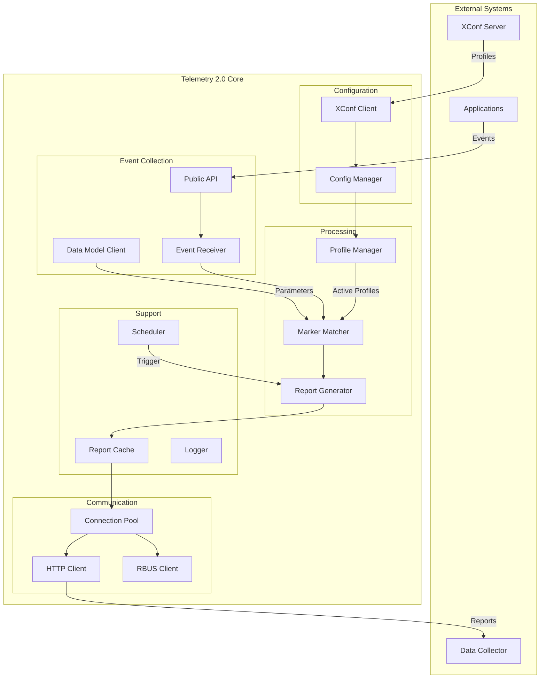
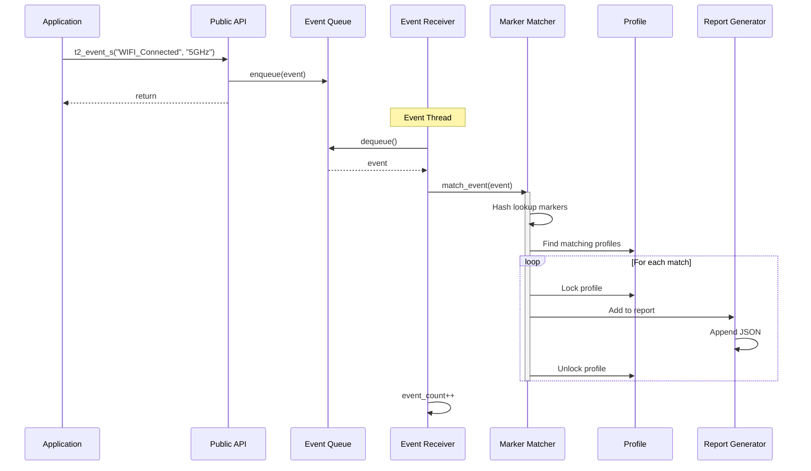
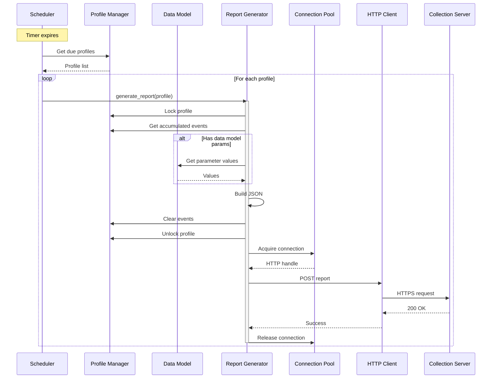
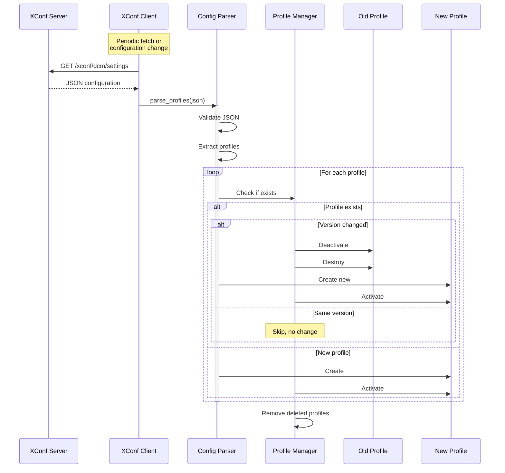
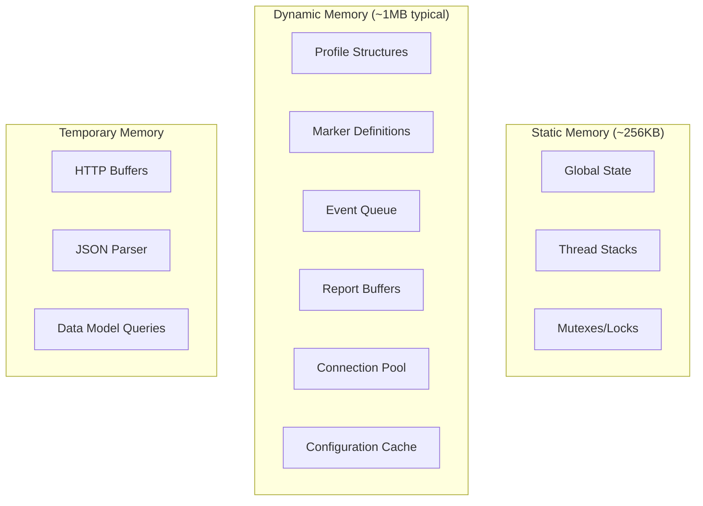

# Telemetry 2.0 Architecture Overview

## System Overview

Telemetry 2.0 is a lightweight, profile-based telemetry framework designed for embedded Linux devices with constrained resources. It provides real-time event collection, data model monitoring, and periodic reporting capabilities optimized for devices with limited memory (<128MB RAM) and CPU resources.

### Design Goals

1. **Minimal Resource Footprint** - Operate efficiently on memory-constrained devices
2. **Platform Independence** - Support multiple embedded platforms and architectures
3. **Flexible Configuration** - Dynamic profile-based configuration via JSON/XConf
4. **Reliable Reporting** - Guaranteed delivery with retry logic and caching
5. **Thread Safety** - Safe concurrent operation across multiple threads
6. **Extensibility** - Support for multiple protocols and encoding formats

## High-Level Architecture



## Key Components

### 1. Configuration Layer

#### XConf Client
- **Purpose**: Retrieve profile configurations from XConf server
- **Thread**: Dedicated background thread
- **Protocol**: HTTP/HTTPS with mTLS
- **Retry Logic**: Exponential backoff
- **Files**: `source/xconf-client/`

#### Config Manager
- **Purpose**: Parse and validate profile configurations
- **Storage**: In-memory profile list
- **Persistence**: Optional disk caching
- **Files**: `source/bulkdata/profilexconf.c`

### 2. Event Collection Layer

#### Public API
- **Purpose**: Application interface for sending telemetry events
- **Functions**: 
  - `t2_event_s()` - String events
  - `t2_event_d()` - Numeric events
  - `t2_event_f()` - Formatted events
- **Thread Safety**: Fully thread-safe
- **Files**: `source/telemetry2_0.c`, `include/telemetry2_0.h`

#### Event Receiver
- **Purpose**: Queue and process incoming events
- **Queue**: Mutex/condition-variable-protected queue (200 events max, see `T2EVENTQUEUE_MAX_LIMIT`)
- **Thread**: Dedicated event processing thread
- **Files**: `source/bulkdata/t2eventreceiver.c`

#### Data Model Client
- **Purpose**: Retrieve TR-181 data model parameters
- **Protocol**: D-Bus (CCSP) or RBUS
- **Caching**: Parameter value cache with TTL
- **Files**: `source/ccspinterface/`

### 3. Processing Layer

#### Profile Manager
- **Purpose**: Manage profile lifecycle
- **Operations**: Create, activate, deactivate, destroy
- **Storage**: Linked list with mutex protection
- **Files**: `source/bulkdata/profile.c`

#### Marker Matcher
- **Purpose**: Match events to profile markers
- **Algorithm**: Hash table lookup (O(1) average)
- **Concurrency**: Read-write lock for parallel matching
- **Files**: `source/bulkdata/t2markers.c`

#### Report Generator
- **Purpose**: Assemble and format reports
- **Formats**: JSON, Protocol Buffers
- **Encoding**: UTF-8
- **Files**: `source/reportgen/reportgen.c`

### 4. Communication Layer

#### Connection Pool
- **Purpose**: Manage reusable HTTP connections
- **Pool Size**: 1-5 connections (configurable)
- **Features**: Keep-alive, mTLS, retry logic
- **Thread Safety**: Mutex-protected handle acquisition
- **Files**: `source/protocol/http/multicurlinterface.c`

#### HTTP Client
- **Purpose**: Transmit reports via HTTP/HTTPS
- **Library**: libcurl 7.65.0+
- **Features**: Chunked encoding, compression, mTLS
- **Files**: `source/protocol/http/`

#### RBUS Client
- **Purpose**: Alternative transport via RBUS
- **Use Case**: Local inter-process communication
- **Files**: `source/protocol/rbusMethod/`

### 5. Support Components

#### Scheduler
- **Purpose**: Trigger periodic report generation
- **Precision**: ±1 second typical
- **Method**: Condition variable timed wait
- **Files**: `source/scheduler/`

#### Report Cache
- **Purpose**: Persist reports across reboots/network failures
- **Storage**: Filesystem-based queue
- **Cleanup**: FIFO with age limits
- **Location**: `/nvram/telemetry/` or `/tmp/`

#### Logger
- **Purpose**: Diagnostic logging
- **Integration**: RDK logger (rdk_debug.h)
- **Levels**: ERROR, WARN, INFO, DEBUG
- **Files**: Integrated throughout

## Data Flow

### Event Processing Flow



### Report Generation Flow



### Configuration Update Flow



## Threading Model

### Thread Overview

| Thread Name | Purpose | Stack Size | Priority | Wakeable |
|------------|---------|------------|----------|----------|
| Main | Initialization, cleanup | Default | Normal | - |
| Event Receiver | Process event queue | 32KB | High | Signal |
| XConf Fetcher | Fetch configurations | 64KB | Low | Timer |
| Scheduler | Trigger reports | 32KB | Normal | Timer |
| Report Sender | HTTP transmission | 64KB | Low | Queue |

### Synchronization Primitives

```c
// Profile list protection
static pthread_mutex_t g_profile_list_mutex = PTHREAD_MUTEX_INITIALIZER;

// Connection pool protection  
static pthread_mutex_t g_pool_mutex = PTHREAD_MUTEX_INITIALIZER;
static pthread_cond_t g_pool_cond = PTHREAD_COND_INITIALIZER;

// Event queue protection
static pthread_mutex_t g_event_queue_mutex = PTHREAD_MUTEX_INITIALIZER;
static pthread_cond_t g_event_queue_cond = PTHREAD_COND_INITIALIZER;

// Marker cache protection
static pthread_rwlock_t g_marker_cache_lock = PTHREAD_RWLOCK_INITIALIZER;

// Per-profile protection
typedef struct {
    pthread_mutex_t mutex;  // Protects profile state
    // ...
} profile_t;
```

### Lock Ordering Rules

To prevent deadlocks, always acquire locks in this order:

1. `g_profile_list_mutex` (global profile list)
2. `profile->mutex` (individual profile)
3. `g_pool_mutex` (connection pool)
4. `g_marker_cache_lock` (read or write)
5. `g_event_queue_mutex` (event queue)

**Never hold multiple locks unless following this order!**

## Memory Architecture

### Memory Layout



### Memory Budget (Typical Configuration)

| Component | Static | Dynamic | Notes |
|-----------|--------|---------|-------|
| Core system | 128 KB | - | Code, globals |
| Thread stacks | 160 KB | - | 5 threads × 32KB |
| Profiles (5) | - | 32 KB | ~6.5KB each |
| Connection pool | - | 2 KB | 3 connections |
| Event queue | - | 80 KB | 1000 events |
| Report buffer | - | 64 KB | Temporary |
| Configuration | - | 16 KB | Cached JSON |
| **Total** | **~288 KB** | **~194 KB** | **~512 KB RSS** |

### Memory Management Strategy

1. **Minimize Heap Fragmentation**
   - Use memory pools for fixed-size allocations
   - Batch allocations/deallocations
   - Avoid frequent realloc

2. **Bounded Resource Usage**
   - Maximum profile count enforced
   - Event queue with fixed size
   - Connection pool with limits

3. **Cleanup on Errors**
   - Single-exit functions with goto cleanup
   - RAII wrappers in C++ tests
   - NULL pointer checks before access

4. **Memory Leak Prevention**
   - Every malloc/strdup paired with free
   - Valgrind verification in CI
   - Smart pointers in C++ tests


### Platform Abstraction

- **Logging**: RDK logger wrapper with fallback to syslog
- **IPC**: RBUS preferred, D-Bus fallback
- **Storage**: /nvram with /tmp fallback
- **Threading**: POSIX threads
- **Networking**: libcurl (OpenSSL/mbedTLS)

## Security Model

### Transport Security

- **mTLS**: Mutual TLS for client authentication
- **Certificate Management**: Integration with librdkcertselector
- **Certificate Rotation**: Automatic cert refresh on failure
- **Fallback**: Recovery certificate support

### Data Protection

- **Sensitive Data**: Filtered from reports (passwords, keys)
- **PII Handling**: Privacy control integration
- **Log Scrubbing**: Sensitive data not logged

### Attack Surface Minimization

- **Input Validation**: All external inputs validated
- **Buffer Overflow Protection**: Size-checked string operations
- **Integer Overflow**: Checked arithmetic
- **Resource Limits**: Bounded allocations

## Performance Characteristics

### CPU Usage

| Scenario | CPU % | Notes |
|----------|-------|-------|


### Memory Usage

| Scenario | RSS | Notes |
|----------|-----|-------|

### Network Usage

| Report Type | Size | Frequency |
|-------------|------|-----------|


## Error Handling Philosophy

### Error Categories

1. **Fatal Errors** - System cannot continue
   - Initialization failure
   - Critical resource exhaustion
   - **Action**: Exit with error code

2. **Recoverable Errors** - Operation failed but system continues
   - Network timeout
   - Single report failure
   - **Action**: Log, retry, degrade gracefully

3. **Warnings** - Unexpected but handled
   - Configuration parsing issues
   - Missing optional parameters
   - **Action**: Log, use defaults

### Recovery Strategies

```c
// Retry with exponential backoff
int retry_count = 0;
int backoff_ms = 1000;

while (retry_count < MAX_RETRIES) {
    ret = send_report(report);
    if (ret == 0) break;
    
    T2Warn("Report send failed (attempt %d): %d\n", 
           retry_count + 1, ret);
    
    usleep(backoff_ms * 1000);
    backoff_ms *= 2;  // Exponential backoff
    retry_count++;
}

if (ret != 0) {
    // Cache for later retry
    cache_report(report);
}
```

## See Also

- [Component Documentation](../../source/docs/) - Detailed component docs
- [Threading Model](threading-model.md) - Thread safety details
- [API Reference](../api/public-api.md) - Public API
- [Build System](../integration/build-setup.md) - Build configuration
- [Testing Guide](../integration/testing.md) - Test procedures

---

**Document Version**: 1.0  
**Last Updated**: March 2026  
**Reviewers**: Architecture Team
