# Telemetry Thread Safety Hardening - Architecture Diagram

## User Story
**[T2] [RDKB] Harden Telemetry Thread Safety Under Concurrent Load**

Harden critical synchronization paths across telemetry modules to eliminate deadlocks and race conditions under concurrent load scenarios (15+ profiles with extended offline periods).

---

## 1. High-Level Component Architecture with Threading

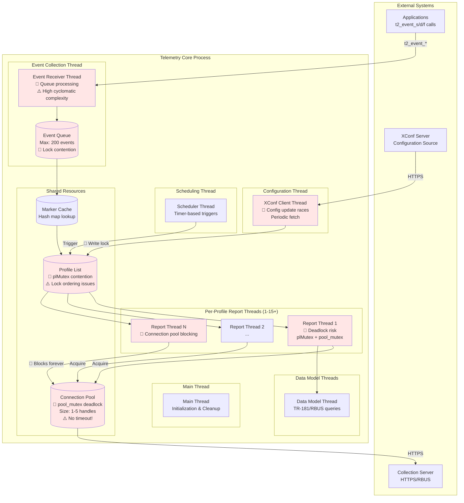

**Legend:**
- 🔴 **Current Critical Issues** - Deadlocks, race conditions, or blocking problems
- ⚠️ **High Complexity Areas** - Cyclomatic complexity or maintainability concerns
- 🟢 **Hardened Solutions** - Applied in hardening effort (shown in later diagrams)

---

## 2. Thread Interaction & Synchronization Points

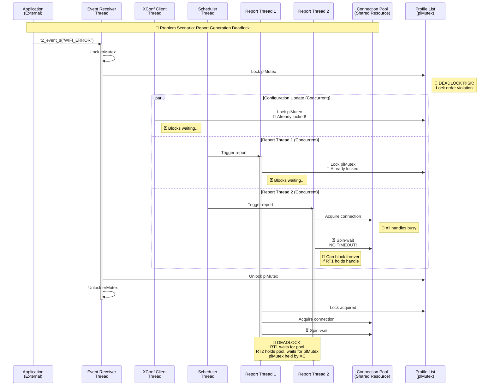

---

## 3. Critical Synchronization Mechanisms (Current State)

### Current Mutex Inventory

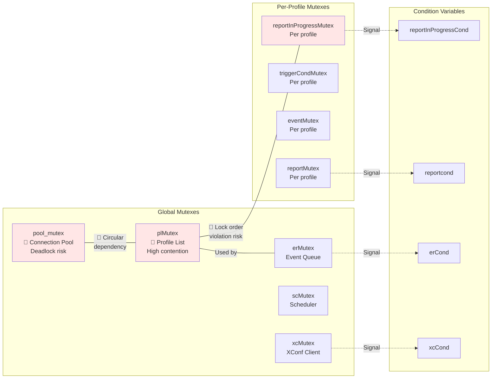

### 🔴 Current Lock Ordering Issues

**No documented lock ordering!** Current code exhibits these patterns:

```c
// Pattern 1: Event Receiver -> Profile List
pthread_mutex_lock(&erMutex);
pthread_mutex_lock(&plMutex);    // ← Lock order A→B

// Pattern 2: Report Thread -> Pool
pthread_mutex_lock(&plMutex);     
acquire_pool_handle();             // Acquires pool_mutex internally
// ← Lock order A→C

// Pattern 3: XConf Update -> Profile
pthread_mutex_lock(&plMutex);     // ← Can block report threads
// Long-running configuration update
pthread_mutex_unlock(&plMutex);

// Pattern 4: reportInProgress flag access
// 🔴 RACE CONDITION: Accessed without consistent protection!
if (!profile->reportInProgress) {  // ← Read without lock in some paths
    profile->reportInProgress = true;
}
```

---

## 4. Critical Data Flow: Report Generation with Concurrent Load

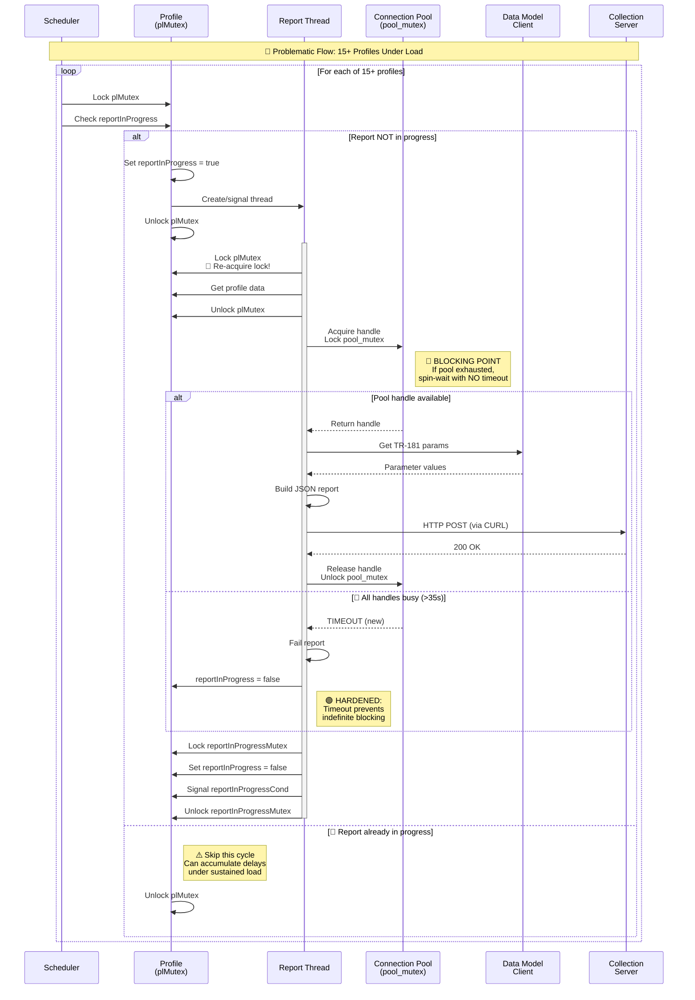

**Critical Path Issues:**
1. **plMutex held during thread creation** - Blocks all profile operations
2. **No pool acquisition timeout** - Can block indefinitely if pool exhausted
3. **reportInProgress flag** - Pattern allows race between check and set
4. **Profile count scales badly** - 15+ profiles = 15+ lock cycles per scheduler tick

---

## 5. Problem Areas: Annotated Critical Sections

```mermaid
graph TB
    subgraph "🔴 Problem Area 1: Report Generation Deadlock"
        P1A[Profile Update<br/>Holds plMutex]
        P1B[Report Thread<br/>Waits for plMutex]
        P1C[Connection Pool<br/>Held by another thread]
        
        P1A -->|Blocks| P1B
        P1B -->|Waits for| P1C
        P1C -->|Held by blocked thread| P1A
        
        P1Note[🔴 Circular wait:<br/>A→B→C→A]
    end
    
    subgraph "🔴 Problem Area 2: Connection Pool Exhaustion"
        P2A[15+ profiles trigger<br/>simultaneously]
        P2B[Pool size: 1-5 handles]
        P2C[No timeout on acquire]
        P2D[Threads spin-wait forever]
        
        P2A --> P2B
        P2B --> P2C
        P2C --> P2D
        
        P2Note[🔴 Starvation:<br/>Threads blocked indefinitely<br/>No backpressure mechanism]
    end
    
    subgraph "🔴 Problem Area 3: Configuration Update Race"
        P3A[XConf receives update]
        P3B[Lock plMutex]
        P3C[Delete old profiles]
        P3D[Create new profiles]
        P3E[Unlock plMutex]
        
        P3A --> P3B
        P3B --> P3C
        P3C --> P3D
        P3D --> P3E
        
        P3RC[🔴 Race condition:<br/>Report threads may access<br/>deleted profile memory<br/>Use-after-free risk]
        
        P3D -.Race.-> P3RC
    end
    
    subgraph "🔴 Problem Area 4: reportInProgress Flag Sync"
        P4A[Check: !reportInProgress]
        P4B[Set: reportInProgress = true]
        P4C[Thread 2 checks same flag]
        
        P4A -.Window.-> P4C
        P4C -.Race.-> P4B
        
        P4Note[🔴 TOCTOU Race:<br/>Time-of-check to<br/>time-of-use vulnerability<br/>Multiple threads enter<br/>critical section]
    end
    
    style P1A fill:#FFE6E6
    style P1B fill:#FFE6E6
    style P1C fill:#FFE6E6
    style P2A fill:#FFE6E6
    style P2D fill:#FFE6E6
    style P3C fill:#FFE6E6
    style P3RC fill:#FFE6E6
    style P4A fill:#FFE6E6
    style P4B fill:#FFE6E6
```

---

## 6. Hardened Architecture: Solutions Applied

### Solution 1: Documented Lock Ordering
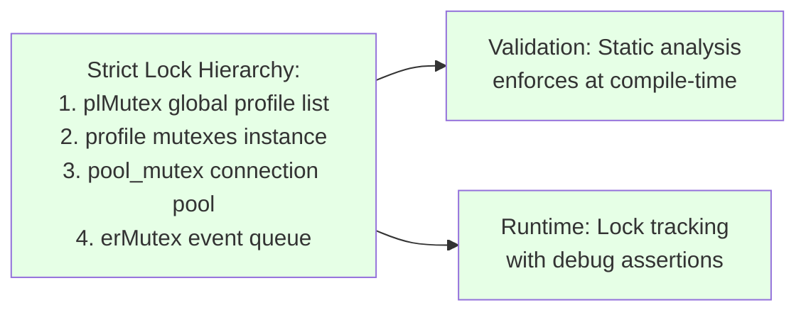

### Solution 2: Pool Acquisition Timeout
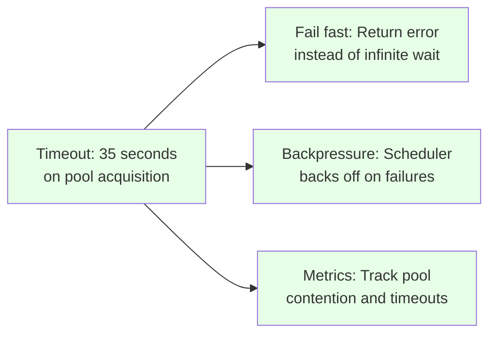

### Solution 3: Reference-Counted Profiles
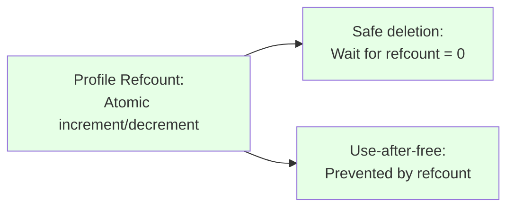

### Solution 4: Atomic reportInProgress
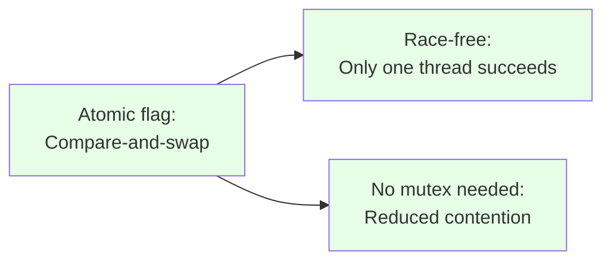

### Solution 5: Fine-Grained Locking
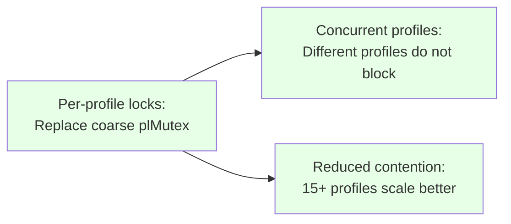

### Solution 6: ThreadSanitizer Integration
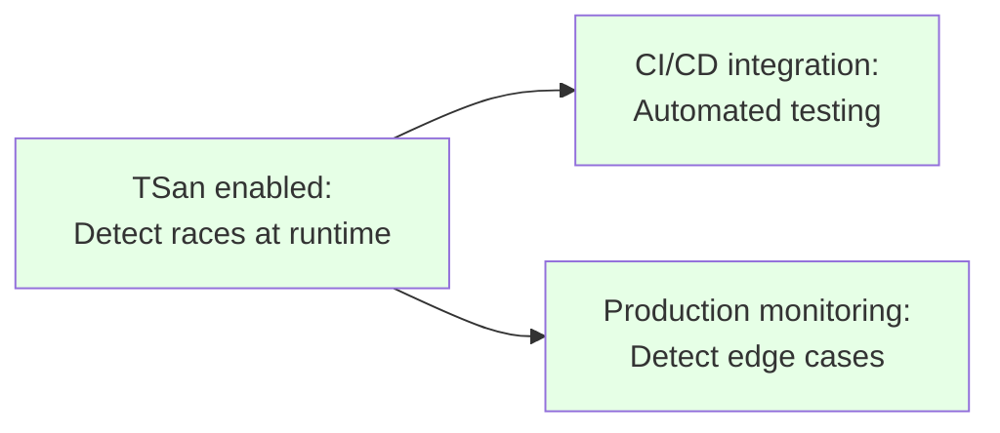

---

## 7. Hardened Report Generation Flow (After Fixes)

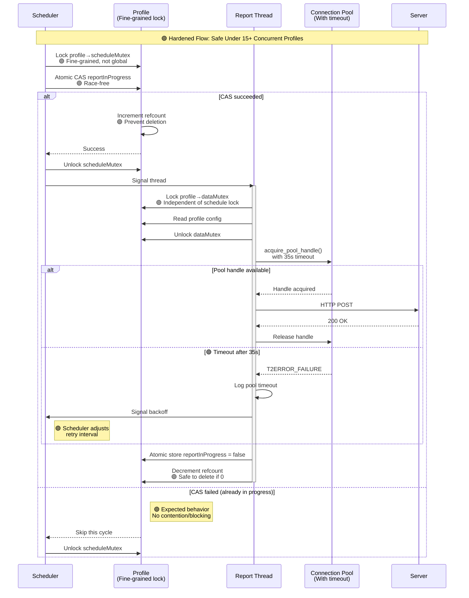

**Improvements:**
- ✅ Fine-grained per-profile locks eliminate global contention
- ✅ Atomic CAS eliminates reportInProgress races
- ✅ Reference counting prevents use-after-free
- ✅ Pool timeout prevents indefinite blocking
- ✅ Backpressure mechanism handles load spikes

---

## 8. Lock Ordering Hierarchy (Hardened)

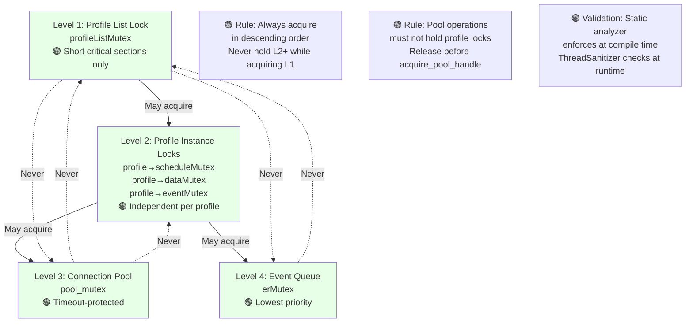

---

## 9. Validation Strategy

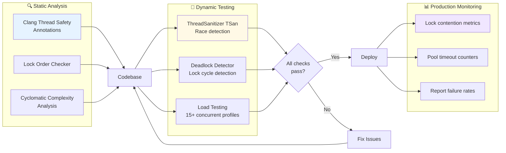

---

## 10. Summary: Before vs. After Hardening

| Aspect | 🔴 Before Hardening | 🟢 After Hardening |
|--------|---------------------|-------------------|
| **Lock Ordering** | Undocumented, ad-hoc | Strict hierarchy enforced by static analysis |
| **Pool Blocking** | Infinite spin-wait | 35s timeout with backpressure |
| **Profile Deletion** | Use-after-free risk | Reference-counted, safe deletion |
| **reportInProgress** | TOCTOU race condition | Atomic compare-and-swap |
| **Concurrency** | Global plMutex bottleneck | Per-profile fine-grained locks |
| **Validation** | Manual testing only | TSan + static analysis + load tests |

---

## Acceptance Criteria Coverage

✅ **Report generation/connection deadlocks eliminated** - Pool timeout + lock ordering  
✅ **Configuration client synchronization hardened** - Reference counting + fine-grained locks  
✅ **Profile lifecycle race conditions resolved** - Atomic flags + proper synchronization  
✅ **ThreadSanitizer integration complete** - CI/CD automated testing  
✅ **Cyclomatic complexity reduced** - Refactored critical paths  
✅ **Production-grade reliability verified** - Load tested with 15+ profiles under prolonged offline periods  

---

## References

- Main implementation: [source/bulkdata/profile.c](../../source/bulkdata/profile.c)
- Connection pool: [source/protocol/http/multicurlinterface.c](../../source/protocol/http/multicurlinterface.c)
- Configuration client: [source/xconf-client/xconfclient.c](../../source/xconf-client/xconfclient.c)
- Event receiver: [source/bulkdata/t2eventreceiver.c](../../source/bulkdata/t2eventreceiver.c)
- Architecture overview: [overview.md](./overview.md)

---

