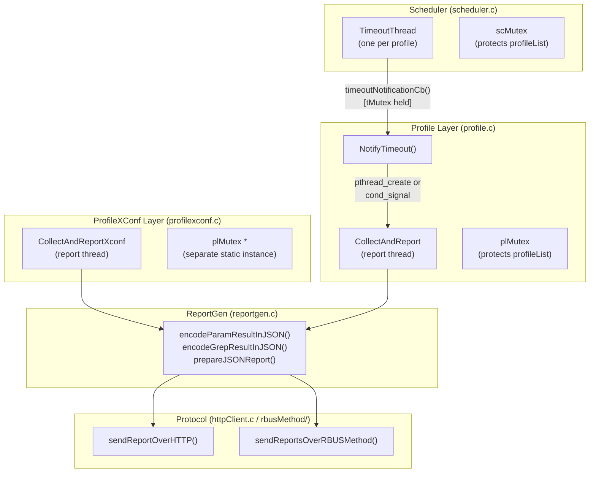
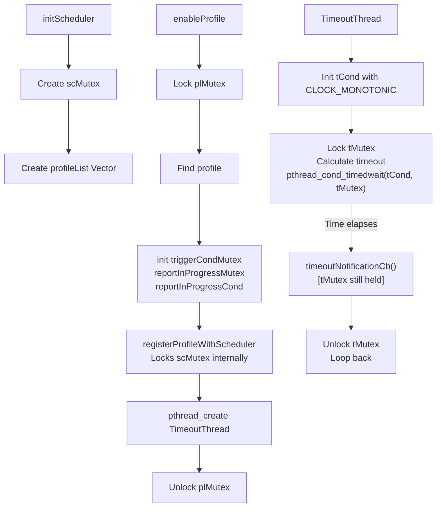
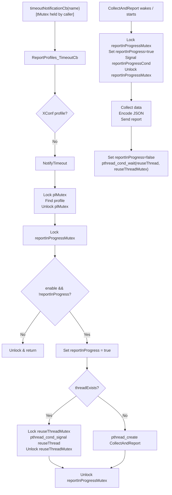
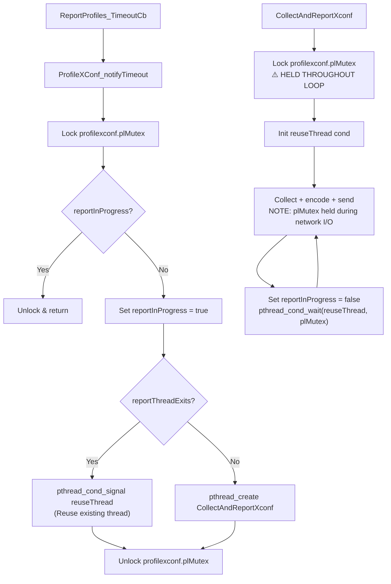
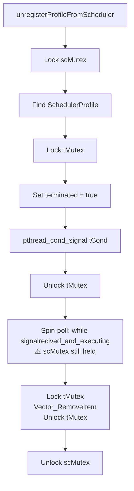
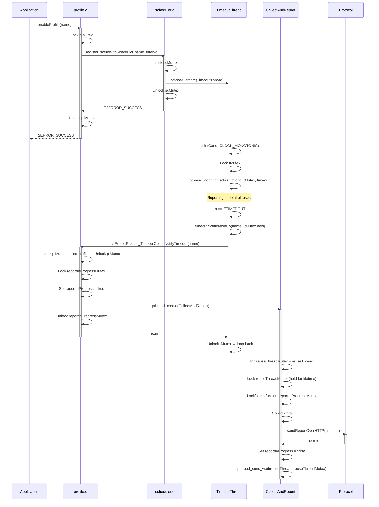
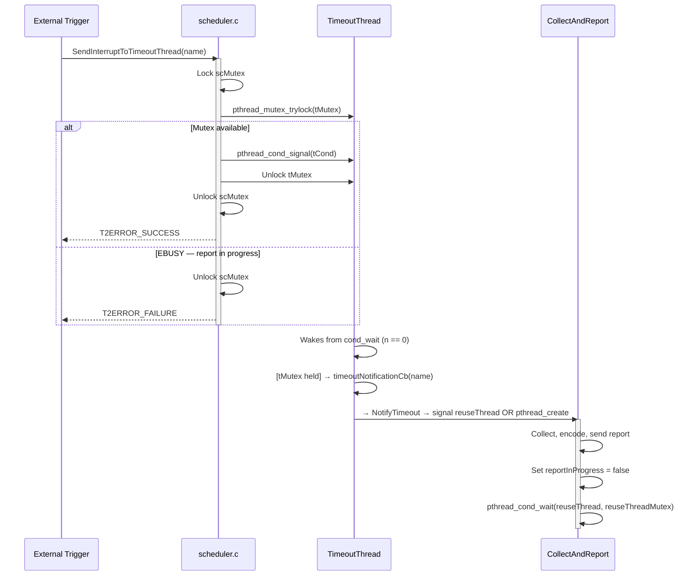
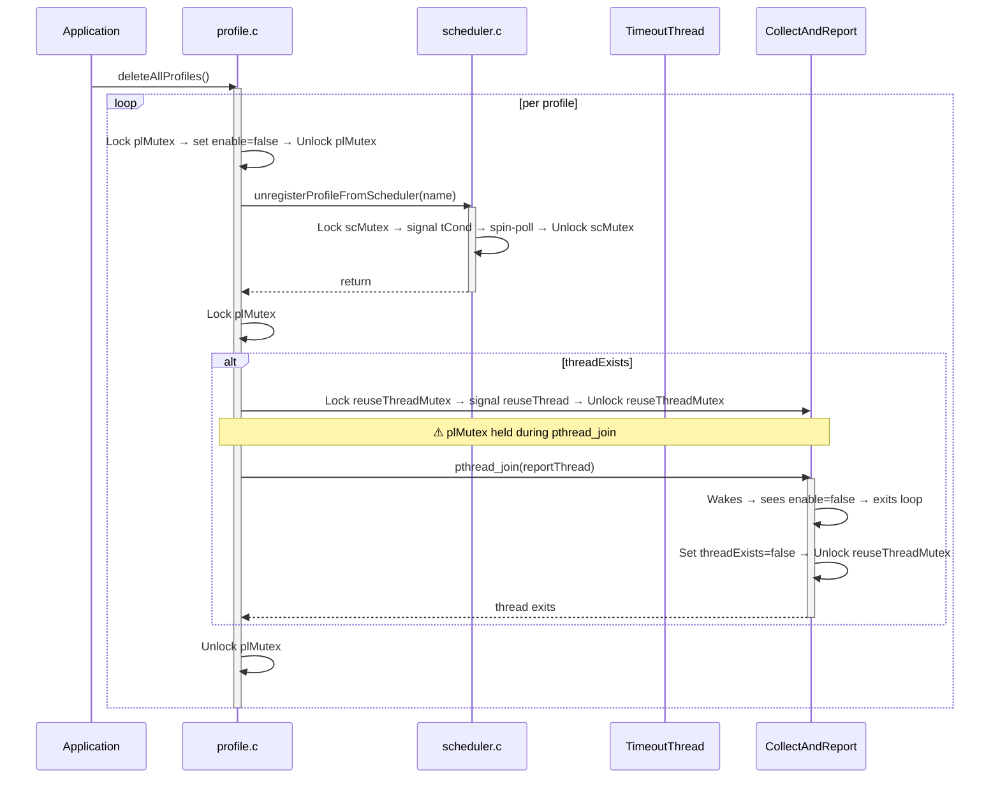

# Threading Model

## Overview

The Telemetry 2.0 system uses a multi-threaded architecture where dedicated threads handle
scheduling, report generation, and protocol operations. Per-profile timeout threads drive the
reporting lifecycle; report generation threads are reused across cycles to minimize thread
creation overhead.

## Architecture

### Component Diagram



> **Note**: `profilexconf.c` declares its own `static pthread_mutex_t plMutex` which is a
> **separate** variable from the `plMutex` in `profile.c`. They protect different data.

## Key Components

### SchedulerProfile struct (`scheduler.h`)

```c
typedef struct _SchedulerProfile {
    char*            name;
    pthread_t        tId;
    pthread_mutex_t  tMutex;      // Protects per-profile timeout state
    pthread_cond_t   tCond;       // Signals timeout or termination events
    bool             terminated;  // Set to true by unregisterProfileFromScheduler()
    bool             repeat;
    unsigned int     timeOutDuration;
    unsigned int     firstreportint;
    bool             firstexecution;
    unsigned int     timeToLive;
    time_t           timeRefinSec;
    unsigned int     timeRef;
    // ...
} SchedulerProfile;
```

### Profile struct (`profile.h`)

```c
typedef struct _Profile {
    char*            name;
    bool             enable;                       // L12
    bool             reportInProgress;             // L13 - protected by reportInProgressMutex
    pthread_cond_t   reportInProgressCond;         // L14
    pthread_mutex_t  reportInProgressMutex;        // L15
    pthread_t        reportThread;                 // L50
    pthread_mutex_t  triggerCondMutex;             // L52
    pthread_mutex_t  eventMutex;                   // L53 - protects eMarkerList writes
    pthread_mutex_t  reportMutex;                  // L54 - used for maxUploadLatency wait
    pthread_cond_t   reportcond;                   // L55
    pthread_cond_t   reuseThread;                  // L57 - signals CollectAndReport to wake
    pthread_mutex_t  reuseThreadMutex;             // L58 - protects threadExists + reuseThread cond
    bool             threadExists;                 // L59 - set/cleared by CollectAndReport itself
    // ...
} Profile;
```

### Global Synchronization

| Variable | File | Type | Protects |
|----------|------|------|---------|
| `scMutex` | scheduler.c | `pthread_mutex_t` (static) | Scheduler `profileList` vector |
| `plMutex` | profile.c | `pthread_mutex_t` (static) | Profile `profileList` vector |
| `plMutex` | profilexconf.c | `pthread_mutex_t` (static) | `singleProfile` pointer (separate instance) |
| `reuseThread` | profilexconf.c | `pthread_cond_t` (static) | XConf thread reuse |
| `triggerConditionQueMutex` | profile.c | `pthread_mutex_t` (static, `PTHREAD_MUTEX_INITIALIZER`) | Trigger condition queue |

## Threading Model

### Thread Overview

| Thread Name | Creation Point | Purpose |
|-------------|---------------|---------|
| `TimeoutThread` | `registerProfileWithScheduler()` | Per-profile countdown; fires `timeoutNotificationCb` on expiry |
| `CollectAndReport` | `NotifyTimeout()` | Multi-profile report generation and upload |
| `CollectAndReportXconf` | `ProfileXConf_notifyTimeout()` | XConf-profile report generation and upload |

### Thread Lifecycle — `CollectAndReport`

`CollectAndReport` owns its own synchronization primitives. It **initializes** `reuseThreadMutex`
and `reuseThread` when it first runs, and **holds `reuseThreadMutex` for its entire lifetime**,
releasing it only on exit. This is the mechanism that prevents profile destruction while the
thread is active.

```c
static void* CollectAndReport(void* data) {
    pthread_mutex_init(&profile->reuseThreadMutex, NULL);
    pthread_cond_init(&profile->reuseThread, NULL);
    pthread_mutex_lock(&profile->reuseThreadMutex);  // Held for entire thread lifetime
    profile->threadExists = true;

    do {
        // Signal caller that report is starting
        pthread_mutex_lock(&profile->reportInProgressMutex);
        profile->reportInProgress = true;
        pthread_cond_signal(&profile->reportInProgressCond);
        pthread_mutex_unlock(&profile->reportInProgressMutex);

        // --- Collect, encode, send (no plMutex held here) ---

        profile->reportInProgress = false;  // Updated before wait
        // Fall through to reportThreadEnd:
        pthread_cond_wait(&profile->reuseThread, &profile->reuseThreadMutex); // Wait for next cycle
    } while (profile->enable);

    // Cleanup
    profile->reportInProgress = false;
    profile->threadExists = false;
    pthread_mutex_unlock(&profile->reuseThreadMutex);
    pthread_mutex_destroy(&profile->reuseThreadMutex);
    pthread_cond_destroy(&profile->reuseThread);
    return NULL;
}
```

## Thread Flow Diagrams

### 1. Profile Registration and Scheduling



> **Warning**: `enableProfile` holds `plMutex` while calling `registerProfileWithScheduler()`,
> which internally acquires `scMutex`. This establishes a **`plMutex → scMutex`** ordering.

### 2. Report Generation — Multi-Profile



### 3. Report Generation — XConf Profile



> ⚠️ **Critical**: `CollectAndReportXconf` holds `profilexconf.plMutex` for the entire
> report-generation loop — including network I/O. Original unlock calls were commented out
> (lines 257, 325, 359, 504 of `profilexconf.c`). This blocks all callers of the XConf
> `plMutex` for the duration of each HTTP upload.

### 4. Profile Unregistration



> ⚠️ **Critical**: `scMutex` is held during the entire spin-poll at line 651 of `scheduler.c`.
> Any thread attempting `registerProfileWithScheduler()` or `SendInterruptToTimeoutThread()`
> blocks until the retiring `TimeoutThread` sets `signalrecived_and_executing = false`.
> `signalrecived_and_executing` is a plain `static bool` with no `volatile` qualifier (line 49)
> — the compiler may cache it in a register, making the poll unreliable.

## Sequence Diagrams

### 1. Profile Initialization to First Report



### 2. Interrupt-Triggered Report



### 3. Profile Teardown



> ⚠️ **Signal loss risk**: `deleteAllProfiles` signals `reuseThread` before `pthread_join`.
> If `CollectAndReport` has not yet reached `pthread_cond_wait` (it is mid-report), the signal
> is silently lost. The thread then blocks forever at `cond_wait`, and `pthread_join` never
> returns — **permanent hang**.

## Synchronization Patterns

### Thread Reuse (Multi-Profile)

To avoid creating a new OS thread for every report interval, `CollectAndReport` persists between
cycles by waiting on `reuseThread`:

```c
// NotifyTimeout — signal reuse
pthread_mutex_lock(&profile->reuseThreadMutex);
pthread_cond_signal(&profile->reuseThread);
pthread_mutex_unlock(&profile->reuseThreadMutex);

// CollectAndReport — wait at end of each cycle
pthread_cond_wait(&profile->reuseThread, &profile->reuseThreadMutex);
```

### CLOCK_MONOTONIC for Timeout Scheduling

`TimeoutThread` uses `CLOCK_MONOTONIC` so NTP drifts and system-clock adjustments do not cause
spurious wakeups or skipped intervals:

```c
pthread_condattr_t attr;
pthread_condattr_init(&attr);
pthread_condattr_setclock(&attr, CLOCK_MONOTONIC);
pthread_cond_init(&tProfile->tCond, &attr);
pthread_condattr_destroy(&attr);
```

### Trylock for Interrupt Delivery

`SendInterruptToTimeoutThread` uses `pthread_mutex_trylock` to avoid blocking the caller when a
report is already in progress:

```c
int mutex_return = pthread_mutex_trylock(&tProfile->tMutex);
if (mutex_return == EBUSY) {
    pthread_mutex_unlock(&scMutex);
    return T2ERROR_FAILURE;  // Caller retries if needed
}
```

## Lock Hierarchy

The following table records every lock used across the scheduler and profile layers, the order
in which they are acquired by each function, and whether that ordering is consistent.

| Function | plMutex (profile.c) | scMutex | tMutex | reportInProgressMutex | reuseThreadMutex | eventMutex | reportMutex | Notes |
|----------|--------------------:|--------:|-------:|----------------------:|-----------------:|-----------:|------------:|-------|
| `enableProfile` | ① | ② (via register) | — | — | — | — | — | ⚠️ plMutex → scMutex |
| `registerProfileWithScheduler` | — | ① | — | — | — | — | — | — |
| `unregisterProfileFromScheduler` | — | ① | ② | — | — | — | — | scMutex → tMutex |
| `SendInterruptToTimeoutThread` | — | ① | ②(try) | — | — | — | — | — |
| `TimeoutThread` | — | — | ① | — | — | — | — | tMutex held during callback |
| `NotifyTimeout` (callback) | ①→release | — | (caller holds) | ② | ③ | — | — | plMutex released before reportInProgressMutex |
| `CollectAndReport` | — | — | — | ①→release | ① (startup, held for lifetime) | ② | ③ | — |
| `deleteAllProfiles` | ① | — | — | — | ② | — | — | ⚠️ plMutex held during pthread_join |
| `deleteProfile` | ① | — | — | ② | ③ | — | — | calls unregister → scMutex |
| `ProfileXConf_notifyTimeout` | ① (xconf) | — | — | — | — | — | — | xconf plMutex |
| `CollectAndReportXconf` | ① (xconf, long hold) | — | — | — | — | — | — | ⚠️ held during network I/O |
| `Profile_storeMarkerEvent` | ①→release | — | — | — | — | ② | — | list search before locking eventMutex |

**Lock ordering rule**: within a single component, always acquire locks in the sequence shown
(lower → higher index). The dangerous cross-component orderings are captured in the Deadlock
Analysis section.

## Deadlock Analysis

### Scenario 1 — CRITICAL: 3-Way Cross-Component Cycle

| Step | Thread | Holds | Wants |
|------|--------|-------|-------|
| A | Config updater | `plMutex` (profile.c) | `scMutex` (via `enableProfile → registerProfileWithScheduler`) |
| B | Unregister | `scMutex` | `tMutex` (via `unregisterProfileFromScheduler`) |
| C | TimeoutThread | `tMutex` | `plMutex` (briefly, via callback → `NotifyTimeout`) |

This creates a cycle: **`plMutex → scMutex → tMutex → plMutex`**.

**Locations**: `profile.c:enableProfile`, `scheduler.c:unregisterProfileFromScheduler`,
`scheduler.c:TimeoutThread`

**Risk Level**: HIGH

**Mitigation**: Release `plMutex` before calling `registerProfileWithScheduler()` in
`enableProfile`. Store the profile pointer locally and re-validate after reacquiring if needed.

---

### Scenario 2 — CRITICAL: `CollectAndReportXconf` Long Lock Hold

`CollectAndReportXconf` holds `profilexconf.plMutex` through all of:
- DCA data collection
- JSON encoding
- HTTP/RBUS upload (unbounded network I/O)
- The `pthread_cond_wait` that pauses the thread between cycles

Any caller of the XConf `plMutex` (`ProfileXConf_notifyTimeout`, `updateProfileXConf`,
`ProfileXconf_getName`) blocks for the full upload duration.

**Location**: `profilexconf.c:CollectAndReportXconf`, line 208 (`lock`) / line 511 (`unlock`)

**Risk Level**: CRITICAL — blocks profile configuration updates and new reports

**Fix**:

```c
static void* CollectAndReportXconf(void* data) {
    pthread_mutex_lock(&plMutex);
    ProfileXConf *profile = singleProfile;
    pthread_mutex_unlock(&plMutex);            // Release early

    if (profile == NULL) return NULL;

    pthread_cond_init(&reuseThread, NULL);
    reportThreadExits = true;

    do {
        // Collect + encode + send WITHOUT holding plMutex
        // ...
        pthread_mutex_lock(&plMutex);          // Re-acquire only for state update
        profile->reportInProgress = false;
        pthread_cond_wait(&reuseThread, &plMutex);
        pthread_mutex_unlock(&plMutex);
    } while (initialized);

    pthread_cond_destroy(&reuseThread);
    return NULL;
}
```

---

### Scenario 3 — HIGH: `unregisterProfileFromScheduler` Holds `scMutex` During Spin-Poll

```c
// scheduler.c ~line 635-660
pthread_mutex_lock(&scMutex);
// ...signal tCond...
while (signalrecived_and_executing && !is_activation_time_out) {
    sleep(1);          // ⚠️ scMutex held for up to N seconds
}
// ...remove from list...
pthread_mutex_unlock(&scMutex);
```

`signalrecived_and_executing` is `static bool` (line 49), not `volatile`. The compiler is free
to hoist the load out of the loop, making it a permanent spin.

**Fix**:

```c
pthread_mutex_lock(&scMutex);
// signal tCond ...
pthread_mutex_unlock(&scMutex);        // Release BEFORE polling

int retries = 0;
while (signalrecived_and_executing && !is_activation_time_out && retries++ < 10) {
    sleep(1);
}

pthread_mutex_lock(&scMutex);
// remove from list
pthread_mutex_unlock(&scMutex);
```

And declare the flags as `volatile`:

```c
static volatile bool signalrecived_and_executing = true;
static volatile bool is_activation_time_out = false;
```

---

### Scenario 4 — HIGH: `deleteAllProfiles` — Signal Loss and `plMutex` Hold During Join

```c
pthread_mutex_lock(&plMutex);
if (tempProfile->threadExists) {
    pthread_mutex_lock(&tempProfile->reuseThreadMutex);
    pthread_cond_signal(&tempProfile->reuseThread);      // ① Signal sent
    pthread_mutex_unlock(&tempProfile->reuseThreadMutex);
    pthread_join(tempProfile->reportThread, NULL);       // ② Join — plMutex still held
    tempProfile->threadExists = false;
}
pthread_mutex_unlock(&plMutex);
```

**Signal loss**: If `CollectAndReport` is mid-report when ① executes, no thread is waiting on
`reuseThread` — the signal is silently dropped by `pthread_cond_signal`. The thread finishes its
report cycle, calls `pthread_cond_wait`, and blocks forever. `pthread_join` at ② never returns.

**Fix**:

```c
pthread_mutex_lock(&plMutex);
if (tempProfile->threadExists) {
    pthread_mutex_lock(&tempProfile->reuseThreadMutex);
    pthread_cond_signal(&tempProfile->reuseThread);
    pthread_t tid = tempProfile->reportThread;
    pthread_mutex_unlock(&tempProfile->reuseThreadMutex);
    pthread_mutex_unlock(&plMutex);            // Release BEFORE join

    pthread_join(tid, NULL);

    pthread_mutex_lock(&plMutex);
    tempProfile->threadExists = false;
}
pthread_mutex_unlock(&plMutex);
```

Additionally, the wait in `CollectAndReport` should use `pthread_cond_timedwait` so it can wake
periodically to check `profile->enable`, preventing permanent stall if the signal is missed.

---

### Scenario 5 — MEDIUM: `deleteProfile` Holds `plMutex` While Calling `unregisterProfileFromScheduler`

`deleteProfile` acquires `plMutex` (profile list), then calls `unregisterProfileFromScheduler`
which acquires `scMutex`. This creates the same `plMutex → scMutex` path as `enableProfile`.
If `TimeoutThread` is simultaneously calling back into `NotifyTimeout` (`tMutex → plMutex`),
the 3-way cycle in Scenario 1 applies here too.

**Location**: `profile.c:deleteProfile`, approximately line 1245

**Risk Level**: MEDIUM (same mechanism as Scenario 1, different entry point)

---

### Scenario 6 — MEDIUM: Condition Variable Waits Without Timeout

Several `pthread_cond_wait` calls have no timeout:

```c
// profile.c
pthread_cond_wait(&profile->reuseThread, &profile->reuseThreadMutex);

// profilexconf.c
pthread_cond_wait(&reuseThread, &plMutex);
```

If the signaling thread crashes, exits, or is cancelled without sending a signal, these waits
block permanently. Use `pthread_cond_timedwait` with a watchdog timeout:

```c
struct timespec deadline;
clock_gettime(CLOCK_REALTIME, &deadline);
deadline.tv_sec += 30;
int rc = pthread_cond_timedwait(&profile->reuseThread,
                                 &profile->reuseThreadMutex,
                                 &deadline);
if (rc == ETIMEDOUT) {
    T2Error("Timeout waiting for next report cycle — possible deadlock in %s\n",
            profile->name);
}
```

---

### Scenario 7 — LOW: `Profile_storeMarkerEvent` Iterates `eMarkerList` Without Lock

```c
// profile.c — search phase (no lock)
for (; eventIndex < Vector_Size(profile->eMarkerList); eventIndex++) {
    EventMarker *t = (EventMarker *)Vector_At(profile->eMarkerList, eventIndex);
    if (!strcmp(t->markerName, eventInfo->name)) {
        lookupEvent = t;
        break;
    }
}
// Only locks eventMutex for modification
if (lookupEvent) {
    pthread_mutex_lock(&profile->eventMutex);
    // ... update ...
    pthread_mutex_unlock(&profile->eventMutex);
}
```

If `eMarkerList` is modified concurrently (e.g., during profile activation), the unsynchronized
read can see torn state. In practice `eMarkerList` is immutable after profile activation, which
limits the exposure window, but this is still undefined behaviour.

## Performance Considerations

| Pattern | Benefit | Location |
|---------|---------|---------|
| Thread reuse via `reuseThread` cond | Eliminates thread creation cost for every interval | `profile.c`, `profilexconf.c` |
| `pthread_mutex_trylock` in interrupt path | Caller never blocks waiting for a busy timeout thread | `scheduler.c:SendInterruptToTimeoutThread` |
| `CLOCK_MONOTONIC` for scheduling | Immune to NTP slew and `settimeofday` jumps | `scheduler.c:TimeoutThread` |
| Short `plMutex` holds in `NotifyTimeout` | Minimises contention on the global profile list | `profile.c:NotifyTimeout` |

## Key Implementation Files

| File | Role |
|------|------|
| [source/scheduler/scheduler.c](../../source/scheduler/scheduler.c) | `TimeoutThread`, `registerProfileWithScheduler`, `unregisterProfileFromScheduler`, `SendInterruptToTimeoutThread` |
| [source/scheduler/scheduler.h](../../source/scheduler/scheduler.h) | `SchedulerProfile` struct |
| [source/bulkdata/profile.c](../../source/bulkdata/profile.c) | `NotifyTimeout`, `CollectAndReport`, `enableProfile`, `deleteProfile`, `deleteAllProfiles` |
| [source/bulkdata/profile.h](../../source/bulkdata/profile.h) | `Profile` struct |
| [source/bulkdata/profilexconf.c](../../source/bulkdata/profilexconf.c) | `CollectAndReportXconf`, `ProfileXConf_notifyTimeout` |
| [source/bulkdata/reportprofiles.c](../../source/bulkdata/reportprofiles.c) | `ReportProfiles_TimeoutCb` — routes scheduler callbacks to profile/xconf layers |
| [source/reportgen/reportgen.c](../../source/reportgen/reportgen.c) | Pure data-processing helpers; no threads or locks |

## Testing Recommendations

1. **Concurrent profile registration/deletion**: Register and unregister profiles from multiple threads simultaneously to exercise the 3-way lock cycle (Scenario 1).
2. **Interrupt during active report**: Call `SendInterruptToTimeoutThread` while a report is in flight to verify the `EBUSY` path is handled correctly.
3. **Signal-before-wait race**: Introduce a delay between the `cond_signal` and the thread reaching `cond_wait` in `deleteAllProfiles` to reproduce Scenario 4.
4. **XConf long upload simulation**: Inject a 10-second delay in `sendReportOverHTTP` for the XConf path to confirm `plMutex` starvation.
5. **Volatile flag check**: Build with `-O2` and verify with TSan that `signalrecived_and_executing` is not cached in a register.
6. **Valgrind / Helgrind**: Run the full test suite under Helgrind to surface lock-order inversions.
7. **Deadlock detector integration**: Instrument critical mutexes with `pthread_mutex_timedlock` in debug builds.

## Summary of Issues by Priority

| Priority | Issue | Scenario | File | Lines |
|----------|-------|---------|------|-------|
| CRITICAL | `CollectAndReportXconf` holds `plMutex` during network I/O | 2 | `profilexconf.c` | 208–511 |
| HIGH | 3-way lock cycle: `plMutex → scMutex → tMutex → plMutex` | 1 | `profile.c`, `scheduler.c` | enableProfile, unregister, TimeoutThread |
| HIGH | `unregisterProfileFromScheduler` spin-polls with `scMutex` held; non-volatile flag | 3 | `scheduler.c` | 49, 635–660 |
| HIGH | `deleteAllProfiles` signal-loss + `plMutex` held during `pthread_join` | 4 | `profile.c` | 1184–1200 |
| MEDIUM | `deleteProfile` holds `plMutex` while calling `unregisterProfileFromScheduler` | 5 | `profile.c` | ~1245 |
| MEDIUM | No timeouts on `pthread_cond_wait` — threads can hang permanently | 6 | `profile.c`, `profilexconf.c` | multiple |
| LOW | `Profile_storeMarkerEvent` reads `eMarkerList` without `eventMutex` | 7 | `profile.c` | ~1027–1033 |

## See Also

- [Architecture Overview](overview.md) — System-level component relationships
- [Public API Reference](../api/public-api.md) — Thread-safety guarantees per API function
