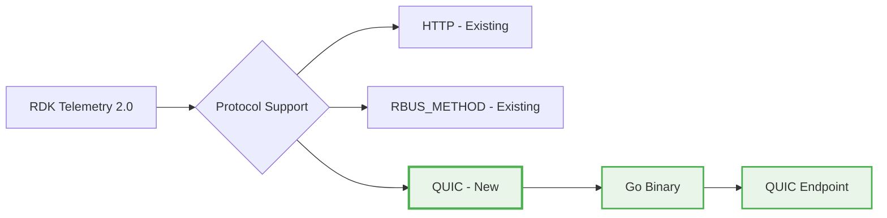
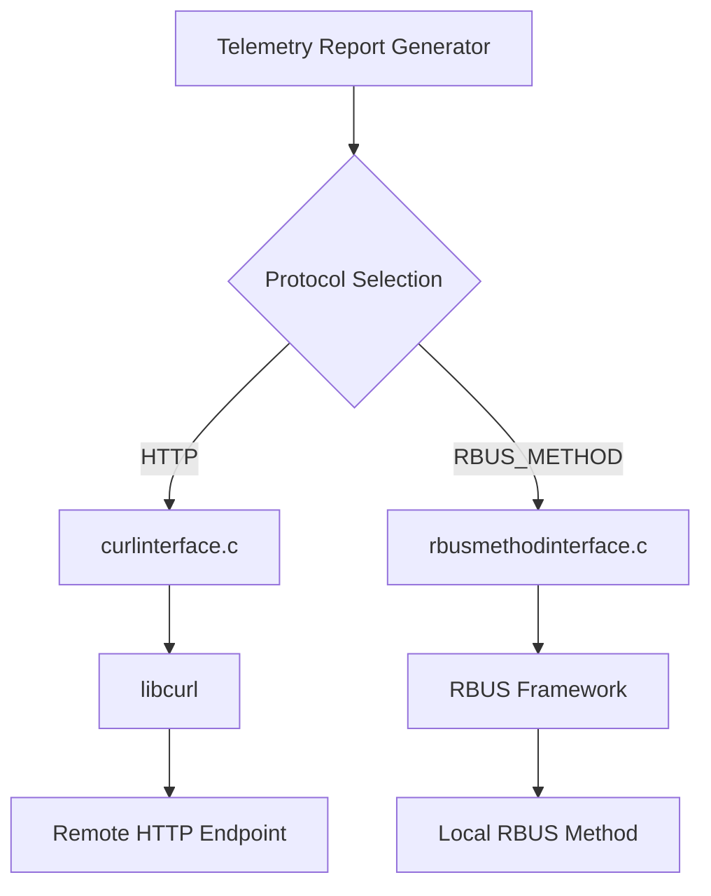
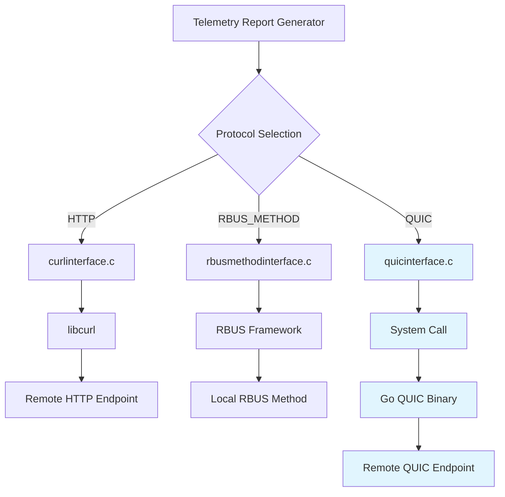
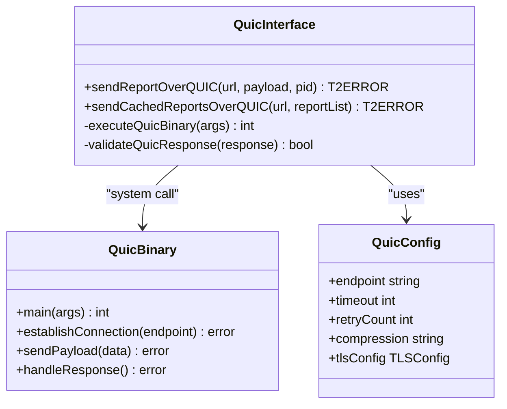
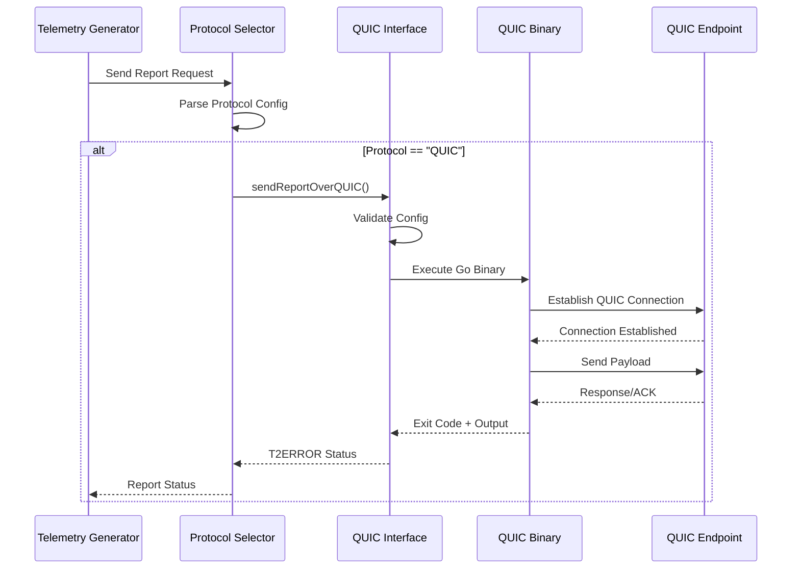
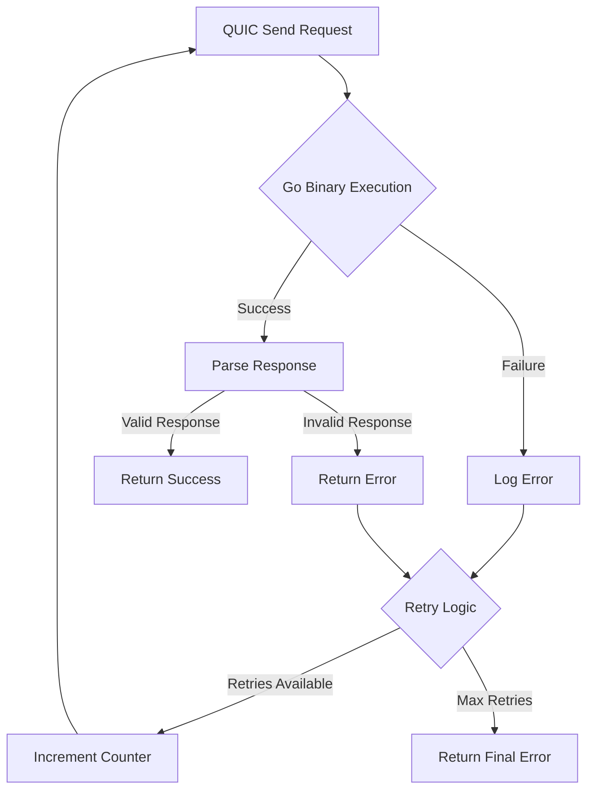
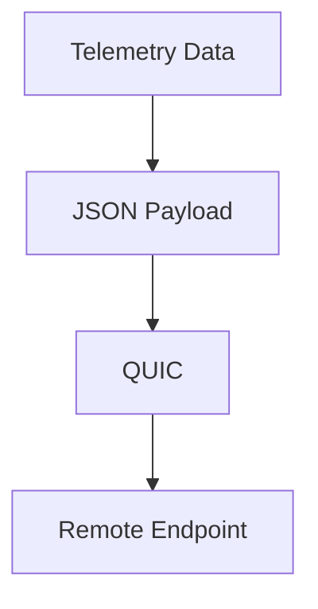
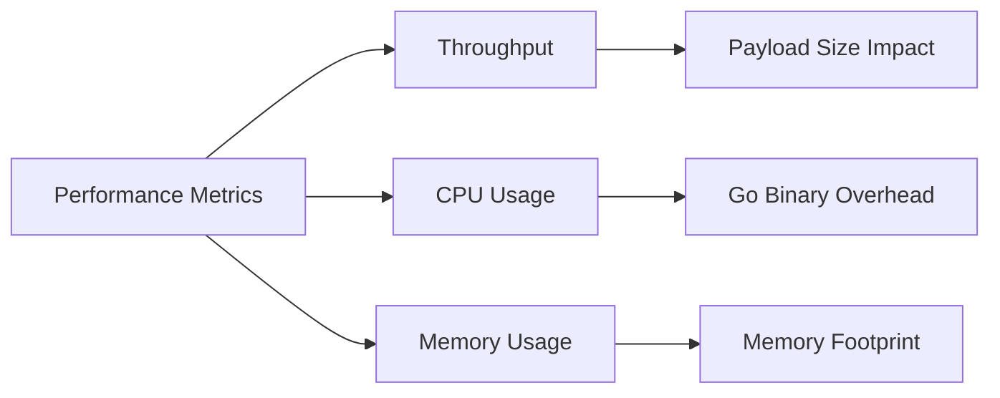
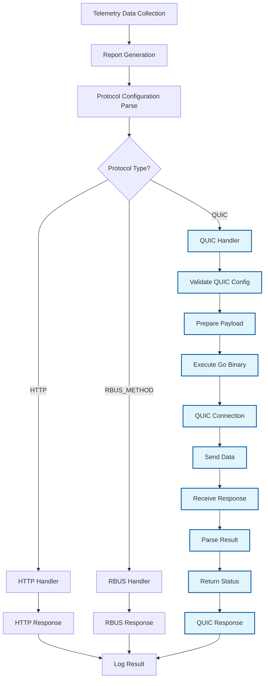

# High-Level Design: QUIC Protocol Support for RDK Telemetry 2.0

## Document Information
- **Version**: 1.0
- **Date**: November 2024
- **Author**: Senior Developer
- **Status**: POC Design

## Executive Summary

This document outlines the high-level design for expanding RDK Telemetry 2.0 reporting protocols to include QUIC support alongside the existing HTTP and RBUS_METHOD protocols. The implementation follows a POC approach using a Go binary system call mechanism for QUIC transport.

### QUIC Integration Overview



## Table of Contents
1. [Current Architecture Analysis](#current-architecture-analysis)
2. [QUIC Protocol Integration Design](#quic-protocol-integration-design)
3. [System Architecture](#system-architecture)
4. [Schema Extensions](#schema-extensions)
5. [Implementation Strategy](#implementation-strategy)
6. [Security Considerations](#security-considerations)
7. [Performance Considerations](#performance-considerations)
8. [Future Enhancements](#future-enhancements)

## Current Architecture Analysis

### Existing Protocol Support

The current Telemetry 2.0 system supports two protocols:

1. **HTTP Protocol** (`source/protocol/http/`)
   - Uses libcurl for HTTP/HTTPS transport
   - Supports POST/PUT methods
   - Handles compression (gzip)
   - Manages SSL/TLS certificates

2. **RBUS_METHOD Protocol** (`source/protocol/rbusMethod/`)
   - Uses RBUS framework for inter-component communication
   - Method-based parameter passing
   - Local system transport

### Current Protocol Flow



## QUIC Protocol Integration Design

### Design Principles

1. **Minimal Core Changes**: Leverage existing protocol abstraction
2. **External Binary Approach**: Use Go binary for QUIC implementation
3. **Consistent Interface**: Maintain same API pattern as existing protocols
4. **Error Handling**: Robust error reporting and fallback mechanisms

### QUIC Protocol Architecture



### QUIC Implementation Components



## System Architecture

### Protocol Selection Flow



### Error Handling Flow



## Schema Extensions

### JSON Schema Updates

The `t2_reportProfileSchema.schema.json` needs to be extended to support QUIC protocol:

#### Protocol Enum Extension
```json
{
  "Protocol": {
    "type": "string",
    "enum": ["HTTP", "RBUS_METHOD", "QUIC"],
    "description": "The protocol to be used for the upload of report generated by this profile."
  }
}
```

#### QUIC Protocol Definition
```json
{
  "protocolDefinitions": {
    "properties": {
      "QUIC": {
        "title": "QUIC Definition",
        "type": "object",
        "properties": {
          "Endpoint": {
            "type": "string",
            "description": "QUIC endpoint URL (quic://host:port)"
          },
          "Timeout": {
            "type": "integer",
            "default": 30,
            "description": "Connection timeout in seconds"
          },
          "Compression": {
            "type": "string",
            "enum": ["None"],
            "default": "None",
            "description": "Compression method for payload"
          },
          "RetryCount": {
            "type": "integer",
            "default": 3,
            "description": "Number of retry attempts"
          },
          "BinaryPath": {
            "type": "string",
            "default": "/usr/bin/quic-sender",
            "description": "Path to QUIC Go binary"
          }
        },
        "required": ["Endpoint"],
        "description": "QUIC Protocol details for report transmission"
      }
    }
  }
}
```

#### Schema Validation Rules
```json
{
  "anyOf": [
    {
      "properties": {
        "Protocol": { "const": "HTTP" }
      },
      "required": ["HTTP"]
    },
    {
      "properties": {
        "Protocol": { "const": "RBUS_METHOD" }
      },
      "required": ["RBUS_METHOD"]
    },
    {
      "properties": {
        "Protocol": { "const": "QUIC" }
      },
      "required": ["QUIC"]
    }
  ]
}
```

## Implementation Strategy

### Phase 1: Core Infrastructure
1. **QUIC Interface Module** (`source/protocol/quic/quicinterface.c`)
   - Implement system call wrapper
   - Error handling and logging
   - Configuration parsing

2. **Go Binary Development**
   - QUIC client will be implemented in a separate Go binary
   - The binary will be called using system call

### Phase 2: Integration
1. **Protocol Factory Updates**
   - Extend protocol selection logic
   - Add QUIC protocol instantiation

2. **Configuration Validation**
   - Schema validation for QUIC parameters
   - Runtime configuration checks

### Phase 3: Testing & Validation
1. **Unit Testing**
   - QUIC interface module tests
   - Go binary functionality tests

2. **Integration Testing**
   - End-to-end protocol testing
   - Error scenario validation

### Directory Structure
```
telemetry/
├── source/
│   └── protocol/
│       ├── http/
│       ├── rbusMethod/
│       └── quic/              # New QUIC protocol implementation
│           ├── Makefile.am
│           ├── quicinterface.c
│           ├── quicinterface.h

├── schemas/
│   └── t2_reportProfileSchema.schema.json  # Updated schema
└── docs/
    └── quic-protocol-expansion-hld.md      # This document
```

## Security Considerations

### Transport Security
- Security is handled by the QUIC Go binary

### System Security
- **Binary Validation**: Relaxed for POC
- **Input Sanitization**: Validate all configuration parameters

### Network Security


## Performance Considerations


### Performance Metrics


### Optimization Strategies
1. **Connection Pooling**: Reuse QUIC connections when possible
2. **Batch Processing**: Send multiple reports in single connection
3. **Compression**: Optimize payload size with gzip compression

### Complete QUIC Data Flow



## Future Enhancements

### Phase 2 Enhancements
1. **Native QUIC Library**: Replace Go binary with native C implementation


## Conclusion

This HLD provides a comprehensive approach to integrating QUIC protocol support into RDK Telemetry 2.0. The design maintains backward compatibility while introducing modern transport capabilities through a well-architected POC implementation using Go binary system calls.

The modular approach ensures minimal impact on existing functionality while providing a foundation for future enhancements and native QUIC implementation.

---

**Next Steps:**
1. Review and approve this HLD
2. Begin Phase 1 implementation
3. Develop comprehensive test suite
