# High-Level Design: Bulkdata Submodule

## Document Information

| Field | Value |
|-------|-------|
| **Module** | Bulkdata (Telemetry 2.0 Report Profiles) |
| **Version** | 1.0 |
| **Date** | January 2026 |
| **Status** | Active |

---

## 1. Overview

### 1.1 Purpose

The Bulkdata submodule manages telemetry report profiles, collects data from various sources, processes events and markers, and generates reports for backend transmission. It provides a flexible framework for configuring, scheduling, and executing telemetry operations.

### 1.2 Key Features

- Multi-format support (JSON, MessagePack, XML, XDR, CSV)
- Dynamic profile management
- Event-driven architecture with queue-based dispatch
- Component-based marker system
- Scheduled reporting with configurable intervals
- Thread-safe operations
- Configuration persistence
- WebConfig integration

---

## 2. System Architecture

### 2.1 High-Level Component View

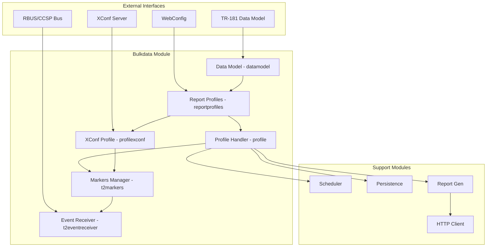

### 2.2 Component Responsibilities

| Component | Files | Responsibility |
|-----------|-------|----------------|
| **Data Model** | datamodel.c/h | TR-181 interface, profile blob processing |
| **Report Profiles** | reportprofiles.c/h | Profile lifecycle coordination |
| **Profile Handler** | profile.c/h | Profile execution, report generation |
| **XConf Profile** | profilexconf.c/h | Legacy XConf profile support |
| **Event Receiver** | t2eventreceiver.c/h | Event queue and dispatch |
| **Markers Manager** | t2markers.c/h | Marker-component mapping |

---

## 3. Component Details

### 3.1 Data Model Layer

**Purpose**: Interface between TR-181 and internal profile processing

**Key Functions**:
- Receive and validate profile configurations
- Queue management for async processing
- Thread-based profile processing

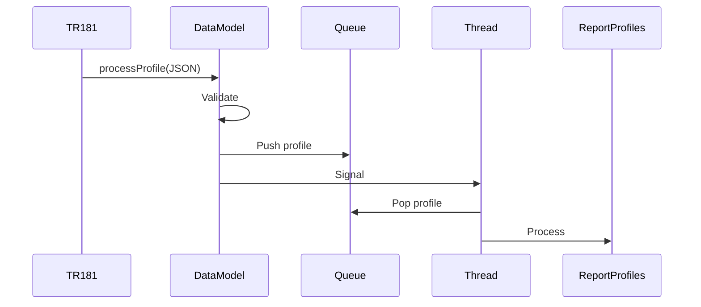

**Threading**:
- `rpThread` - Regular report profiles
- `tmpRpThread` - Temporary profiles
- `rpMsgThread` - MessagePack profiles

### 3.2 Report Profiles Manager

**Purpose**: Central coordinator for profile operations

**Profile Processing**:

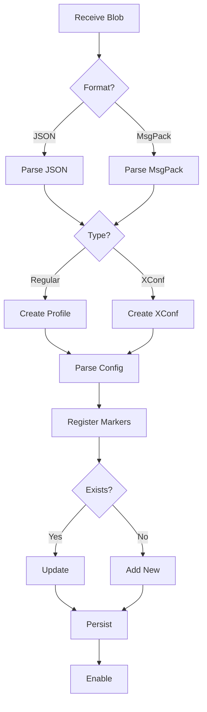

**Key Operations**:
- Initialize/cleanup profiles
- Parse JSON/MessagePack blobs
- Coordinate profile types
- Handle timeouts and callbacks

### 3.3 Profile Handler

**Purpose**: Manage individual profile lifecycle

**State Machine**:

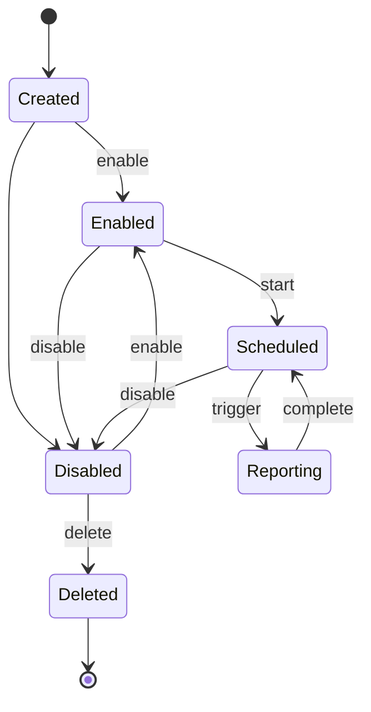

**Profile Structure**:
- Status flags (enable, reportInProgress, generateNow)
- Configuration (name, hash, protocol, encodingType)
- Timing (reportingInterval, activationTimeoutPeriod)
- Collections (paramList, eMarkerList, gMarkerList)
- Destinations (HTTP, RBUS)
- Threading (reportThread, mutexes, conditions)

### 3.4 Event Receiver

**Purpose**: Asynchronous event collection and dispatch

**Event Flow**:

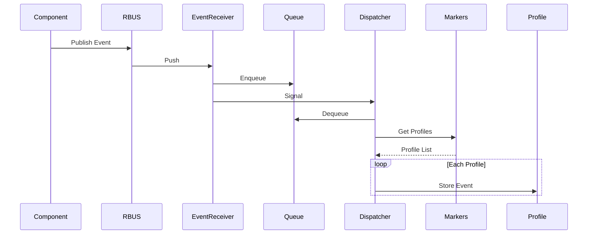

**Configuration**:
- Max queue size: 200 events
- Overflow: Drop oldest
- Thread-safe with mutex

### 3.5 Markers Manager

**Purpose**: Marker-component mapping and routing

**Architecture**:

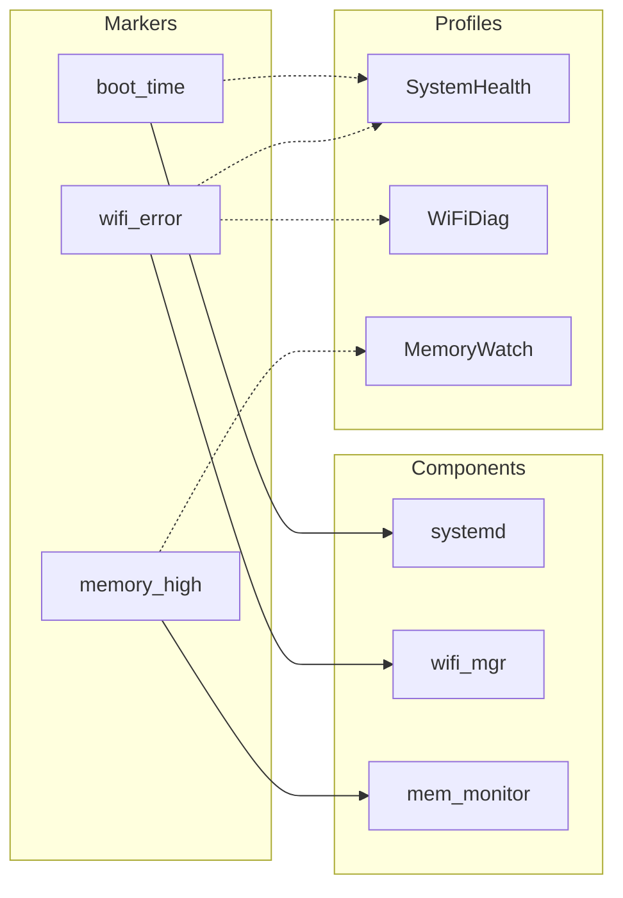

**Data Structure**:
- Hash map: marker name → T2Marker
- T2Marker contains: markerName, componentName, profileList
- Thread-safe access

---

## 4. Data Flows

### 4.1 Profile Configuration

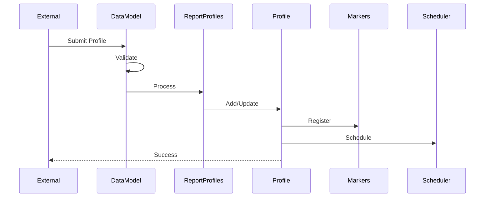

### 4.2 Event-Driven Report

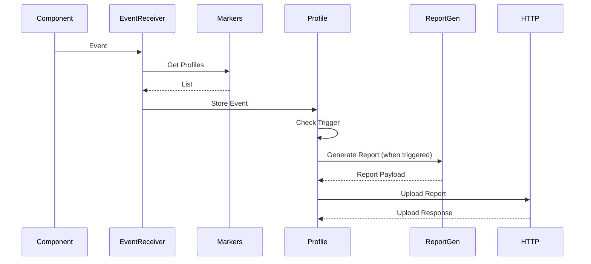

### 4.3 Scheduled Report

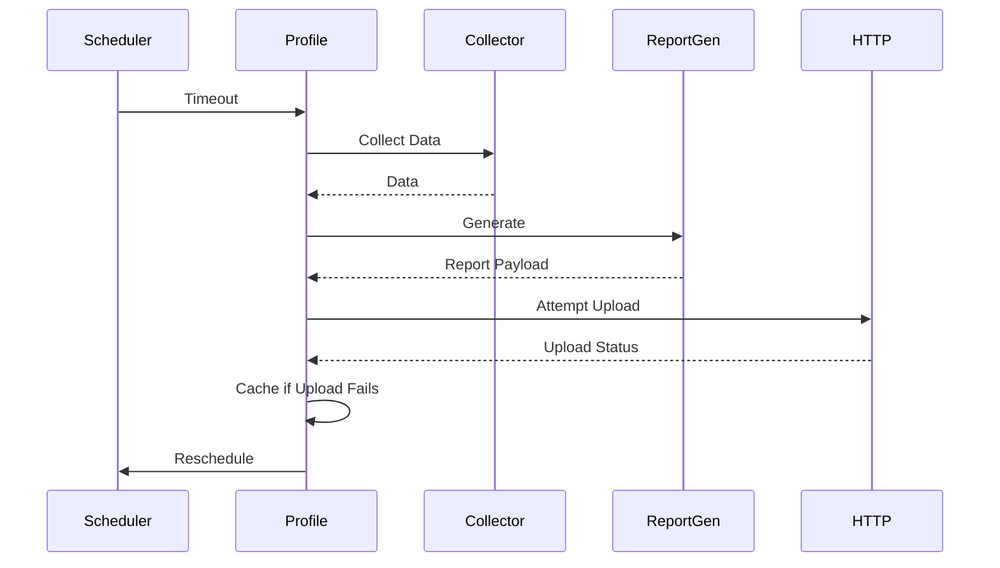

---

## 5. Threading Model

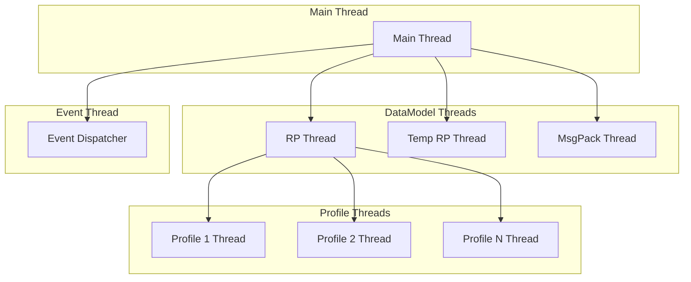

**Synchronization**:
- Mutexes: rpMutex, erMutex, plMutex, reportMutex, t2MarkersMutex
- Conditions: rpCond, erCond, reportcond
- Thread-safe queues and vectors

---

## 6. API Summary

### 6.1 Data Model APIs

- `datamodel_init()` - Initialize
- `datamodel_unInit()` - Cleanup
- `datamodel_processProfile()` - Process JSON
- `datamodel_MsgpackProcessProfile()` - Process MessagePack

### 6.2 Report Profiles APIs

- `initReportProfiles()` - Initialize
- `ReportProfiles_uninit()` - Cleanup
- `ReportProfiles_ProcessReportProfilesBlob()` - Process blob
- `ReportProfiles_storeMarkerEvent()` - Store event
- `ReportProfiles_deleteProfile()` - Delete profile

### 6.3 Profile Handler APIs

- `initProfileList()` - Initialize
- `addProfile()` - Add profile
- `enableProfile()` - Enable
- `disableProfile()` - Disable
- `deleteProfile()` - Delete
- `Profile_storeMarkerEvent()` - Store event
- `triggerReportOnCondtion()` - Trigger report

### 6.4 Event Receiver APIs

- `T2ER_Init()` - Initialize
- `T2ER_Uninit()` - Cleanup
- `T2ER_StartDispatchThread()` - Start dispatcher
- `T2ER_Push()` - Push event

### 6.5 Markers Manager APIs

- `initT2MarkerComponentMap()` - Initialize
- `addT2EventMarker()` - Add marker
- `getMarkerProfileList()` - Get profiles
- `getComponentsWithEventMarkers()` - Get components

---

## 7. Data Models

### 7.1 Encoding Types

| Type | Description | Use Case |
|------|-------------|----------|
| JSON | JavaScript Object Notation | Modern APIs |
| MESSAGE_PACK | Binary serialization | Efficient transmission |
| XML | Extensible Markup Language | Legacy systems |
| XDR | External Data Representation | Legacy RDK |
| CSV | Comma-Separated Values | Simple export |

### 7.2 Report Formats

**JSON Formats**:
- Object Hierarchy: Nested structure
- Key-Value Pair: Flat structure

**Timestamp Formats**:
- Unix Epoch: Seconds since 1970
- ISO 8601: Standard date-time format
- None: No timestamp

### 7.3 Configuration Constraints

- Min report interval: 10 seconds
- Max parameters per profile: 100
- Max cached reports: 5
- Default max report size: 50KB
- Event queue max: 200 events

---

## 8. Persistence

**Storage Locations**:
- Regular profiles: `/tmp/t2profiles/` or `/nvram/t2profiles/`
- XConf profile: `/tmp/DCMSettings.conf` or `/nvram/DCMSettings.conf`
- WebConfig version: `/nvram/telemetry_webconfig_blob_version.txt`

**Strategy**:
- Save on create/update
- Load on initialization
- Hash-based change detection
- Atomic file operations

---

## 9. Security

### 9.1 Authentication

- MTLS support for secure communication
- Certificate-based authentication
- Privilege dropping (DROP_ROOT_PRIV)
- Capability-based access control

### 9.2 Privacy

- Privacy mode control
- Do-not-share functionality
- Sensitive data filtering
- HTTPS enforcement

---

## 10. Integration

### 10.1 RBUS/CCSP

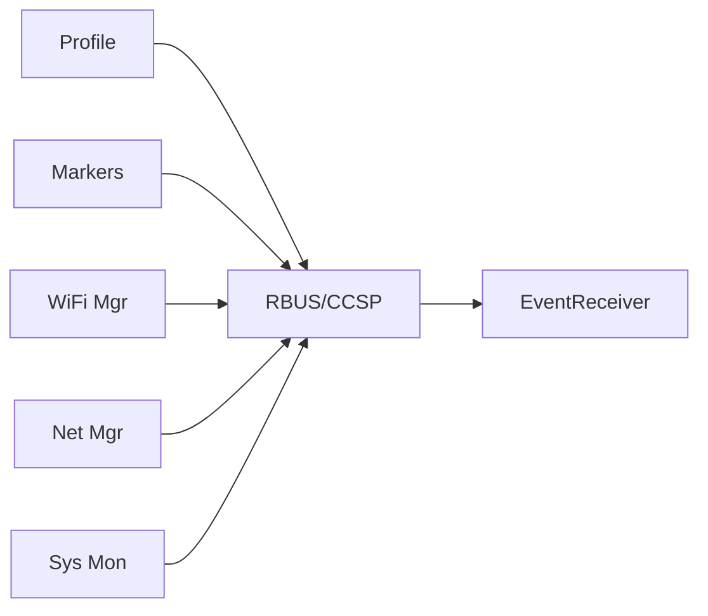

**Features**:
- Event subscriptions
- Marker registration
- Dynamic routing
- Method invocations

### 10.2 WebConfig

- Remote configuration
- Version-based updates
- Blob validation
- Rollback support
- Subdocument: `telemetry`

---

## 11. Build Configuration

**Conditional Compilation**:
- `CCSP_SUPPORT_ENABLED` - CCSP bus
- `FEATURE_SUPPORT_WEBCONFIG` - WebConfig
- `PRIVACYMODES_CONTROL` - Privacy modes
- `DROP_ROOT_PRIV` - Privilege dropping
- `ENABLE_RDKB_SUPPORT` - RDKB features
- `DEVICE_EXTENDER` - Extender mode

**Dependencies**:
- cjson, msgpack, pthread, curl, rbus
- t2collection, persistence, scheduler, reportgen, t2parser

---

## 12. Error Handling

**Error Codes**:
- T2ERROR_SUCCESS
- T2ERROR_FAILURE
- T2ERROR_INVALID_ARGS
- T2ERROR_MEMALLOC_FAILED
- T2ERROR_PROFILE_NOT_FOUND
- T2ERROR_QUEUE_FULL

**Strategy**:
- Input validation at boundaries
- Graceful degradation
- Profile isolation
- Automatic retry
- Report caching on failure

---

## 13. Performance

**Optimization**:
- Vector-based collections
- Efficient memory management
- Thread pool for reports
- Async event processing
- HTTP connection reuse
- Compression support

**Resource Limits**:
- Event queue: 200
- Max profiles: Memory-limited
- Max params/profile: 100
- Cached reports: 5
- Max report size: 50KB

---

## 14. Testing

**Coverage** (Current: 37.2% lines, 74.0% functions):
- Unit tests for each component
- Profile CRUD operations
- Event queue operations
- Marker management
- JSON/MessagePack parsing

**Integration Tests**:
- End-to-end profile flow
- Event-driven reporting
- Scheduled reporting
- Multi-profile execution
- Error recovery
- WebConfig integration

---

## 15. Glossary

| Term | Definition |
|------|------------|
| **Profile** | Configuration for data collection and reporting |
| **Marker** | Named event indicator for data collection |
| **Event** | Occurrence of a marker with data |
| **Report** | Formatted telemetry data collection |
| **XConf** | Legacy configuration format |
| **TR-181** | Device data model standard |
| **RBUS** | RDK Bus IPC framework |
| **CCSP** | Common Component Software Platform |

---

## Appendix: Component Interaction Matrix

| Component | Data Model | Report Profiles | Profile | XConf | Event Receiver | Markers |
|-----------|------------|-----------------|---------|-------|----------------|---------|
| Data Model | - | Calls | - | - | - | - |
| Report Profiles | Called by | - | Calls | Calls | Calls | - |
| Profile | - | Called by | - | - | Calls | Calls |
| XConf | - | Called by | - | - | Calls | Calls |
| Event Receiver | - | - | Called by | Called by | - | Calls |
| Markers | - | - | Called by | Called by | Called by | - |

---

**Document Version**: 1.0  
**Last Updated**: January 12, 2026  
**Status**: Active
