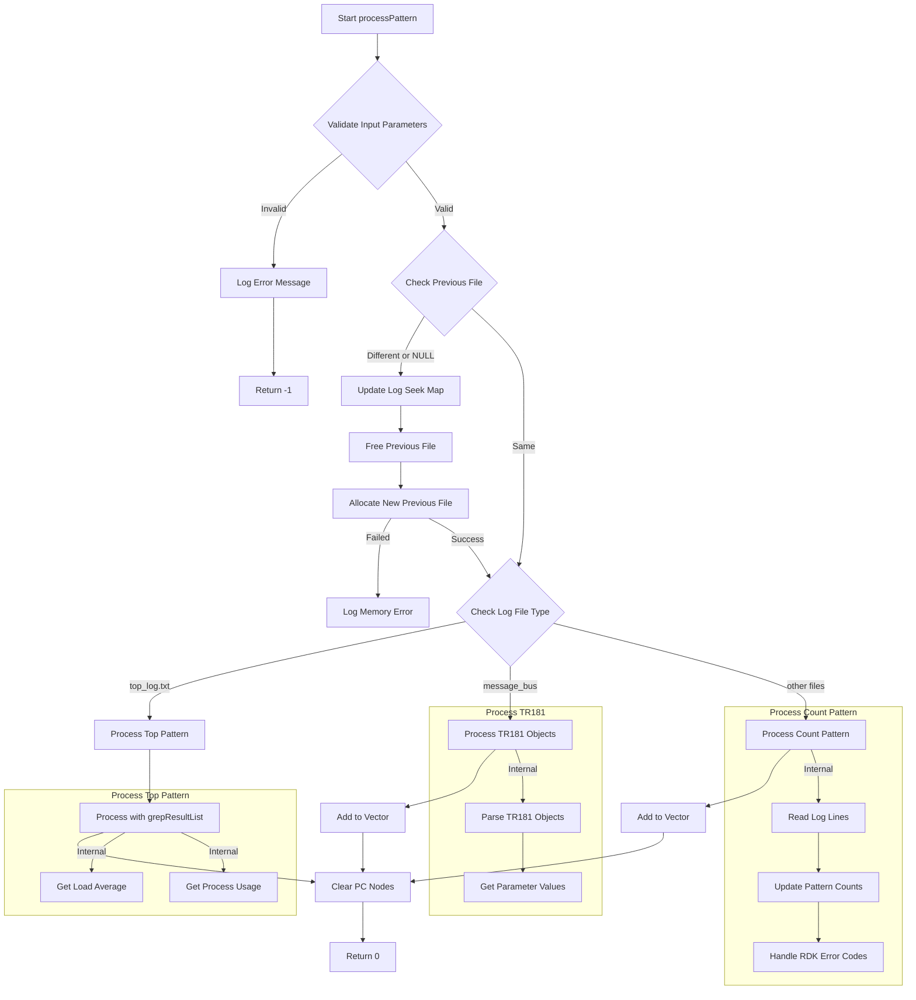

```mermaid
flowchart TD
    A[Start processPattern] --> B{Validate Input Parameters}
    B -->|Invalid| C[Log Error Message]
    C --> D[Return -1]
    
    B -->|Valid| E{Check Previous File}
    
    E -->|Different or NULL| F[Update Log Seek Map]
    F --> G[Free Previous File]
    G --> H[Allocate New Previous File]
    H -->|Failed| I[Log Memory Error]
    
    H -->|Success| J{Check Log File Type}
    E -->|Same| J
    
    J -->|top_log.txt| K[Process Top Pattern]
    K --> K1[Process with grepResultList]
    
    J -->|message_bus| L[Process TR181 Objects]
    L --> L1[Add to Vector]
    
    J -->|other files| M[Process Count Pattern]
    M --> M1[Add to Vector]
    
    K1 --> N[Clear PC Nodes]
    L1 --> N
    M1 --> N
    
    N --> O[Return 0]
    
    subgraph Process Top Pattern
        K1 -->|Internal| KA[Get Load Average]
        K1 -->|Internal| KB[Get Process Usage]
    end
    
    subgraph Process TR181
        L -->|Internal| LA[Parse TR181 Objects]
        LA --> LB[Get Parameter Values]
    end
    
    subgraph Process Count Pattern
        M -->|Internal| MA[Read Log Lines]
        MA --> MB[Update Pattern Counts]
        MB --> MC[Handle RDK Error Codes]
    end
```