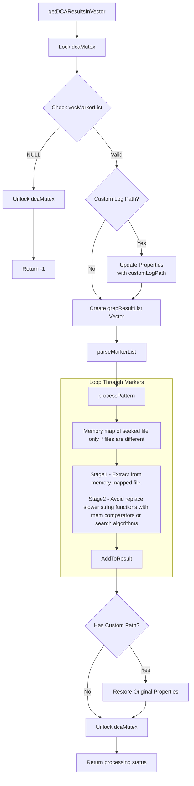

```mermaid
flowchart TD
    Start[getDCAResultsInVector] --> Lock[Lock dcaMutex]
    
    Lock --> CheckInput{Check vecMarkerList}
    CheckInput -->|NULL| Unlock1[Unlock dcaMutex]
    Unlock1 --> Return1[Return -1]
    
 
    CheckInput -->|Valid| CheckCustomPath
 
    
    
    CheckCustomPath{Custom Log Path?} -->|Yes| UpdateProps[Update Properties\nwith customLogPath]
    CheckCustomPath -->|No| CreateVector
    UpdateProps --> CreateVector
    
    CreateVector[Create grepResultList Vector] --> ParseMarkers[parseMarkerList]
    
    ParseMarkers --> processPattern
    subgraph LoopThroughMarkers[Loop Through Markers]
        processPattern --> GetSeekMap[Memory map of seeked file only if files are different]
        GetSeekMap --> LogPattern[Stage1 - Extract from memory mapped file.
                                  Stage2 - Avoid replace slower string functions with mem comparators or search algorithms]
        LogPattern --> AddToResult
    end
    
    AddToResult --> CheckCustom{Has Custom Path?}
    CheckCustom -->|Yes| RestoreProps[Restore Original Properties]
    CheckCustom -->|No| Unlock2[Unlock dcaMutex]
    RestoreProps --> Unlock2
    
    Unlock2 --> Return2[Return processing status]
```

