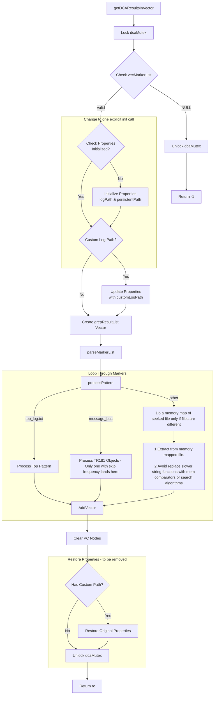

```mermaid
flowchart TD
    Start[getDCAResultsInVector] --> Lock[Lock dcaMutex]
    
    Lock --> CheckInput{Check vecMarkerList}
    CheckInput -->|NULL| Unlock1[Unlock dcaMutex]
    Unlock1 --> Return1[Return -1]
    
 
    CheckInput -->|Valid| CheckProps{Check Properties\nInitialized?}
 
    subgraph CheckInputValid[Change to one explicit init call]
    CheckProps -->|No| InitProps[Initialize Properties\nlogPath & persistentPath]
    CheckProps -->|Yes| CheckCustomPath
    end 
    InitProps --> CheckCustomPath
    
    CheckCustomPath{Custom Log Path?} -->|Yes| UpdateProps[Update Properties\nwith customLogPath]
    CheckCustomPath -->|No| CreateVector
    UpdateProps --> CreateVector
    
    CreateVector[Create grepResultList Vector] --> ParseMarkers[parseMarkerList]
    
    ParseMarkers --> processPattern
    subgraph LoopThroughMarkers[Loop Through Markers]
        processPattern -->|top_log.txt| TopPattern[Process Top Pattern]
        processPattern -->|message_bus| TR181[Process TR181 Objects - Only one with skip frequency lands here]
        processPattern -->|other| GetSeekMap[Do a memory map of seeked file only if files are different]
        GetSeekMap --> LogPattern[1.Extract from memory mapped file.
                                  2.Avoid replace slower string functions with mem comparators or search algorithms]
        TopPattern --> AddVector
        TR181 --> AddVector
        LogPattern --> AddVector
      end
    
    AddVector --> CleanupNodes[Clear PC Nodes]
   
    CleanupNodes --> CheckCustom{Has Custom Path?}
    subgraph RestoreProp[Restore Properties - to be removed]
    CheckCustom -->|Yes| RestoreProps[Restore Original Properties]
    CheckCustom -->|No| Unlock2[Unlock dcaMutex]
    end
    RestoreProps --> Unlock2
    
    Unlock2 --> Return2[Return rc]
```

