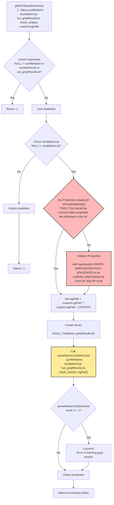

```mermaid
flowchart TD
    Start["getDCAResultsInVector
    1. Takes profileName, vecMarkerList, out_grepResultList, check_rotated, customLogPath"] --> CheckArgs{"Check Arguments
    NULL == profileName or
    vecMarkerList or
    out_grepResultList?"}
    CheckArgs -->|Yes| ReturnError["Return -1"]
    
    CheckArgs -->|No| Lock["Lock dcaMutex"]
    
    Lock --> CheckMarkers{"Check vecMarkerList
    NULL != vecMarkerList?"}
    CheckMarkers -->|No| Unlock1["Unlock dcaMutex"]
    Unlock1 --> Return1["Return -1"]
    
    CheckMarkers -->|Yes| CheckProps{"Are Properties Initialized?
    isPropsInitialized() - TODO: This should be removed after properties are initialized in the init."}
    style CheckProps fill:#ffb8b8,stroke:#333,stroke-width:2px
    
    
    CheckProps -->|No| InitProps["Initialize Properties
    initProperties(&LOGPATH, &PERSISTENTPATH, &PAGESIZE) to be explicitly called during init once per app life cycle"]
    style InitProps fill:#ffb8b8,stroke:#333,stroke-width:2px
    CheckProps -->|Yes| SetLogPath
    InitProps --> SetLogPath
    
    SetLogPath["Set logPath = customLogPath ? customLogPath : LOGPATH"] --> CreateVector["Create Vector
    Vector_Create(out_grepResultList)"]
    
    CreateVector --> ParseMarkers["Call parseMarkerListOptimized
    (profileName, vecMarkerList, *out_grepResultList, check_rotated, logPath)"]
    style ParseMarkers fill:#FFEB99,stroke:#333,stroke-width:2px

    ParseMarkers --> CheckParseResult{"parseMarkerListOptimized
    result == -1?"}
    CheckParseResult -->|Yes| LogError2["Log error
    \"Error in fetching grep results\""]
    CheckParseResult -->|No| Unlock2["Unlock dcaMutex"]
    LogError2 --> Unlock2
    
    Unlock2 --> Return2["Return processing status"]
```

```mermaid
flowchart TD
    subgraph parseMarkerListOptimized["parseMarkerListOptimized Function"]
        Init["Initialize variables:
        - prevfile = NULL
        - Get GrepSeekProfile
        - Check rotation flags
        - Set profileExecCounter
        - Check first report after bootup"] --> MarkerLoop["Loop through vecMarkerList"]
        
        MarkerLoop --> CheckMarker{"Is marker valid?
        - Has logFile
        - Has searchString
        - Has markerName"}
        CheckMarker -->|No| NextMarker["Continue to next marker"]
        
        CheckMarker -->|Yes| CheckSpecialFiles{"Is file special?
        (message_bus or top_log.txt)- Only for dev debug. Parsers needs an update. And this check should be removed before production"}
        style CheckSpecialFiles fill:#ffb8b8,stroke:#333,stroke-width:2px
        CheckSpecialFiles -->|Yes| LogError["Log error and continue"]
        LogError --> NextMarker
        
        CheckSpecialFiles -->|No| CheckFile{"Is file different
        from previous?"}
        CheckFile -->|Yes| CloseOld["Close previous file
        and release resources"]
        CloseOld --> OpenNew["Open new log file
        fd = getLogFileDescriptor()"]
        OpenNew --> CheckFileDescriptor{"fd == -1 or fd == -2?"}
        CheckFileDescriptor -->|Yes| HandleFileError["Handle file error
        - fd == -1: Error opening file
        - fd == -2: File size matches seek value"]
        HandleFileError --> UpdatePrevFile["Update prevfile and continue"]
        UpdatePrevFile --> NextMarker
        
        CheckFileDescriptor -->|No| MemMap["Memory map file
        getFileDeltaInMemMapAndSearch()"]
        style MemMap fill:#f96,stroke:#333,stroke-width:2px

        MemMap --> CheckMemMap{"Memory map successful?"}
        CheckMemMap -->|No| CleanupFd["Close fd and continue"]
        CleanupFd --> NextMarker
        
        CheckFile -->|No| SkipCheck{"Should skip or fd = -2 ?
        Based on skipFreq or return status of getLogFileDescriptor()"}
        CheckMemMap -->|Yes| SkipCheck
        
        SkipCheck -->|No| Process["Process Pattern
        processPatternWithOptimizedFunction()"]
        style Process fill:#b8d4ff,stroke:#333,stroke-width:2px
        SkipCheck -->|Yes| NextMarker
        Process --> NextMarker
        
        NextMarker --> EndLoop{"End of markers?"}
        EndLoop -->|No| MarkerLoop
        EndLoop -->|Yes| UpdateCounter["Increment execCounter
        gsProfile->execCounter += 1"]
        UpdateCounter --> Cleanup["Cleanup resources:
        - Free prevfile
        - Close fd
        - Free fileDescriptor"]
    end
```

```mermaid
flowchart TD
    
    subgraph processPatternWithOptimizedFunction["processPatternWithOptimizedFunction"]
    style processPatternWithOptimizedFunction fill:#b8d4ff,stroke:#333,stroke-width:2px
        ProcessInit["Get data from marker:
        - searchString (pattern)
        - trimParam
        - regexParam
        - markerName (header)
        - mType"] --> CheckType{"Check marker type"}
        
        CheckType -->|MTYPE_COUNTER| CountMatch["Count pattern matches
        getCountPatternMatch()"]
        CountMatch --> CheckCount{"Count > 0?"}
        CheckCount -->|Yes| FormatCount["Format count value
        (limit to 9999)"]
        FormatCount --> CreateCountResult["Create GrepResult
        with count value"]
        CheckCount -->|No| EndProcess
        
        CheckType -->|Other| FindMatch["Find pattern match
        getAbsolutePatternMatch()"]
        FindMatch --> CheckFound{"Match found?"}
        CheckFound -->|Yes| CreateMatchResult["Create GrepResult
        with matched string"]
        CheckFound -->|No| EndProcess
        
        CreateCountResult --> AddToVector["Add result to vector
        Vector_PushBack()"]
        CreateMatchResult --> AddToVector
        AddToVector --> EndProcess["End processing"]
    end
    
    subgraph getFileDeltaInMemMapAndSearch["getFileDeltaInMemMapAndSearch Function"]
    style getFileDeltaInMemMapAndSearch fill:#f96,stroke:#333,stroke-width:2px
        MapInit["Check fd is valid"] --> CheckFileSize["Get file size using fstat"]
        CheckFileSize --> ValidateSize{"File size > 0?"}
        ValidateSize -->|No| ReturnNULL["Return NULL"]
        ValidateSize -->|Yes| CalculateOffset["Calculate page-aligned offset
        - offset_in_page_size_multiple
        - bytes_ignored"]
        CalculateOffset --> MemoryMap["Memory map file with calculated offset"]
        MemoryMap --> CheckMapSuccess{"Memory map successful?"}
        CheckMapSuccess -->|No| ReturnNULL2["Return NULL"]
        CheckMapSuccess -->|Yes| CreateDescriptor["Create FileDescriptor
        - Set baseAddr, addr, fd, file_size"]
        CreateDescriptor --> ReturnDescriptor["Return FileDescriptor"]
    end
    
```

