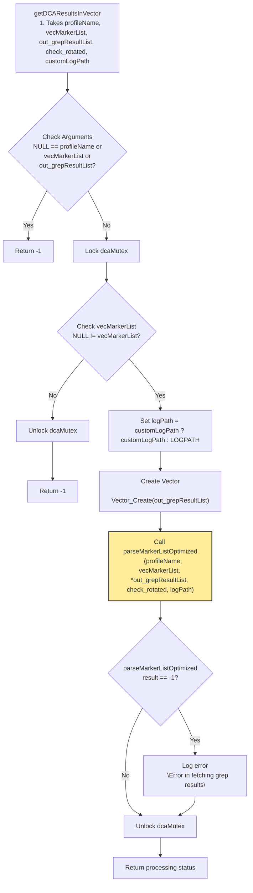

```mermaid
flowchart TD
    subgraph parseMarkerListOptimized["parseMarkerListOptimized Function"]
        Init["Initialize variables:
        - prevfile = NULL
        - Get GrepSeekProfile
        - Check rotation flags
        - Set profileExecCounter
        - Check first report after bootup"] --> MarkerLoop["Loop through vecMarkerList"]
        
        MarkerLoop --> CheckMarker{"Is marker valid?
        - Has logFile
        - Has searchString
        - Has markerName"}
        CheckMarker -->|No| NextMarker["Continue to next marker"]
        
        CheckMarker -->|Yes| CheckFile{"Is file different
        from previous?"}
        CheckFile -->|Yes| CloseOld["Close previous file
        and release resources"]
        CloseOld --> OpenNew["Open new log file
        fd = getLogFileDescriptor()"]
        OpenNew --> CheckFileDescriptor{"fd == -1 or fd == -2?"}
        CheckFileDescriptor -->|Yes| HandleFileError["Handle file error
        - fd == -1: Error opening file
        - fd == -2: File size matches seek value"]
        HandleFileError --> UpdatePrevFile["Update prevfile and continue"]
        UpdatePrevFile --> NextMarker
        
        CheckFileDescriptor -->|No| MemMap["Memory map file
        getFileDeltaInMemMapAndSearch()"]
        style MemMap fill:#f96,stroke:#333,stroke-width:2px

        MemMap --> CheckMemMap{"Memory map successful?"}
        CheckMemMap -->|No| CleanupFd["Close fd and continue"]
        CleanupFd --> NextMarker
        
        CheckFile -->|No| SkipCheck{"Should skip or fd = -2 ?
        Based on skipFreq or return status of getLogFileDescriptor()"}
        CheckMemMap -->|Yes| SkipCheck
        
        SkipCheck -->|No| Process["Process Pattern
        processPatternWithOptimizedFunction()"]
        style Process fill:#b8d4ff,stroke:#333,stroke-width:2px
        SkipCheck -->|Yes| NextMarker
        Process --> NextMarker
        
        NextMarker --> EndLoop{"End of markers?"}
        EndLoop -->|No| MarkerLoop
        EndLoop -->|Yes| Cleanup
        Cleanup["Cleanup resources:
        - Free prevfile
        - Close fd
        - Free fileDescriptor"]
    end
```

```mermaid
flowchart TD
    
    subgraph processPatternWithOptimizedFunction["processPatternWithOptimizedFunction"]
    style processPatternWithOptimizedFunction fill:#b8d4ff,stroke:#333,stroke-width:2px
        ProcessInit["Get data from marker:
        - searchString (pattern)
        - trimParam
        - regexParam
        - markerName (header)
        - mType"] --> CheckType{"Check marker type"}

        CheckType -->|MTYPE_COUNTER| CountMatch["Count pattern matches
        getCountPatternMatch()"]
        CountMatch --> strnstr["strnstr (boyer-moore- 
        horspool algorithm)"]
        strnstr --> CheckCount{"Count > 0?"}
        CheckCount -->|Yes| FormatCount["Format count value
        (limit to 9999)"]
        FormatCount --> CreateCountResult["Create GrepResult
        with count value"]
        CheckCount -->|No| EndProcess

        CheckType -->|Other| FindMatch["Find pattern match
        getAbsolutePatternMatch()"]
        FindMatch --> strnstr["strnstr (boyer-moore- 
        horspool algorithm)"]
        strnstr --> CheckFound{"Match found?"}
        CheckFound -->|Yes| CreateMatchResult["Create GrepResult
        with matched string"]
        CheckFound -->|No| EndProcess

        CreateCountResult --> AddToVector["Add result to vector
         Vector_PushBack()"]
        CreateMatchResult --> AddToVector
        AddToVector --> EndProcess["End processing"]
    end

    subgraph getFileDeltaInMemMapAndSearch["getFileDeltaInMemMapAndSearch Function"]
    style getFileDeltaInMemMapAndSearch fill:#f96,stroke:#333,stroke-width:2px
        MapInit["Check fd is valid"] --> CheckFileSize["Get file size using fstat"]
        CheckFileSize --> ValidateSize{"File size > 0?"}
        ValidateSize -->|No| ReturnNULL["Return NULL"]
        ValidateSize -->|Yes| CalculateOffset["Calculate page-aligned offset
        - offset_in_page_size_multiple
        - bytes_ignored"]
        CalculateOffset --> tmp_fd{"create temp file descriptor"}
        tmp_fd --> sendfile{"copy the contents of
         file to temp file descriptor"}
        sendfile --> |No| ReturnNULL2["Return NULL"]
        sendfile --> |Yes| seekvalueCheck{"Check seek_value > file_size
        or check rotated"}
        seekvalueCheck --> |Yes| MemoryMap1["Do MMap for main &
         rotated files with calculated offset"]
        seekvalueCheck --> |No| MemoryMap2["Memory map file with calculated offset"]
        MemoryMap1 --> CheckMapSuccess{"Memory map successful?"}
        MemoryMap2 --> CheckMapSuccess{"Memory map successful?"}
        CheckMapSuccess -->|No| ReturnNULL2["Return NULL"]
        CheckMapSuccess -->|Yes| CreateDescriptor["Create FileDescriptor
        - Set baseAddr, rotatedAddr, addrcf, addrrf, fd, filesizes"]
        CreateDescriptor --> ReturnDescriptor["Return FileDescriptor"]
    end
   ```
```mermaid
flowchart TD
    subgraph strnstr["strnstr Function"]
    style strnstr fill:#b8d4ff,stroke:#333,stroke-width:2px
    start["search pattern
    in memory map
    Takes haystack, pattern and
     len of haystack"] --> CheckArgs{"haystack == NULL or
     needle == NULL or
      len < needle_len or
       len - needle_len > len"}
    CheckArgs -->|Yes| ReturnNULL["Return NULL"]
    CheckArgs -->|No| Check_needlelen{"if needle_len< 4"}
    Check_needlelen --> |Yes| string_found{"memcmp
    if match found
    in haystack"}
    string_found --> |Yes| return_start_of_string["return haystack[i]"]
    string_found --> |No| return_NULL["return NULL"]
    Check_needlelen --> |No| search_len["calculate search len"]
    search_len --> multi-char_check["check first && last 2 chars"]
    multi-char_check --> calculate_skip_value["calculate skip
    value = needle_len / 4"]
    calculate_skip_value --> loop_thru_haystack{"loop thru haystack"}
    loop_thru_haystack -->  boundary_check{"haystack[i] == '\0' ||
    i + needle_len > len ||
     i >= search_len"}
     boundary_check --> |Yes| return_NULL
     boundary_check --> |No| boundary_char_match{"if all boundary chars
      match"}
    boundary_char_match --> |Yes| middle_section_search{"do a full  comparison
    of the middle section
    if match found"}
    boundary_char_match --> |No| skip_checkformatch["skip upto value and check
    for next match"] --> continue_search
    middle_section_search --> |Yes| return_start_of_string["return haystack[i]"]
    middle_section_search --> |No| skip_one_char --> continue_search
    continue_search --> loop_thru_haystack
    end
    
```
