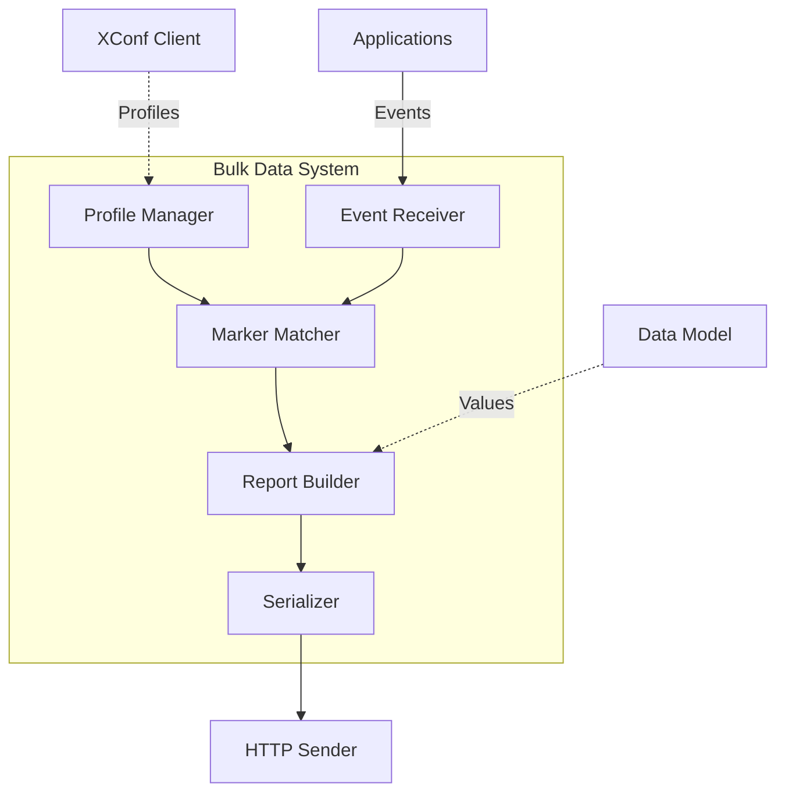
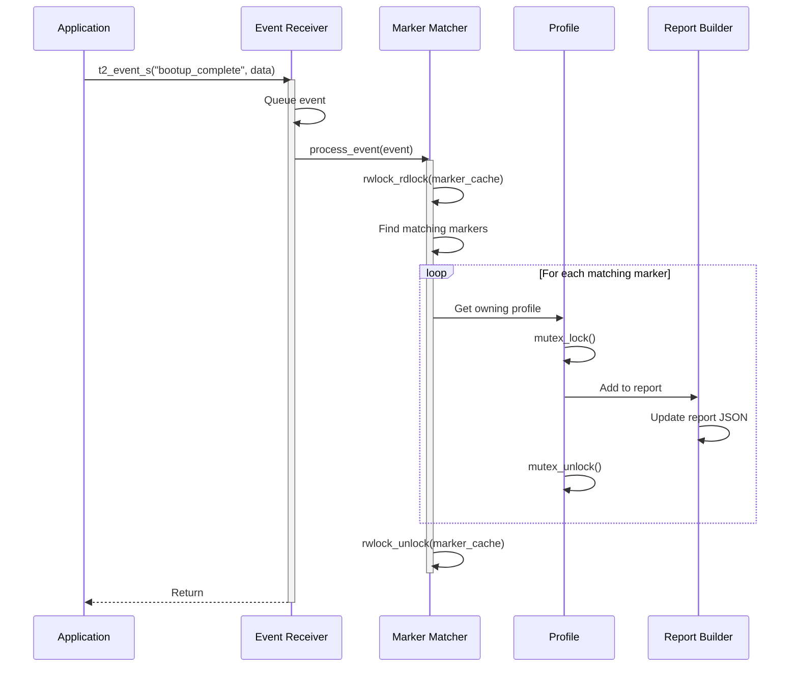
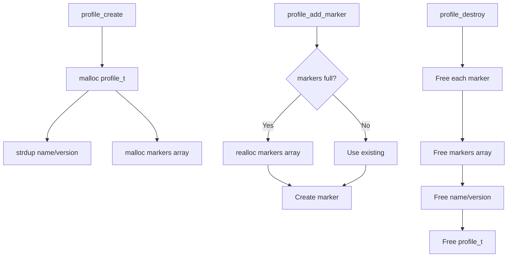

# Bulk Data Component

## Overview

The Bulk Data component is the core of the Telemetry 2.0 framework. It manages telemetry profiles, processes marker events, matches events against profile configurations, and coordinates report generation. This is the central component that ties together all telemetry operations.

## Architecture

### Component Overview



### Key Components

1. **Profile Manager** (`profile.c`) - Manages profile lifecycle
2. **Marker Matcher** (`t2markers.c`) - Matches events to profiles
3. **Event Receiver** (`t2eventreceiver.c`) - Receives marker events
4. **Report Profiles** (`reportprofiles.c`) - Report generation logic
5. **Data Model** (`datamodel.c`) - Device data retrieval

## Key Data Structures

### Profile Structure

```c
/**
 * Telemetry profile
 * Defines what data to collect and when to report
 */
typedef struct {
    char name[MAX_PROFILE_NAME];     // Profile identifier
    char version[MAX_VERSION_LEN];   // Profile version
    char protocol[16];                // "HTTP" or "RBUS"
    char encoding[16];                // "JSON" or "GPB"
    unsigned int reporting_interval; // Seconds between reports
    
    // Markers
    marker_t** markers;               // Array of marker definitions
    int marker_count;                 // Number of markers
    
    // Report data
    cJSON* current_report;            // Accumulated report data
    time_t last_report_time;          // Last report timestamp
    
    // State
    pthread_mutex_t mutex;            // Protects profile state
    bool active;                      // Profile active flag
    bool persistent;                  // Persist across reboots
} profile_t;
```

### Marker Structure

```c
/**
 * Marker definition
 * Specifies what data point to collect
 */
typedef struct {
    char name[MAX_MARKER_NAME];      // Marker name
    marker_type_t type;               // Type (event, datamodel, etc.)
    
    union {
        struct {
            char param_name[MAX_PARAM_NAME];  // Data model parameter
            bool use_absolute_time;            // Timestamp mode
        } datamodel;
        
        struct {
            char event_name[MAX_EVENT_NAME];  // Event to match
            char component[MAX_COMPONENT];     // Component filter
        } event;
        
        struct {
            char pattern[MAX_PATTERN];         // Grep pattern
            char log_file[MAX_PATH];           // Log file path
        } grep;
    } config;
    
    // Statistics
    uint64_t match_count;             // Times matched
    time_t last_match_time;           // Last match timestamp
} marker_t;
```

### Marker Types

```c
typedef enum {
    MARKER_TYPE_EVENT,        // Event marker (e.g., bootup_complete)
    MARKER_TYPE_DATAMODEL,    // TR-181 data model parameter
    MARKER_TYPE_COMPONENT,    // Component status marker
    MARKER_TYPE_GREP,         // Log file pattern match
    MARKER_TYPE_ABSOLUTE      // Absolute timestamp marker
} marker_type_t;
```

## Threading Model

### Threads

| Thread | Purpose | Stack | Priority |
|--------|---------|-------|----------|
| Event Thread | Process incoming events | 32KB | High |
| Report Thread | Generate and send reports | 64KB | Normal |

### Synchronization

```c
// Global state protection
static pthread_mutex_t profile_list_mutex = PTHREAD_MUTEX_INITIALIZER;
static pthread_rwlock_t marker_cache_lock = PTHREAD_RWLOCK_INITIALIZER;

// Per-profile protection
typedef struct profile {
    pthread_mutex_t mutex;  // Protects profile state
    // ... other fields
} profile_t;
```

### Lock Hierarchy

To avoid deadlocks, always acquire locks in this order:

1. `profile_list_mutex` (global profile list)
2. `profile->mutex` (individual profile)
3. `marker_cache_lock` (read or write)

**Example:**
```c
// CORRECT
pthread_mutex_lock(&profile_list_mutex);
profile_t* prof = find_profile_by_name_locked("MyProfile");
if (prof) {
    pthread_mutex_lock(&prof->mutex);
    // Work with profile
    pthread_mutex_unlock(&prof->mutex);
}
pthread_mutex_unlock(&profile_list_mutex);
```

### Event Processing Flow



## API Reference

### Public API

#### t2_init()

Initialize the telemetry system.

**Signature:**
```c
int t2_init(const char* config_file);
```

**Parameters:**
- `config_file` - Path to configuration file (NULL for default)

**Returns:**
- `0` - Success
- `-EINVAL` - Invalid configuration
- `-ENOMEM` - Memory allocation failed

**Thread Safety:** Not thread-safe. Call once at startup.

**Example:**
```c
if (t2_init("/etc/telemetry/T2Agent.cfg") != 0) {
    fprintf(stderr, "Failed to initialize telemetry\n");
    return -1;
}
```

#### t2_event_s()

Send a string event marker.

**Signature:**
```c
void t2_event_s(const char* marker_name, const char* value);
```

**Parameters:**
- `marker_name` - Event marker name (non-NULL)
- `value` - Event value string (non-NULL)

**Thread Safety:** Thread-safe. Can be called from any thread.

**Example:**
```c
t2_event_s("SYS_INFO_DeviceBootup", "Boot completed successfully");
t2_event_s("WIFI_Connected", "5GHz");
```

#### t2_event_d()

Send an integer/double event marker.

**Signature:**
```c
void t2_event_d(const char* marker_name, double value);
```

**Parameters:**
- `marker_name` - Event marker name (non-NULL)
- `value` - Numeric value

**Thread Safety:** Thread-safe.

**Example:**
```c
t2_event_d("WIFI_RSSI", -65.5);
t2_event_d("CPU_Usage", 45.2);
```

### Internal API

#### profile_create()

Create a new profile from JSON configuration.

**Signature:**
```c
int profile_create(const cJSON* json_profile, profile_t** out_profile);
```

**Parameters:**
- `json_profile` - JSON profile definition (non-NULL)
- `out_profile` - Output profile pointer (non-NULL)

**Returns:**
- `0` - Success
- `-EINVAL` - Invalid JSON or parameters
- `-ENOMEM` - Memory allocation failed

**Thread Safety:** Thread-safe.

**Internal Use Only.**

#### profile_add_marker()

Add a marker to a profile.

**Signature:**
```c
int profile_add_marker(profile_t* profile, const cJSON* marker_json);
```

**Parameters:**
- `profile` - Target profile (non-NULL)
- `marker_json` - Marker definition JSON (non-NULL)

**Returns:**
- `0` - Success
- `-EINVAL` - Invalid marker definition
- `-ENOMEM` - Memory allocation failed

**Thread Safety:** Not thread-safe. Call before profile activation.

**Internal Use Only.**

## Usage Examples

### Example: Sending Markers from Application

```c
#include "telemetry2_0.h"
#include <stdio.h>

void on_boot_complete(void) {
    // Send boot completion event
    t2_event_s("SYS_INFO_DeviceBootup", "success");
}

void on_wifi_connected(int rssi, const char* ssid) {
    char msg[128];
    
    // Send connection event
    t2_event_s("WIFI_Connected", ssid);
    
    // Send RSSI value
    t2_event_d("WIFI_RSSI", (double)rssi);
}

void on_error(const char* component, int error_code) {
    char marker_name[64];
    char error_msg[128];
    
    // Construct marker name
    snprintf(marker_name, sizeof(marker_name), 
             "%s_ERROR", component);
    
    // Send error event
    snprintf(error_msg, sizeof(error_msg),
             "Error code: %d", error_code);
    t2_event_s(marker_name, error_msg);
}

int main(void) {
    // Initialize telemetry
    if (t2_init(NULL) != 0) {
        return -1;
    }
    
    // Application logic
    on_boot_complete();
    on_wifi_connected(-65, "MyNetwork");
    
    // Cleanup
    t2_uninit();
    return 0;
}
```

### Example: Profile JSON Configuration

```json
{
  "Profile": "DeviceMonitoring",
  "Version": "1.0.0",
  "Protocol": "HTTP",
  "EncodingType": "JSON",
  "ReportingInterval": 300,
  "TimeReference": "0001-01-01T00:00:00Z",
  
  "Parameter": [
    {
      "type": "dataModel",
      "reference": "Device.DeviceInfo.Manufacturer",
      "use_absolute_time": false
    },
    {
      "type": "dataModel",
      "reference": "Device.DeviceInfo.ModelName"
    },
    {
      "type": "dataModel",
      "reference": "Device.WiFi.SSID.1.Status"
    }
  ],
  
  "HTTPUploadComponent": [
    {
      "Name": "BootEvents",
      "Markers": [
        {
          "type": "event",
          "eventName": "SYS_INFO_DeviceBootup"
        },
        {
          "type": "event",
          "eventName": "bootup_complete"
        }
      ]
    },
    {
      "Name": "WiFiEvents",
      "Markers": [
        {
          "type": "event",
          "eventName": "WIFI_Connected"
        },
        {
          "type": "event",
          "eventName": "WIFI_Disconnected"
        }
      ]
    }
  ],
  
  "JSONEncoding": {
    "ReportFormat": "NameValuePair",
    "ReportTimestamp": "Unix_Epoch"
  }
}
```

## Memory Management

### Allocation Pattern



### Memory Ownership

| Object | Owner | Lifecycle |
|--------|-------|-----------|
| `profile_t` | Profile Manager | create → destroy |
| Marker strings | Profile | Copied on add, freed on destroy |
| Report JSON | Profile | Created on first event, cleared after send |
| Event data | Caller | Passed by value or copied immediately |

### Memory Budget

Typical memory usage per profile:

```
profile_t base:           ~256 bytes
Name/version strings:     ~128 bytes
Markers (10 markers):     ~2,000 bytes
Report JSON (active):     ~4,000 bytes (varies)
Mutex/locks:              ~128 bytes
----------------------------------------
Total per profile:        ~6.5 KB
```

**System totals** (typical deployment):
- 5 profiles: ~32 KB
- 20 profiles: ~130 KB

## Performance Considerations

### Event Processing

- **Throughput**: ~10,000 events/sec on ARM Cortex-A9
- **Latency**: <1ms typical, <5ms worst-case
- **Queue depth**: 1,000 events max

### Marker Matching

- **Complexity**: O(m) where m = total markers across all profiles
- **Optimization**: Read-write lock allows parallel reads
- **Cache**: Marker name hash table for fast lookup

### Report Generation

- **Overhead**: ~10ms per report (JSON serialization)
- **Size**: 1-64 KB typical per report
- **Batching**: Multiple markers batched into single report

## Error Handling

### Error Codes

| Code | Meaning |
|------|---------|
| `0` | Success |
| `-EINVAL` | Invalid parameter or configuration |
| `-ENOMEM` | Memory allocation failed |
| `-EEXIST` | Profile already exists |
| `-ENOENT` | Profile or marker not found |
| `-EBUSY` | Profile is active, cannot modify |

### Error Recovery Strategies

```c
// Example: Graceful degradation on profile create failure
int ret = profile_create(json, &prof);
if (ret == -ENOMEM) {
    // Out of memory - remove oldest inactive profile
    profile_t* old = find_oldest_inactive_profile();
    if (old) {
        profile_destroy(old);
        // Retry
        ret = profile_create(json, &prof);
    }
}

if (ret != 0) {
    // Log error but continue operation
    T2Error("Failed to create profile: %d\n", ret);
    // System continues with existing profiles
}
```

## Platform Notes

### Linux

- Uses POSIX threads and synchronization primitives
- JSON parsing via cJSON library
- File monitoring via inotify (for profile updates)

### RDKB Devices

- Integration with Component Registrar (CCSP)
- TR-181 data model access via D-Bus/RBUS
- Persistent storage in `/nvram/telemetry/`

### Resource Constraints

Recommended limits for embedded devices:

| Resource | Minimum | Recommended | Maximum |
|----------|---------|-------------|---------|
| RAM | 64 MB | 128 MB | 256+ MB |
| Profiles | 5 | 10-15 | 20 |
| Markers/profile | 10 | 20-30 | 50 |
| CPU (idle) | 1% | <2% | 5% |

## Testing

### Unit Tests

Located in `source/test/bulkdata_test.cpp`:

```bash
# Run all bulkdata tests
./test/telemetry_test --gtest_filter=BulkDataTest.*

# Run specific test
./test/telemetry_test --gtest_filter=BulkDataTest.ProfileCreateDestroy
```

**Test Coverage:**
- Profile lifecycle (create, activate, destroy)
- Marker matching accuracy
- Event processing under load
- Memory leak testing
- Thread safety verification
- Error handling paths

### Integration Tests

```bash
# Functional test with real profiles
cd test
./run_ut.sh

# Memory leak check
valgrind --leak-check=full ./telemetry2_0

# Performance profiling
perf record -g ./telemetry2_0
perf report
```

## Troubleshooting

### Issue: Events not appearing in reports

**Symptoms:** Events sent but not in generated reports

**Debug Steps:**
1. Verify marker defined in profile
2. Check event name matches exactly (case-sensitive)
3. Enable debug logging
4. Check profile is active

```bash
# Enable verbose logging
export T2_ENABLE_DEBUG=1

# Send test event
t2_event_s "TEST_EVENT" "test value"

# Check logs
grep "TEST_EVENT" /var/log/telemetry/t2.log
```

**Common Causes:**
- Marker name mismatch
- Profile not activated
- Event sent before telemetry initialized

### Issue: High memory usage

**Symptoms:** RSS grows over time

**Debug Steps:**
```bash
# Check for memory leaks
valgrind --leak-check=full --show-leak-kinds=all ./telemetry2_0

# Monitor memory over time
watch -n 10 'ps -o pid,rss,cmd -p $(pgrep telemetry2_0)'
```

**Common Causes:**
- Report JSON not cleared after send
- Marker accumulation in large profiles
- Event queue not draining

**Solution:**
- Reduce profile count
- Lower marker count per profile
- Increase reporting frequency

## See Also

- [XConf Client](../xconf-client/README.md) - Profile retrieval from server
- [Report Generator](../reportgen/README.md) - Report creation and formatting
- [Protocol Layer](../protocol/README.md) - HTTP/RBUS communication
- [Public API](../../docs/api/public-api.md) - Complete API reference
- [Architecture Overview](../../docs/architecture/overview.md) - System architecture

---

**Component Owner**: Telemetry Core Team  
**Last Updated**: March 2026  
**Complexity**: High  
**Status**: Active Development
