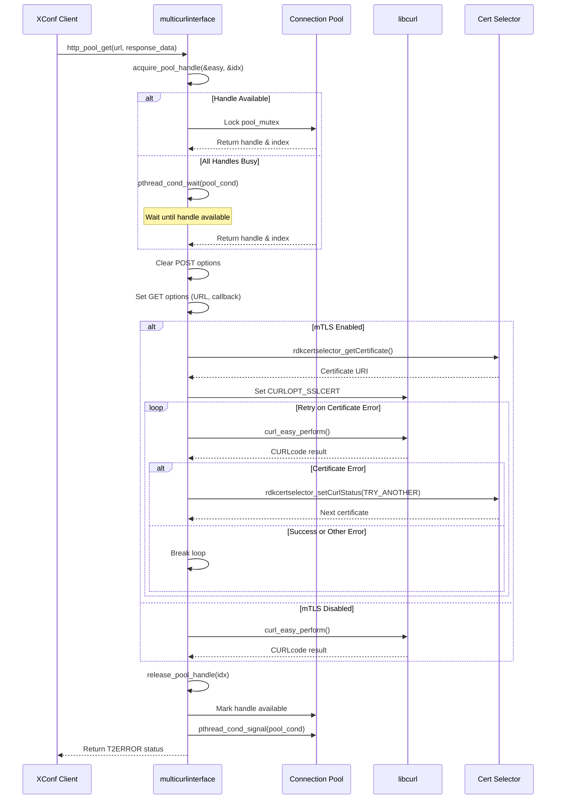
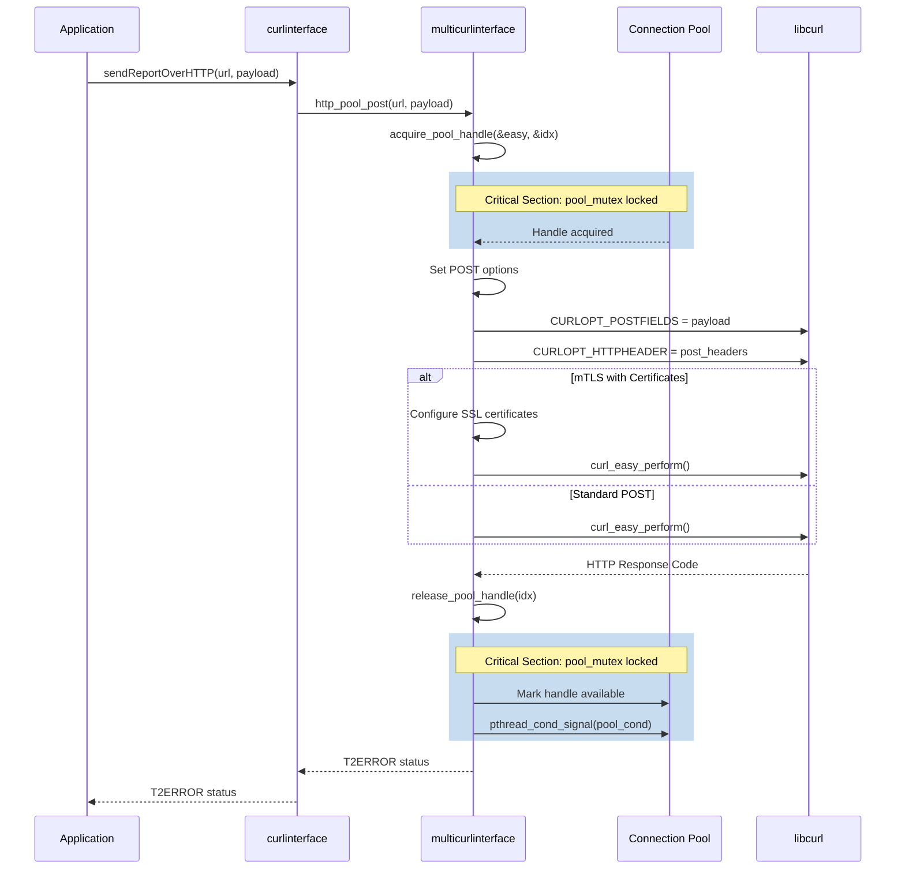
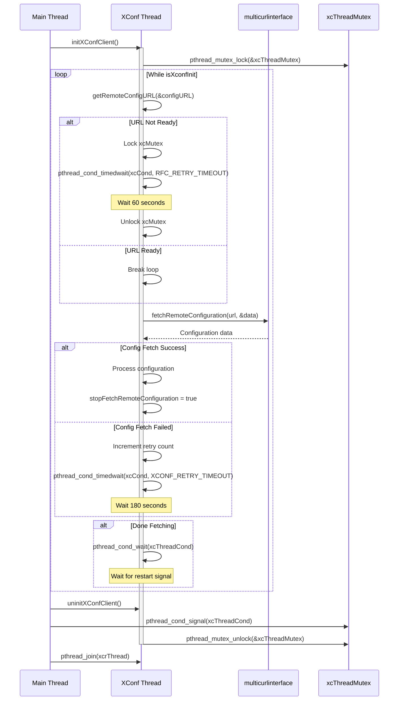
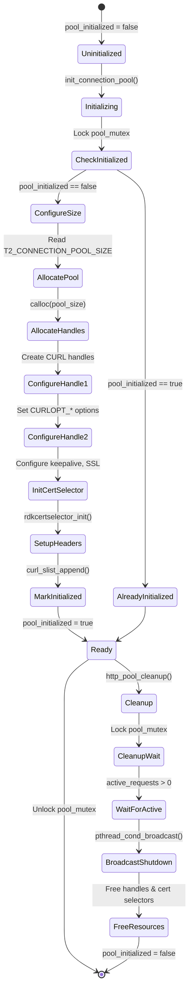
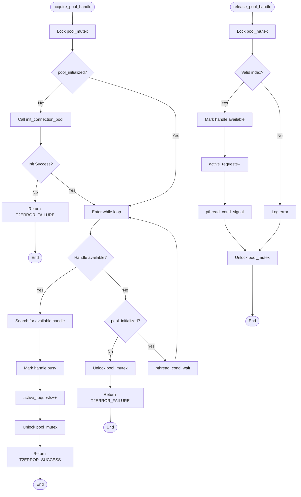

# CURL Usage Architecture Documentation

## Overview

This document describes the architecture of the CURL-based HTTP communication subsystem in the Telemetry component. The system implements a connection pooling mechanism for efficient HTTP operations with thread-safe access and mTLS support.

## Components

### 1. **multicurlinterface.c** - Connection Pool Layer
The core component implementing a thread-safe connection pool for CURL handles.

**Key Features:**
- Connection pooling with configurable pool size (1-5 connections)
- Thread-safe handle acquisition and release
- Support for both GET and POST operations
- mTLS certificate management integration
- Keep-alive and connection reuse optimization

**Key Data Structures:**
```c
typedef struct {
    CURL *easy_handle;               // Single CURL handle
    bool handle_available;           // Availability flag
    rdkcertselector_h cert_selector; // Certificate selector (LIBRDKCERTSEL_BUILD)
    rdkcertselector_h rcvry_cert_selector; // Recovery cert selector
} http_pool_entry_t;
```

**Global State:**
- `pool_entries`: Array of pool entries
- `pool_mutex`: Protects pool state (statically initialized)
- `pool_cond`: Condition variable for handle availability
- `pool_initialized`: Initialization flag
- `active_requests`: Counter for in-use handles
- `pool_size`: Configured pool size

### 2. **curlinterface.c** - Wrapper Layer
Simple wrapper providing backward compatibility and convenience functions.

**Key Functions:**
- `sendReportOverHTTP()`: Sends telemetry reports via HTTP POST
- `sendCachedReportsOverHTTP()`: Sends multiple cached reports sequentially

### 3. **xconfclient.c** - Configuration Client
Manages fetching configuration from XConf server with threading and retry logic.

**Key Features:**
- Background thread for configuration fetching
- Retry logic with exponential backoff
- Multiple condition variables for flow control
- DCM integration (when DCMAGENT is defined)

**Synchronization Primitives:**
- `xcMutex` & `xcCond`: Controls retry timing
- `xcThreadMutex` & `xcThreadCond`: Controls thread lifecycle
- `xcrThread`: Configuration fetching thread
- `dcmThread`: DCM notification thread (DCMAGENT)

## Architecture Diagrams

### Component Architecture

### HTTP GET Flow



### HTTP POST Flow



### XConf Client Thread Flow



### Connection Pool Initialization



### Handle Acquisition & Release Flow



## Synchronization Mechanisms

## Critical Race Conditions & Deadlock Risks

### 🔴 HIGH RISK: Pool Cleanup During Active Requests

**Location:** `http_pool_cleanup()` in multicurlinterface.c

**Issue:**
```c
while(active_requests > 0) {
    pthread_cond_wait(&pool_cond, &pool_mutex);
}
```

**Risk:** If a thread is blocked in `acquire_pool_handle()` waiting for an available handle when cleanup starts:
1. Cleanup sets `pool_initialized = false`
2. Waiting thread wakes up, sees `!pool_initialized`, exits with error
3. If the thread had incremented `active_requests` before waiting, the counter may be incorrect
4. Cleanup may wait forever if signals are missed

**Mitigation Required:**
- Use `pthread_cond_broadcast()` instead of waiting
- Add shutdown flag checked in acquire path
- Ensure proper signal on all return paths


### 🟡 MEDIUM RISK: Static Initialization Race

**Location:** `init_connection_pool()` in multicurlinterface.c

**Issue:**
```c
static pthread_mutex_t pool_mutex = PTHREAD_MUTEX_INITIALIZER;
static bool pool_initialized = false;

// Later in code:
pthread_mutex_lock(&pool_mutex);
if(pool_initialized) {
    pthread_mutex_unlock(&pool_mutex);
    return T2ERROR_SUCCESS;
}
```

**Risk:** Although `PTHREAD_MUTEX_INITIALIZER` provides static initialization, there's a check-then-act pattern that could theoretically have issues if multiple threads call `init_connection_pool()` simultaneously before `pool_initialized` is set.

**Current Protection:** The lock is acquired before checking, so this is actually safe. However, the `acquire_pool_handle()` function calls `init_connection_pool()` while holding `pool_mutex`, which is correct but creates nested critical sections.

**Status:** Currently protected, but recursive pattern is fragile.

### 🟡 MEDIUM RISK: Condition Variable Missed Signals

**Location:** Various locations using `pthread_cond_wait()`


### 🟢 LOW RISK: Active Request Counter

**Location:** `acquire_pool_handle()` and `release_pool_handle()` in multicurlinterface.c

**Issue:**
```c
active_requests++;  // In acquire
active_requests--;  // In release
```

**Risk:** Counter could become inaccurate if:
- Release called without acquire
- Error path doesn't decrement
- Signal handling interrupts

**Current Protection:** 
- All paths protected by `pool_mutex`
- index validation in release prevents double-release

**Status:** Well-protected but no assertions to detect corruption.


## Thread Safety Analysis

### Thread-Safe Operations
✅ `http_pool_get()` - Protected by pool_mutex
✅ `http_pool_post()` - Protected by pool_mutex  
✅ `init_connection_pool()` - Double-check locking with mutex
✅ `http_pool_cleanup()` - Synchronized with broadcast
✅ Handle acquisition/release - Mutex + condition variable

### Non-Thread-Safe (By Design)
⚠️ Individual CURL handle operations - Assumes single thread per handle (correct)
⚠️ Certificate selector callbacks - Called within handle's execution context (correct)


## Recommended Improvements

### 1. Add Timeout to Acquire - Prevent deadlocks

```c
T2ERROR acquire_pool_handle_timeout(CURL **easy, int *idx, int timeout_ms);
```

### 2. Separate Cert Selectors from Pool (Not needed now for pool sie 1)

Consider managing cert selectors independently to reduce coupling and simplify state management.


## Testing Recommendations

### Unit Tests Needed
1. ✅ Pool initialization and cleanup
2. ✅ Concurrent acquire/release from multiple threads
3. ✅ Pool exhaustion behavior (all handles busy)
4. ⚠️ Cleanup during active requests
5. ⚠️ Signal/wait patterns with multiple threads
6. ⚠️ Lock ordering validation
7. ⚠️ Environment variable edge cases

### Integration Tests Needed
1. ✅ Full GET/POST operations
2. ⚠️ Certificate rotation scenarios
3. ⚠️ Network failures and retries
4. ⚠️ Graceful shutdown with pending requests
5. ⚠️ Pool size scaling under load

### Stress Tests Needed
1. High-frequency requests (pool saturation)
2. Long-running requests (blocking pool) simulated by long responding connection
3. Rapid init/cleanup cycles
4. Mixed GET/POST workloads

---

**Document Version:** 1.0  
**Last Updated:** February 24, 2026  
**Author:** Architecture Analysis  
**Status:** Initial Analysis
