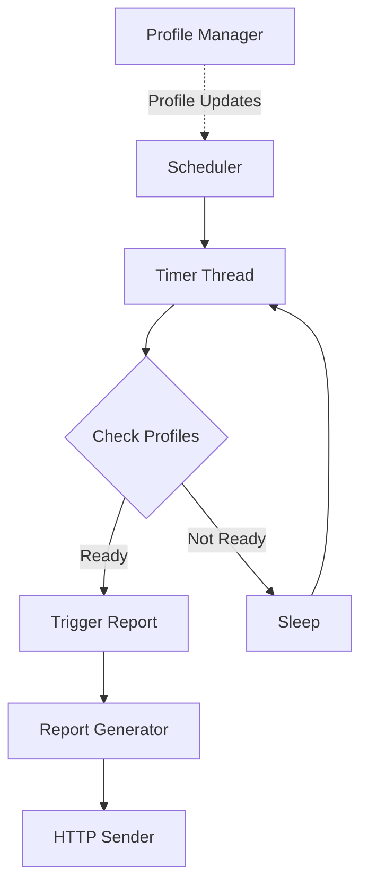
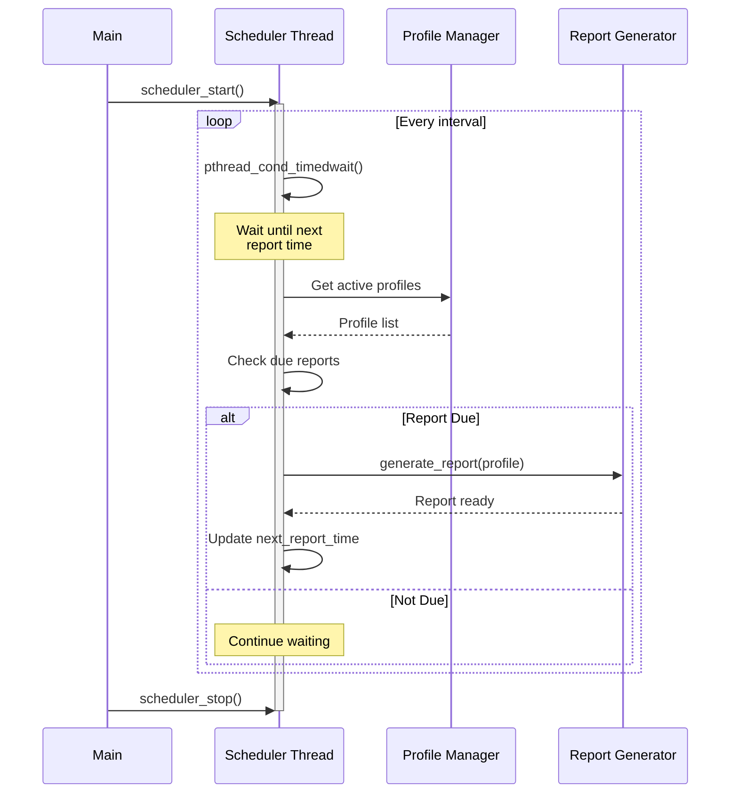
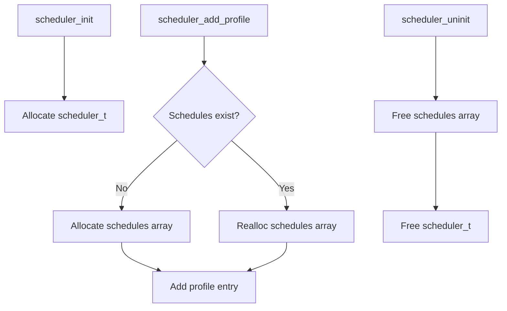

# Scheduler Component

## Overview

The Scheduler component manages the timing and coordination of telemetry report generation and transmission. It handles periodic report generation based on profile configurations and ensures reports are sent at appropriate intervals to minimize network overhead.

## Architecture

### Component Diagram



### Key Responsibilities

1. **Timing Management** - Track reporting intervals for each profile
2. **Event Coordination** - Coordinate with profile matcher when reports are due
3. **Resource Management** - Prevent excessive report generation
4. **Backoff Handling** - Implement retry logic for failed transmissions

## Key Components

### scheduler.h

Main scheduler interface and data structures.

```c
/**
 * Scheduler state
 */
typedef struct {
    pthread_t thread;              // Scheduler thread
    pthread_mutex_t mutex;         // Protects schedule state
    pthread_cond_t cond;          // Signals schedule changes
    bool running;                  // Running flag
    profile_schedule_t* schedules; // Per-profile schedules
    int schedule_count;            // Number of schedules
} scheduler_t;

/**
 * Per-profile schedule information
 */
typedef struct {
    char profile_name[64];        // Profile identifier
    time_t last_report_time;      // Last report timestamp
    unsigned int interval_sec;     // Reporting interval
    time_t next_report_time;      // Next scheduled report
    bool enabled;                  // Schedule enabled flag
} profile_schedule_t;
```

## Threading Model

### Threads

| Thread | Purpose | Stack Size | Priority |
|--------|---------|------------|----------|
| Scheduler | Timing and coordination | 32KB | Normal |

### Synchronization

```c
// Global scheduler state
static scheduler_t g_scheduler = {
    .mutex = PTHREAD_MUTEX_INITIALIZER,
    .cond = PTHREAD_COND_INITIALIZER,
    .running = false
};
```

**Lock Usage:**
- `scheduler.mutex` - Protects all schedule state
- `scheduler.cond` - Signals when schedules change or timer expires

**Thread Safety:**
- All public functions are thread-safe
- Uses condition variable for efficient timer wait
- Wakes on profile changes or timeout

### Scheduler Thread Flow



## API Reference

### scheduler_init()

Initialize the scheduler component.

**Signature:**
```c
int scheduler_init(void);
```

**Returns:**
- `0` - Success
- `-ENOMEM` - Memory allocation failed
- `-EINVAL` - Already initialized

**Thread Safety:** Thread-safe

**Example:**
```c
if (scheduler_init() != 0) {
    fprintf(stderr, "Failed to initialize scheduler\n");
    return -1;
}
```

### scheduler_start()

Start the scheduler thread.

**Signature:**
```c
int scheduler_start(void);
```

**Returns:**
- `0` - Success
- `-EINVAL` - Not initialized or already running
- `-EAGAIN` - Thread creation failed

**Thread Safety:** Thread-safe

**Example:**
```c
// After initialization
if (scheduler_start() != 0) {
    fprintf(stderr, "Failed to start scheduler\n");
    scheduler_uninit();
    return -1;
}
```

### scheduler_add_profile()

Add or update a profile schedule.

**Signature:**
```c
int scheduler_add_profile(const char* profile_name, 
                         unsigned int interval_sec);
```

**Parameters:**
- `profile_name` - Unique profile name (max 63 chars, non-NULL)
- `interval_sec` - Reporting interval in seconds (min: 60, max: 86400)

**Returns:**
- `0` - Success
- `-EINVAL` - Invalid parameter
- `-ENOMEM` - Memory allocation failed

**Thread Safety:** Thread-safe. Signals scheduler thread on changes.

**Example:**
```c
// Add profile with 5-minute interval
if (scheduler_add_profile("MyProfile", 300) != 0) {
    fprintf(stderr, "Failed to add profile schedule\n");
    return -1;
}
```

### scheduler_remove_profile()

Remove a profile from the schedule.

**Signature:**
```c
int scheduler_remove_profile(const char* profile_name);
```

**Parameters:**
- `profile_name` - Profile name to remove (non-NULL)

**Returns:**
- `0` - Success
- `-EINVAL` - Invalid parameter
- `-ENOENT` - Profile not found

**Thread Safety:** Thread-safe. Signals scheduler thread on changes.

### scheduler_stop()

Stop the scheduler thread.

**Signature:**
```c
int scheduler_stop(void);
```

**Returns:**
- `0` - Success
- `-EINVAL` - Not running

**Thread Safety:** Thread-safe. Blocks until thread exits.

### scheduler_uninit()

Uninitialize and cleanup scheduler resources.

**Signature:**
```c
void scheduler_uninit(void);
```

**Thread Safety:** Not thread-safe. Call only after scheduler_stop().

## Usage Examples

### Example: Basic Scheduler Usage

```c
#include "scheduler.h"
#include <stdio.h>

int main(void) {
    int ret = 0;
    
    // Initialize scheduler
    ret = scheduler_init();
    if (ret != 0) {
        fprintf(stderr, "Failed to init scheduler: %d\n", ret);
        return -1;
    }
    
    // Add profiles with different intervals
    scheduler_add_profile("Profile1", 300);   // 5 minutes
    scheduler_add_profile("Profile2", 600);   // 10 minutes
    scheduler_add_profile("Profile3", 1800);  // 30 minutes
    
    // Start scheduler
    ret = scheduler_start();
    if (ret != 0) {
        fprintf(stderr, "Failed to start scheduler: %d\n", ret);
        scheduler_uninit();
        return -1;
    }
    
    printf("Scheduler running. Press Ctrl+C to stop...\n");
    
    // Run for some time...
    sleep(3600);  // 1 hour
    
    // Cleanup
    scheduler_stop();
    scheduler_uninit();
    
    return 0;
}
```

### Example: Dynamic Profile Updates

```c
// Update profile interval
scheduler_remove_profile("Profile1");
scheduler_add_profile("Profile1", 600);  // Change to 10 minutes

// Disable profile temporarily
scheduler_remove_profile("Profile2");

// Re-enable later
scheduler_add_profile("Profile2", 600);
```

## Memory Management

### Allocation Pattern



### Memory Ownership

- **scheduler_t**: Owned by scheduler module (singleton)
- **schedules array**: Owned by scheduler, dynamically sized
- **Profile names**: Copied into schedule entries

### Memory Budget

| Component | Size | Notes |
|-----------|------|-------|
| scheduler_t | ~128 bytes | Singleton |
| profile_schedule_t | ~96 bytes each | Dynamic array |
| **Typical total** | ~1KB | For 10 profiles |

## Error Handling

### Error Codes

| Code | Meaning | Recovery |
|------|---------|----------|
| `0` | Success | - |
| `-EINVAL` | Invalid parameter or state | Check parameters |
| `-ENOMEM` | Memory allocation failed | Reduce profile count |
| `-ENOENT` | Profile not found | Verify profile name |
| `-EAGAIN` | Thread creation failed | Check system resources |

### Error Recovery

```c
int ret = scheduler_add_profile("Test", 300);
if (ret != 0) {
    switch (-ret) {
        case EINVAL:
            // Invalid interval or name
            fprintf(stderr, "Invalid profile parameters\n");
            break;
        case ENOMEM:
            // Out of memory
            fprintf(stderr, "Out of memory, reduce profiles\n");
            // Remove unused profiles
            scheduler_remove_profile("OldProfile");
            // Retry
            ret = scheduler_add_profile("Test", 300);
            break;
    }
}
```

## Performance Considerations

### Timer Accuracy

- Uses `pthread_cond_timedwait()` for efficient waiting
- Accuracy: ±1 second typical
- Does not busy-wait; minimal CPU usage when idle

### Scalability

- Supports hundreds of profiles efficiently
- O(n) scan each timer tick where n = active profiles
- Minimal overhead per profile (~100 bytes)

### CPU Usage

| State | CPU Usage |
|-------|-----------|
| Idle (waiting) | <0.1% |
| Checking profiles | ~1% |
| Triggering report | Delegates to report generator |

## Platform Notes

### Linux

- Uses POSIX threads and condition variables
- Requires pthread library
- Timer resolution depends on kernel HZ value

### RDKB Devices

- Tested on various ARM platforms
- Minimal resource usage suitable for constrained devices
- Integrates with RDK logging

### Constraints

- **Minimum interval**: 60 seconds (enforced)
- **Maximum interval**: 86400 seconds (24 hours)
- **Maximum profiles**: Limited by available memory

## Testing

### Unit Tests

Tests are located in `source/test/scheduler_test.cpp`:

```bash
# Run scheduler unit tests
./test/telemetry_test --gtest_filter=SchedulerTest.*
```

**Test Coverage:**
- [ ] Initialization and cleanup
- [ ] Adding/removing profiles
- [ ] Thread start/stop
- [ ] Timer accuracy
- [ ] Concurrent profile updates
- [ ] Error handling

### Manual Testing

```bash
# Enable debug logging
export T2_ENABLE_DEBUG=1

# Run with test profiles
./telemetry2_0 &

# Add profiles via D-Bus/RBUS
# Monitor /var/log/telemetry/scheduler.log

# Verify reports generated at intervals
```

## Troubleshooting

### Issue: Reports not generated on time

**Symptoms:** Report intervals inconsistent or missed

**Possible Causes:**
1. System clock changed
2. Thread starved (low priority)
3. Report generator blocking

**Debug Steps:**
```bash
# Check scheduler thread is running
ps -T -p $(pgrep telemetry2_0) | grep sched

# Check system load
top -H -p $(pgrep telemetry2_0)

# Enable debug logging
kill -USR1 $(pgrep telemetry2_0)  # Toggle debug
tail -f /var/log/telemetry/scheduler.log
```

**Solution:** Increase thread priority or reduce number of profiles.

### Issue: High CPU usage

**Symptoms:** Scheduler thread using excessive CPU

**Debug Steps:**
```bash
# Profile the scheduler thread
perf record -g -p $(pgrep telemetry2_0)
perf report
```

**Solution:** Check for tight loop or missing sleep. File a bug report.

## See Also

- [Report Generator](../reportgen/README.md) - Report generation triggered by scheduler
- [Profile Manager](../bulkdata/README.md) - Profile configuration
- [Threading Model](../../docs/architecture/threading-model.md) - Overall thread architecture
- [API Reference](../../docs/api/internal-api.md) - Internal API documentation

---

**Component Owner**: Telemetry Team  
**Last Updated**: March 2026  
**Status**: Active Development
