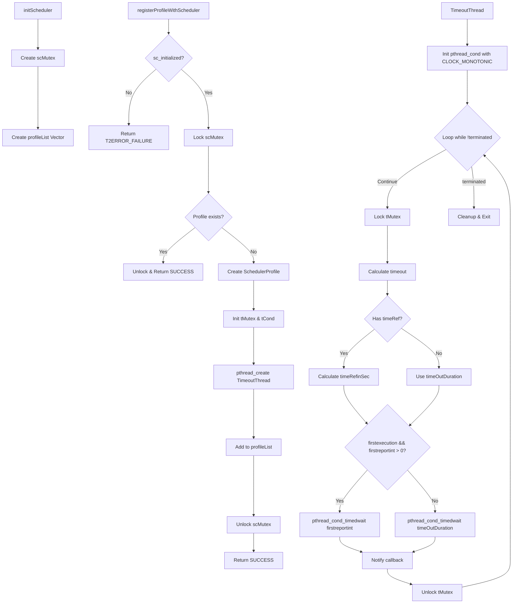
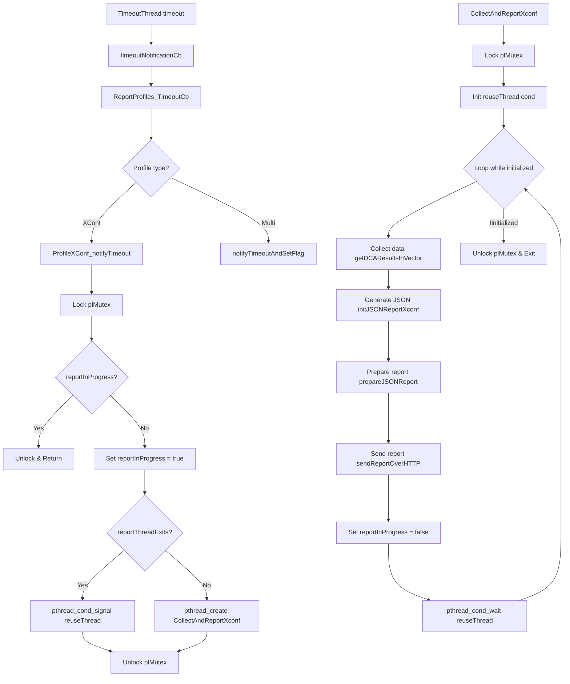
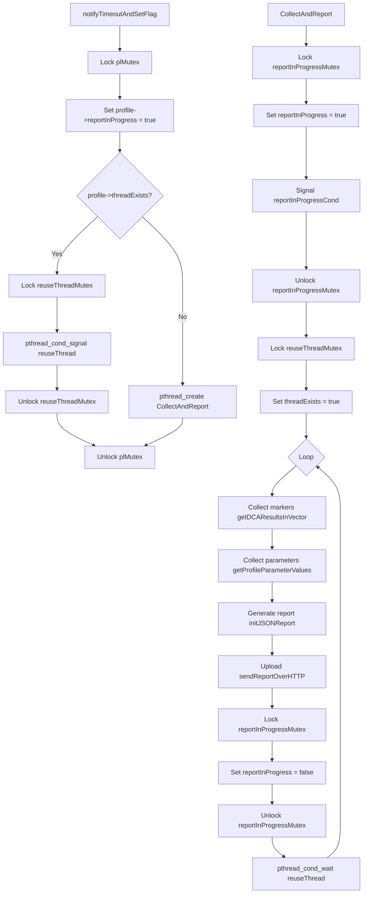
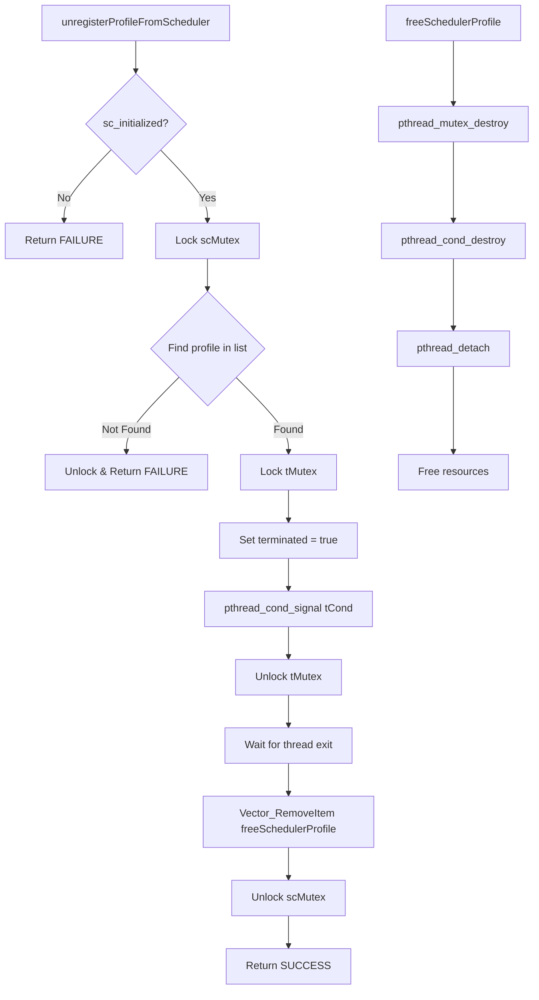
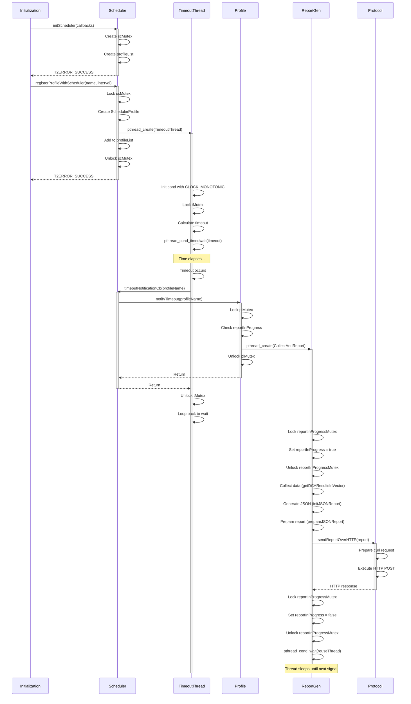
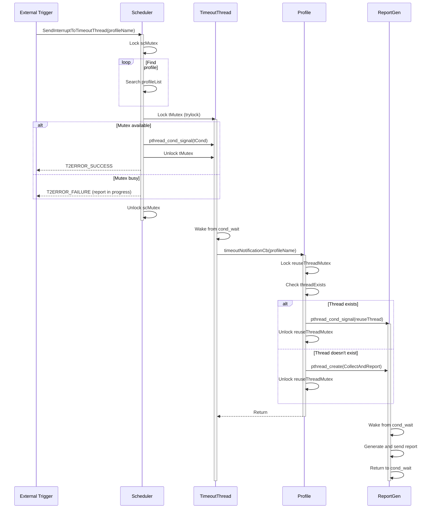
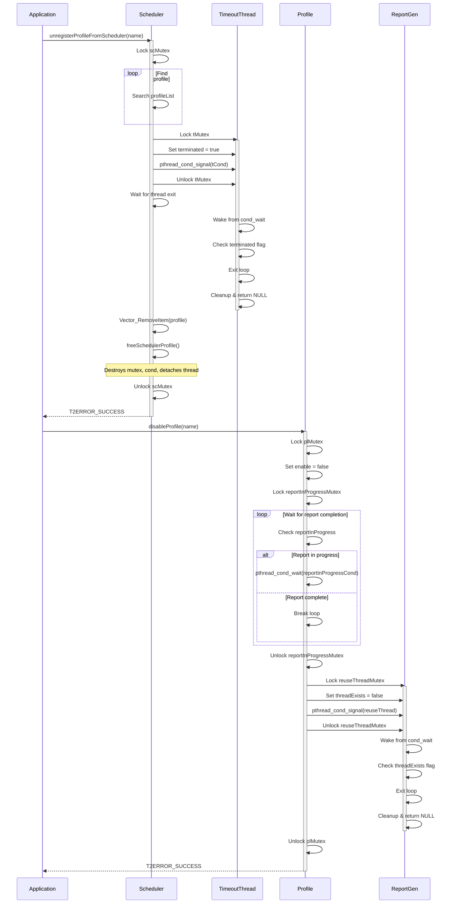
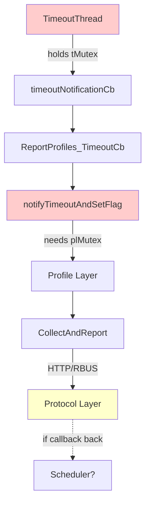

# Thread Synchronization Analysis

## Overview

This document analyzes the thread synchronization mechanisms in the Telemetry 2.0 system, focusing on the interactions between scheduler, reportgen, protocol, and t2parser components.

## Component Responsibilities

### 1. Scheduler (`source/scheduler/scheduler.c`)
- Manages timing and triggering of report generation
- Creates timeout threads for each profile
- Handles report interval scheduling and time reference-based scheduling

### 2. Report Generator (`source/reportgen/reportgen.c`)
- Prepares JSON reports from collected data
- Formats reports according to profile specifications
- Interfaces with protocol layer for transmission

### 3. Protocol Layer (`source/bulkdata/profilexconf.c`, `source/bulkdata/profile.c`)
- Handles HTTP/RBUS protocol operations
- Manages report upload via curl
- Coordinates with report generation threads

### 4. Parser (`source/t2parser/`)
- Parses profile configurations (JSON/MessagePack)
- Creates Profile structures
- No direct thread management (passive component)

## Thread Architecture

### Main Threads

1. **TimeoutThread** - One per profile (created in `registerProfileWithScheduler`)
2. **CollectAndReportXconf** - XConf profile reporting thread (created in `ProfileXConf_notifyTimeout`)
3. **CollectAndReport** - Multi-profile reporting thread (created in `enableProfile`)

## Synchronization Primitives

### Scheduler Mutexes and Condition Variables

```c
// Global scheduler mutex
static pthread_mutex_t scMutex;

// Per-profile synchronization
typedef struct _SchedulerProfile {
    pthread_mutex_t tMutex;      // Protects profile state
    pthread_cond_t tCond;        // Signals timeout events
    bool terminated;             // Thread termination flag
    bool repeat;                 // Repeat scheduling flag
} SchedulerProfile;
```

### Profile Mutexes and Condition Variables

```c
typedef struct _Profile {
    pthread_mutex_t reportInProgressMutex;
    pthread_cond_t reportInProgressCond;
    pthread_mutex_t triggerCondMutex;
    pthread_mutex_t eventMutex;
    pthread_mutex_t reportMutex;
    pthread_cond_t reportcond;
    pthread_mutex_t reuseThreadMutex;
    pthread_cond_t reuseThread;
    bool reportInProgress;
    bool threadExists;
} Profile;
```

### ProfileXConf Synchronization

```c
static pthread_mutex_t plMutex;        // Protects XConf profile
static pthread_cond_t reuseThread;     // Thread reuse signaling
static bool reportThreadExits;         // Thread lifecycle flag
```

## Thread Flow Diagrams

### 1. Profile Registration and Scheduling Flow



### 2. Report Generation Synchronization Flow



### 3. Multi-Profile Report Flow



### 4. Profile Unregistration Flow



## Sequence Diagrams

### 1. Profile Registration to Report Generation



### 2. Interrupt-Based Report Generation



### 3. Profile Cleanup and Thread Termination



## Critical Synchronization Patterns

### 1. Double-Checked Locking for Report Generation

```c
// In ProfileXConf_notifyTimeout
pthread_mutex_lock(&plMutex);
if(!singleProfile->reportInProgress) {
    singleProfile->reportInProgress = true;
    
    if (reportThreadExits) {
        pthread_cond_signal(&reuseThread);  // Reuse existing thread
    } else {
        pthread_create(...);                // Create new thread
    }
}
pthread_mutex_unlock(&plMutex);
```

### 2. Thread Reuse Pattern

```c
// In CollectAndReportXconf
do {
    // Generate report
    profile->reportInProgress = false;
    pthread_cond_wait(&reuseThread, &plMutex);  // Wait for next trigger
} while(initialized);
```

### 3. Condition Variable with CLOCK_MONOTONIC

```c
// In TimeoutThread
pthread_condattr_t Profile_attr;
pthread_condattr_init(&Profile_attr);
pthread_condattr_setclock(&Profile_attr, CLOCK_MONOTONIC);  // Immune to time changes
pthread_cond_init(&tProfile->tCond, &Profile_attr);
```

### 4. Safe Termination Pattern

```c
// In unregisterProfileFromScheduler
pthread_mutex_lock(&tProfile->tMutex);
tProfile->terminated = true;
pthread_cond_signal(&tProfile->tCond);     // Wake thread
pthread_mutex_unlock(&tProfile->tMutex);

// Thread checks terminated flag and exits
// Mutex is destroyed after thread detachment
```

## Potential Race Conditions and Mitigations

### 1. **Report In Progress Flag**

**Risk**: Multiple threads checking `reportInProgress` simultaneously

**Mitigation**: Always check and set `reportInProgress` within the same mutex lock

### 2. **Thread Reuse Signal**

**Risk**: Signal sent before thread reaches wait state

**Mitigation**: Use `reportThreadExits` flag to track thread state

### 3. **Scheduler Mutex Deadlock**

**Risk**: Multiple locks acquired in different orders

**Mitigation**: Consistent lock ordering: `scMutex` → `tMutex`

### 4. **Profile Removal During Report**

**Risk**: Profile freed while report thread is active

**Mitigation**: Wait for `reportInProgress` to be false before cleanup

## Lock Hierarchy

```
Level 1: scMutex (Scheduler global)
Level 2: plMutex (Profile list)
Level 3: tMutex (Individual timeout thread)
Level 4: reportInProgressMutex (Report state)
Level 5: reuseThreadMutex (Thread reuse)
```

**Rule**: Always acquire locks from lower to higher level to avoid deadlock.

## Performance Considerations

1. **Thread Pooling**: Report threads are reused via condition variables instead of creating new threads for each report
2. **Minimal Lock Duration**: Mutexes are held only during critical state changes
3. **Condition Variables**: Efficient waiting mechanism instead of polling
4. **CLOCK_MONOTONIC**: Prevents scheduler drift from system time changes

## Key Implementation Files

- **Scheduler**: `source/scheduler/scheduler.c`, `source/scheduler/scheduler.h`
- **Profile Management**: `source/bulkdata/profile.c`, `source/bulkdata/profile.h`
- **XConf Profile**: `source/bulkdata/profilexconf.c`
- **Report Generation**: `source/reportgen/reportgen.c`
- **Protocol Layer**: `source/protocol/httpClient.c`

## Deadlock Analysis

### Potential Deadlock Scenarios

#### 1. **CRITICAL: Nested Mutex Lock in unregisterProfileFromScheduler**

**Location**: `source/scheduler/scheduler.c:633-660`

**Scenario**:
```c
pthread_mutex_lock(&scMutex);              // Lock 1
for (index...) {
    pthread_mutex_lock(&tProfile->tMutex); // Lock 2 - nested under scMutex
    tProfile->terminated = true;
    pthread_cond_signal(&tProfile->tCond);
    pthread_mutex_unlock(&tProfile->tMutex);
    
    // DANGEROUS: Waiting with scMutex held!
    while(signalrecived_and_executing) {
        sleep(1);
    }
    
    pthread_mutex_lock(&tProfile->tMutex);  // Lock 2 again!
    Vector_RemoveItem(profileList, tProfile, freeSchedulerProfile);
    pthread_mutex_unlock(&tProfile->tMutex);
}
pthread_mutex_unlock(&scMutex);
```

**Problem**: 
- `scMutex` is held while waiting in the sleep loop
- If another thread tries to acquire `scMutex` (e.g., `registerProfileWithScheduler`, `SendInterruptToTimeoutThread`), it will block
- The thread being terminated needs to complete execution, but if it needs `scMutex` for any reason, **DEADLOCK**

**Risk Level**: HIGH

**Mitigation Needed**: 
- Release `scMutex` before entering the wait loop
- Reacquire after the wait completes
- Use proper condition variable instead of sleep polling

#### 2. **CRITICAL: Lock Order Violation in SendInterruptToTimeoutThread**

**Location**: `source/scheduler/scheduler.c:393-424`

**Scenario**:
```c
pthread_mutex_lock(&scMutex);                    // Lock order: scMutex -> tMutex
for (index...) {
    if (strcmp(profileName, tProfile->name) == 0) {
        pthread_mutex_trylock(&tProfile->tMutex); // Using trylock (good!)
        if (mutex_return == EBUSY) {
            pthread_mutex_unlock(&scMutex);
            return T2ERROR_FAILURE;
        }
        pthread_cond_signal(&tProfile->tCond);
        pthread_mutex_unlock(&tProfile->tMutex);
    }
}
pthread_mutex_unlock(&scMutex);
```

**Cross-Reference with TimeoutThread**:
```c
// In TimeoutThread
pthread_mutex_lock(&tProfile->tMutex);          // Lock order: tMutex first
// ... work ...
timeoutNotificationCb(profileName);             // May call into profile layer
pthread_mutex_unlock(&tProfile->tMutex);
```

**Problem**: 
- `SendInterruptToTimeoutThread`: acquires `scMutex` → `tMutex`
- `TimeoutThread` callback might eventually need `scMutex` through profile operations
- **POTENTIAL DEADLOCK** if lock ordering is violated

**Risk Level**: MEDIUM (mitigated by trylock)

**Current Mitigation**: Uses `pthread_mutex_trylock` instead of lock - GOOD PRACTICE

#### 3. **Lock Order Issue: plMutex vs reportInProgressMutex**

**Location**: `source/bulkdata/profile.c:262-337`

**Scenario A - notifyTimeoutAndSetFlag**:
```c
pthread_mutex_lock(&plMutex);                           // Lock 1
// ... find profile ...
pthread_mutex_unlock(&plMutex);

pthread_mutex_lock(&profile->reportInProgressMutex);   // Lock 2
profile->reportInProgress = true;
pthread_mutex_unlock(&profile->reportInProgressMutex);
```

**Scenario B - deleteProfile/deleteAllProfiles**:
```c
pthread_mutex_lock(&plMutex);                           // Lock 1
// ... find profile ...

pthread_mutex_lock(&profile->reportInProgressMutex);   // Lock 2 - NESTED!
while (profile->reportInProgress) {
    pthread_cond_wait(&profile->reportInProgressCond, 
                      &profile->reportInProgressMutex);
}
pthread_mutex_unlock(&profile->reportInProgressMutex);
pthread_mutex_unlock(&plMutex);
```

**Problem**:
- Different functions use different lock ordering
- `notifyTimeoutAndSetFlag`: releases `plMutex` before acquiring `reportInProgressMutex`
- `deleteProfile`: holds `plMutex` while acquiring `reportInProgressMutex`
- If timing is unlucky, this **CAN CAUSE DEADLOCK**

**Risk Level**: MEDIUM-HIGH

**Specific Issue**: In `deleteProfile` (line 1261), waiting on condition variable while holding `plMutex` can block other operations

#### 4. **ProfileXConf: Long-Hold Pattern**

**Location**: `source/bulkdata/profilexconf.c:208-495`

**Scenario**:
```c
static void* CollectAndReportXconf(void* data) {
    pthread_mutex_lock(&plMutex);               // Lock acquired
    
    do {
        // ENTIRE REPORT GENERATION WITH MUTEX HELD!
        // - Data collection (getDCAResultsInVector)
        // - JSON generation (initJSONReportXconf)
        // - Report preparation (prepareJSONReport)  
        // - HTTP upload (sendReportOverHTTP)       // ⚠️ Network I/O with mutex!
        
        profile->reportInProgress = false;
        pthread_cond_wait(&reuseThread, &plMutex); // Wait WITH mutex held
    } while(initialized);
    
    pthread_mutex_unlock(&plMutex);
}
```

**Problem**:
- `plMutex` is held for the **ENTIRE duration** of report generation and upload
- Network I/O (`sendReportOverHTTP`) can take seconds or fail with long timeouts
- Any other operation needing `plMutex` will block indefinitely
- Functions blocked: `ProfileXConf_isSet`, `ProfileXconf_getName`, `ProfileXConf_notifyTimeout`, `updateProfileXConf`

**Risk Level**: CRITICAL (Performance Bottleneck + Deadlock Risk)

**Impact**:
- System appears hung during report upload
- Cannot query profile status
- Cannot update configuration
- Cannot trigger new reports

#### 5. **Cross-Component Lock Cycle Risk**

**Chain**: Scheduler → Profile → Protocol



**Scenario**:
1. **Thread 1** (TimeoutThread): Holds `tMutex` → calls callback → needs `plMutex`
2. **Thread 2** (Configuration Update): Holds `plMutex` → tries to unregister → needs `scMutex` → needs `tMutex`
3. **Thread 3** (Interrupt): Holds `scMutex` → needs `tMutex`

**Risk Level**: MEDIUM (Complex, timing-dependent)

#### 6. **Condition Variable Wait Without Timeout**

**Location**: Multiple places

**Examples**:
```c
// source/bulkdata/profile.c:337
pthread_cond_wait(&profile->reportInProgressCond, 
                  &profile->reportInProgressMutex);

// source/bulkdata/profilexconf.c:495
pthread_cond_wait(&reuseThread, &plMutex);

// source/bulkdata/profile.c:1268
while (profile->reportInProgress && !profile->threadExists) {
    pthread_cond_wait(&profile->reportInProgressCond, 
                      &profile->reportInProgressMutex);
}
```

**Problem**:
- If the signaling thread crashes or exits without signaling, waiters will block **FOREVER**
- No timeout mechanism to detect hung threads
- Cannot recover from protocol errors or exceptions

**Risk Level**: MEDIUM (Availability Issue)

#### 7. **deleteAllProfiles Lock Pattern**

**Location**: `source/bulkdata/profile.c:1175-1186`

**Scenario**:
```c
pthread_mutex_lock(&plMutex);
if (tempProfile->threadExists) {
    pthread_mutex_lock(&tempProfile->reuseThreadMutex);  // Nested lock!
    pthread_cond_signal(&tempProfile->reuseThread);
    pthread_mutex_unlock(&tempProfile->reuseThreadMutex);
    pthread_join(tempProfile->reportThread, NULL);       // BLOCKING with plMutex held!
    tempProfile->threadExists = false;
}
pthread_mutex_unlock(&plMutex);
```

**Problem**:
- Holds `plMutex` during `pthread_join` 
- If the report thread needs `plMutex` to complete (it does in `CollectAndReport`), **DEADLOCK**
- The report thread's wait loop eventually needs to wake up and check `threadExists`

**Risk Level**: HIGH

### Deadlock Prevention Recommendations

#### 1. **Fix unregisterProfileFromScheduler Critical Section**

```c
// BEFORE (Dangerous)
pthread_mutex_lock(&scMutex);
while(signalrecived_and_executing) {
    sleep(1);  // Holding mutex!
}
pthread_mutex_unlock(&scMutex);

// AFTER (Safe)
pthread_mutex_lock(&scMutex);
pthread_mutex_lock(&tProfile->tMutex);
tProfile->terminated = true;
pthread_cond_signal(&tProfile->tCond);
pthread_mutex_unlock(&tProfile->tMutex);
pthread_mutex_unlock(&scMutex);  // Release BEFORE waiting

// Wait outside mutex
int count = 0;
while(signalrecived_and_executing && count++ < 10) {
    sleep(1);
}

pthread_mutex_lock(&scMutex);
pthread_mutex_lock(&tProfile->tMutex);
Vector_RemoveItem(profileList, tProfile, freeSchedulerProfile);
pthread_mutex_unlock(&tProfile->tMutex);
pthread_mutex_unlock(&scMutex);
```

#### 2. **Refactor CollectAndReportXconf - Release Mutex During I/O**

```c
static void* CollectAndReportXconf(void* data) {
    pthread_mutex_lock(&plMutex);
    ProfileXConf* profile = singleProfile;
    pthread_mutex_unlock(&plMutex);  // Release early!
    
    do {
        // Collect data WITHOUT holding plMutex
        Vector *profileParamVals = getDCAResultsInVector(...);
        initJSONReportXconf(...);
        prepareJSONReport(...);
        
        // Network I/O WITHOUT mutex
        ret = sendReportOverHTTP(profile->t2HTTPDest->URL, jsonReport);
        
        // Re-acquire only for state update
        pthread_mutex_lock(&plMutex);
        profile->reportInProgress = false;
        pthread_cond_wait(&reuseThread, &plMutex);
        pthread_mutex_unlock(&plMutex);
    } while(initialized);
}
```

#### 3. **Consistent Lock Ordering - Document and Enforce**

**Establish Global Lock Hierarchy**:
```
Level 0: triggerConditionQueMutex (lowest)
Level 1: profile->eventMutex
Level 2: profile->reportMutex  
Level 3: profile->triggerCondMutex
Level 4: profile->reuseThreadMutex
Level 5: profile->reportInProgressMutex
Level 6: plMutex (profile list global)
Level 7: tMutex (timeout thread)
Level 8: scMutex (scheduler global - highest)
```

**Rule**: Always acquire locks from HIGHER level to LOWER level

#### 4. **Add Timeouts to Condition Variable Waits**

```c
// Instead of infinite wait
pthread_cond_wait(&profile->reportInProgressCond, &profile->reportInProgressMutex);

// Use timed wait with timeout
struct timespec timeout;
clock_gettime(CLOCK_REALTIME, &timeout);
timeout.tv_sec += 30;  // 30 second timeout

int result = pthread_cond_timedwait(&profile->reportInProgressCond, 
                                     &profile->reportInProgressMutex,
                                     &timeout);
if (result == ETIMEDOUT) {
    T2Error("Timeout waiting for report completion - possible deadlock!\n");
    // Recovery logic
}
```

#### 5. **Fix deleteAllProfiles - Release Before Join**

```c
pthread_mutex_lock(&plMutex);
if (tempProfile->threadExists) {
    pthread_mutex_lock(&tempProfile->reuseThreadMutex);
    pthread_cond_signal(&tempProfile->reuseThread);
    pthread_mutex_unlock(&tempProfile->reuseThreadMutex);
    
    pthread_t thread = tempProfile->reportThread;
    pthread_mutex_unlock(&plMutex);  // Release BEFORE join!
    
    pthread_join(thread, NULL);
    
    pthread_mutex_lock(&plMutex);
    tempProfile->threadExists = false;
}
pthread_mutex_unlock(&plMutex);
```

#### 6. **Implement Deadlock Detection**

```c
// Use pthread_mutex_timedlock instead of pthread_mutex_lock
struct timespec timeout;
clock_gettime(CLOCK_REALTIME, &timeout);
timeout.tv_sec += 5;  // 5 second timeout

if (pthread_mutex_timedlock(&plMutex, &timeout) != 0) {
    T2Error("Failed to acquire plMutex within timeout - possible deadlock!\n");
    // Log stack trace, trigger watchdog, etc.
    return T2ERROR_FAILURE;
}
```

### Lock Acquisition Matrix

| Function | scMutex | tMutex | plMutex | reportInProgressMutex | reuseThreadMutex | Order Valid? |
|----------|---------|--------|---------|----------------------|------------------|--------------|
| registerProfileWithScheduler | ✓ | | | | | ✓ |
| unregisterProfileFromScheduler | ✓ | ✓ | | | | ✓ |
| SendInterruptToTimeoutThread | ✓ | ✓(try) | | | | ✓ |
| TimeoutThread | | ✓ | | | | ✓ |
| notifyTimeoutAndSetFlag | | | ✓ | ✓ | ✓ | ✓ |
| deleteProfile | | | ✓ | ✓ | ✓ | ✓ |
| deleteAllProfiles | | | ✓ | | ✓ | ⚠️ |
| CollectAndReportXconf | | | ✓ (held) | | | ⚠️ |
| CollectAndReport | | | | ✓ | ✓ | ✓ |
| disableProfile | | | ✓ | | | ✓ |

**Legend**: 
- ✓ = Lock acquired
- ✓(try) = Lock attempted with trylock
- ✓ (held) = Lock held for extended duration
- ⚠️ = Potential deadlock risk

## Testing Recommendations

1. **Concurrent Profile Registration**: Test multiple profiles being registered simultaneously
2. **Rapid Enable/Disable**: Test profile enable/disable cycles
3. **Interrupt During Report**: Test `SendInterruptToTimeoutThread` during active report generation
4. **Profile Removal Under Load**: Test profile removal while reports are being generated
5. **Time Reference Drift**: Test scheduler behavior with time changes (NTP sync)
6. **Memory Leak Detection**: Use valgrind to verify proper cleanup of mutex/condition variables
7. **Thread Sanitizer**: Use TSan to detect race conditions and deadlocks
8. **Stress Testing**: Run with many profiles and short intervals to stress thread synchronization
9. **Deadlock Injection**: Simulate network delays in HTTP uploads to trigger long mutex holds
10. **Concurrent Deletion**: Test deleteAllProfiles while reports are being generated
11. **Lock Timeout Testing**: Verify behavior when locks cannot be acquired within timeout
12. **Thread Abort Scenarios**: Test cleanup when threads are forcefully terminated

## Summary

The Telemetry 2.0 system employs a sophisticated multi-threaded architecture with careful synchronization:

- **Scheduler** manages per-profile timeout threads using condition variables
- **Profile** layer implements thread reuse patterns to minimize overhead
- **Protocol** layer handles HTTP operations in dedicated threads
- **Parser** operates synchronously without thread management

The system uses a hierarchical locking strategy, thread reuse patterns, and CLOCK_MONOTONIC condition variables to ensure thread-safe operation while maintaining high performance. Critical sections are kept minimal, and proper termination protocols ensure clean shutdown without resource leaks.

### Critical Issues Identified

1. **HIGH PRIORITY**: `CollectAndReportXconf` holds `plMutex` during network I/O - major bottleneck and deadlock risk
2. **HIGH PRIORITY**: `unregisterProfileFromScheduler` holds `scMutex` while polling - deadlock risk
3. **HIGH PRIORITY**: `deleteAllProfiles` holds `plMutex` during `pthread_join` - deadlock risk  
4. **MEDIUM PRIORITY**: Inconsistent lock ordering between `deleteProfile` and `notifyTimeoutAndSetFlag`
5. **MEDIUM PRIORITY**: No timeouts on condition variable waits - threads can hang forever
6. **LOW PRIORITY**: Cross-component lock cycle risk (complex, timing-dependent)

**Recommendation**: Address HIGH priority issues immediately to prevent system hangs and improve reliability.
